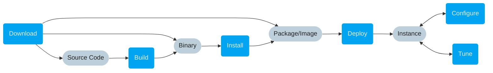

# Setup VAST

This section covers the different stages of the setup process that ultimately
yield a running VAST instance. You have several options to enter the setup
pipeline, based on what intermediate artifact you would like to begin with.

👇 Click on any blue actions to get started.

