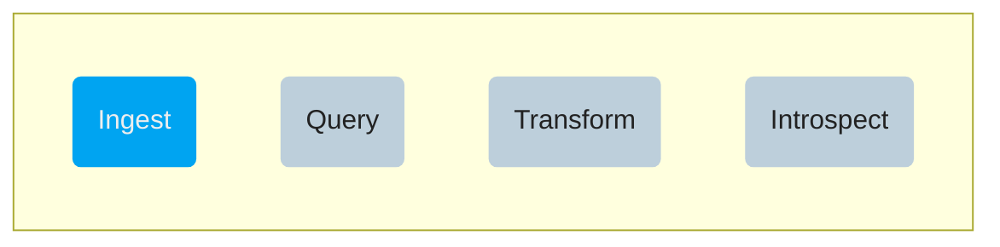

# Use VAST

After having completed the [VAST setup](/docs/setup-vast), you can interact with
the system. At a high level, VAST does 3 things:

1. **Manage Data**: VAST ingests and indexes events, executes queries to
   retrieve data, facilitates metadata management to describe data, and supports
   flexible aging data to meet capacity and compliance requirements.
2. **Contextualize Events**: VAST provides operations to make more sense of the
   data, such as pivoting to linked events, exploring a spatio-temporal
   neighborhood, and enriching events with third-party context.
3. **Execute Security Content**: VAST processes threat intelligence, matching it
   live during ingestion and applying it retrospectively by compiling it into queries.

👇 Click on any blue actions to get started.

