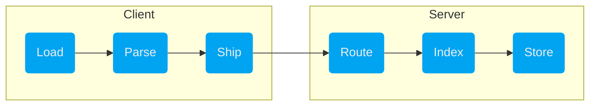

# Ingest

*Ingesting* data refers to the import pipeline that covers the following steps:



Adding a new data source involves spinning up a VAST client node that loads,
parses, and ships the normalized data to a VAST server node. The deployment
mindset is that clients have *fate sharing* with the data source, hence reliance
on process isolation to decoupling from a server node with higher availability
guarantees.

:::note Lakehouse Architecture
VAST uses open standards for data in motion ([Arrow](https://arrow.apache.org))
and data at rest ([Parquet](https://parquet.apache.org/)). You only ETL data
once to a destination of your choice. In that sense, VAST resembles a [lakehouse
architecture][lakehouse-paper]. Think of the above pipeline as a chain of
independently operating microservices, each of which can be scaled
independently. The [actor
model](/docs/understand-vast/architecture/actor-model/) architecture of
VAST enables this naturally.
[lakehouse-paper]: http://www.cidrdb.org/cidr2021/papers/cidr2021_paper17.pdf
:::

To onboard a new data source, you first need to [setup a VAST server
node](/docs/setup-vast). The subsequent discussion explains how to setup a
client that sends data to an existing server, as illustrated below.


## Load input from a carrier

A *carrier* is responsible for acquiring data from a dedicated I/O path, such as
a file, network socket, a custom transport path via a 3rd-party library.

:::note Implementation underway
We are currently reworking the inbound data path by separating the I/O-bound
loading phase from the subsequent CPU-bound parsing phase. To date, these stages
are intertwined and take place together. Moving forward, it will be possible to
mix and match carriers and formats. To date, the format dictates the carrier and
is not possible to configure separately.
:::

## Choose an import format

The *format* defines the encoding of data. ASCII formats include JSON, CSV, or
tool-specific data encodings like Zeek TSV. Examples for binary formats are
PCAP and NetFlow.

The `import` command reads data from file or standard input and takes a
concrete format as sub-command:

```bash
vast import [options] <format> [options] [expr]
```

For example, to import a file in JSON, use the `json` format:

```bash
vast import json < data.json
```

To see a list of available import formats, run `vast import help`. To see the
help for a specific format, run `vast import <format> help`.

### JSON

The `json` import format consumes [line-delimited
JSON](https://en.wikipedia.org/wiki/JSON_streaming#Line-delimited_JSON) objects
according to a specified schema. That is, one line corresponds to one event.
The object field names correspond to record field names.

JSON can express only a subset VAST's data model. For example, VAST has
first-class support IP addresses but they are strings in JSON. To get the most
out of your data and retain domain semantics, [define a schema for your JSON
objects](#provide-a-schema-for-unknown-types).

:::caution Example Missing
Coming soon!
:::

### CSV

The `import csv` command imports [comma-separated
values (CSV)](https://en.wikipedia.org/wiki/Comma-separated_values) in tabular
form. The first line in a CSV file must contain a header that describes the
field names. The remaining lines contain concrete values. Except for the header,
one line corresponds to one event.

Because CSV has no notion of typing, it is necessary to select a layout via
`--type` whose field names correspond to the CSV header field names. Such a
layout must be defined in a known module.

:::caution Example Missing
Coming soon!
:::

### Zeek

The `import zeek` command consumes [Zeek](https://zeek.org) logs in
tab-separated value (TSV) style, and the `import zeek-json` command consumes
Zeek logs as [line-delimited
JSON](https://en.wikipedia.org/wiki/JSON_streaming#Line-delimited_JSON) objects
as produced by the
[json-streaming-logs](https://github.com/corelight/json-streaming-logs) package.
Unlike stock Zeek JSON logs, where one file contains exactly one log type, the
streaming format contains different log event types in a single stream and uses
an additional `_path` field to disambiguate the log type. For stock Zeek JSON
logs, use the existing `import json` with the `--type` option to specify the log
type.

Here's an example of a typical Zeek `conn.log`:

```
#separator \x09
#set_separator  ,
#empty_field  (empty)
#unset_field  -
#path conn
#open 2014-05-23-18-02-04
#fields ts  uid id.orig_h id.orig_p id.resp_h id.resp_p proto service duration  …orig_bytes resp_bytes  conn_state  local_orig  missed_bytes  history orig_pkts …orig_ip_bytes  resp_pkts resp_ip_bytes tunnel_parents
#types  time  string  addr  port  addr  port  enum  string  interval  count coun…t  string  bool  count string  count count count count table[string]
1258531221.486539 Pii6cUUq1v4 192.168.1.102 68  192.168.1.1 67  udp - 0.163820  …301  300 SF  - 0 Dd  1 329 1 328 (empty)
1258531680.237254 nkCxlvNN8pi 192.168.1.103 137 192.168.1.255 137 udp dns 3.7801…25 350 0 S0  - 0 D 7 546 0 0 (empty)
1258531693.816224 9VdICMMnxQ7 192.168.1.102 137 192.168.1.255 137 udp dns 3.7486…47 350 0 S0  - 0 D 7 546 0 0 (empty)
1258531635.800933 bEgBnkI31Vf 192.168.1.103 138 192.168.1.255 138 udp - 46.72538…0  560 0 S0  - 0 D 3 644 0 0 (empty)
1258531693.825212 Ol4qkvXOksc 192.168.1.102 138 192.168.1.255 138 udp - 2.248589…  348  0 S0  - 0 D 2 404 0 0 (empty)
1258531803.872834 kmnBNBtl96d 192.168.1.104 137 192.168.1.255 137 udp dns 3.7488…93 350 0 S0  - 0 D 7 546 0 0 (empty)
1258531747.077012 CFIX6YVTFp2 192.168.1.104 138 192.168.1.255 138 udp - 59.05289…8  549 0 S0  - 0 D 3 633 0 0 (empty)
1258531924.321413 KlF6tbPUSQ1 192.168.1.103 68  192.168.1.1 67  udp - 0.044779  …303  300 SF  - 0 Dd  1 331 1 328 (empty)
1258531939.613071 tP3DM6npTdj 192.168.1.102 138 192.168.1.255 138 udp - - - - S0…  -  0 D 1 229 0 0 (empty)
1258532046.693816 Jb4jIDToo77 192.168.1.104 68  192.168.1.1 67  udp - 0.002103  …311  300 SF  - 0 Dd  1 339 1 328 (empty)
1258532143.457078 xvWLhxgUmj5 192.168.1.102 1170  192.168.1.1 53  udp dns 0.0685…11 36  215 SF  - 0 Dd  1 64  1 243 (empty)
1258532203.657268 feNcvrZfDbf 192.168.1.104 1174  192.168.1.1 53  udp dns 0.1709…62 36  215 SF  - 0 Dd  1 64  1 243 (empty)
1258532331.365294 aLsTcZJHAwa 192.168.1.1 5353  224.0.0.251 5353  udp dns 0.1003…81 273 0 S0  - 0 D 2 329 0 0 (empty)
```

You can import this log as follows:

```bash
vast import zeek < conn.log
```

When Zeek [rotates
logs](https://docs.zeek.org/en/stable/frameworks/logging.html#rotation), it
produces compressed batches of `*.tar.gz` regularly. If log freshness is not a
priority, you could trigger an ad-hoc ingestion for every compressed
batch of Zeek logs:

```bash
gunzip -c *.gz | vast import zeek
```
### Suricata

The `import suricata` command format consumes [Eve
JSON](https://suricata.readthedocs.io/en/latest/output/eve/eve-json-output.html)
logs from [Suricata](https://suricata-ids.org). Eve JSON is Suricata's unified
format to log all types of activity as single stream of [line-delimited
JSON](https://en.wikipedia.org/wiki/JSON_streaming#Line-delimited_JSON).

For each log entry, VAST parses the field `event_type` to determine the
specific record type and then parses the data according to the known schema.

To add support for additional fields and event types, adapt the
`suricata.schema` file that ships with every installation of VAST.

```bash
vast import suricata < path/to/eve.log
```

### NetFlow

:::caution Text Missing
Coming soon!
:::

### PCAP

:::caution Text Missing
Coming soon!
:::

### Argus

:::caution Text Missing
Coming soon!
:::

## Discard events at parse time

An optional filter expression allows for importing the relevant subset of
information only. For example, you might want to import Suricata Eve JSON, but
skip over all events of type `suricata.stats`.

```bash
vast import suricata '#type != "suricata.stats"' < path/to/eve.json
```

See the [query language documentation](/docs/understand-vast/query-language/) to
learn more about how to express filters.

## Map input records to schemas

For some input formats, such as JSON and CSV, VAST requires an existing schema
to find the corresponding type definition and use higher-level types.

There exist two ways to tell VAST how to map input records to schemas:

1. **Field Matching**: by default, VAST checks every new record whether there
   exists a corresponding schema where the record fields match. If found, VAST
   automatically assigns the matching schema.

   The `--type=PREFIX` option makes it possible to restrict the set of candidate
   schemas to type names with a given prefix, in case there exist multiple
   schemas with identical field names.

   VAST permanently tracks imported event types. They do not need to be
   specified again for consecutive imports.

2. **Selector Specification**: some input records have a dedicated field to
   indicate the type name of a particular event. For example, Suricata EVE JSON
   records have an `event_type` field that contains `flow`, `dns`, `smb`, etc.,
   to signal what object structure to expect.

   To designate a selector field, use the `--selector=FIELD:PREFIX` option to
   specify a colon-separated field-name-to-schema-prefix mapping, e.g.,
   `vast import json --selector=event_type:suricata` reads the value from the
   field `event_type` and prefixes it with `suricata.` to look for a
   corresponding schema.
## Provide a schema for unknown types

:::caution Text Missing
Coming soon!
:::

## Infer a schema from data
The `infer` command implements basic schema inference. For example,
`head data.json | vast infer` will print a schema that can be [embedded into a
module](#organize-types-into-modules).

The idea is that `infer` jump-starts the schema writing process by providing a
reasonable blueprint. You still need to provide the right name for the type and
perform adjustments, such as replacing some generic types with more semantic
aliases, e.g., using the `timstamp` alias instead of type `time` to designate
the event timestamp.

:::caution Example Missing
Coming soon!
:::

## Organize types into modules

:::caution Text Missing
Coming soon!
:::
