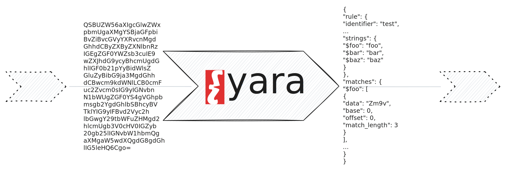

Executes YARA rules on byte streams.

```tql
yara rule:list<string>, [blockwise=bool, compiled_rules=bool, fast_scan=bool]
```

## Description

The `yara` operator applies [YARA](https://virustotal.github.io/yara/) rules to
an input of bytes, emitting rule context upon a match.



We modeled the operator after the official [`yara` command-line
utility](https://yara.readthedocs.io/en/stable/commandline.html) to enable a
familiar experience for the command users. Similar to the official `yara`
command, the operator compiles the rules by default, unless you provide the
option `compiled_rules=true`. To quote from the above link:

> This is a security measure to prevent users from inadvertently using compiled
> rules coming from a third-party. Using compiled rules from untrusted sources
> can lead to the execution of malicious code in your computer.

The operator uses a YARA *scanner* under the hood that buffers blocks of bytes
incrementally. Even though the input arrives in non-contiguous blocks of
memories, the YARA scanner engine support matching across block boundaries. For
continuously running pipelines, use the `blockwise=true` option that considers each
block as a separate unit. Otherwise the scanner engine would simply accumulate
blocks but never trigger a scan.

### `rule: list<string>`

The path to the YARA rule(s).

If the path is a directory, the operator attempts to recursively add all
contained files as YARA rules.

### `blockwise = bool (optional)`

Whether to match on every byte chunk instead of triggering a scan when the input
exhausted.

This option makes sense for never-ending dataflows where each chunk of bytes
constitutes a self-contained unit, such as a single file.

### `compiled_rules = bool (optional)`

Whether to interpret the rules as compiled.

When providing this flag, you must exactly provide one rule path as positional
argument.

### `fast_scan = bool (optional)`

Enable fast matching mode.

## Examples

The examples below show how you can scan a single file and how you can create a
simple rule scanning service.

### Perform one-shot scanning of files

Scan a file with a set of YARA rules:

```tql
load_file "evil.exe", mmap=true
yara "rule.yara"
```

:::note[Memory Mapping Optimization]
The `mmap` flag is merely an optimization that constructs a single chunk of
bytes instead of a contiguous stream. Without `mmap=true`,
[`load_file`](/reference/operators/load_file) generates a stream of byte chunks and feeds them
incrementally to the `yara` operator. This also works, but performance is better
due to memory locality when using `mmap`.
:::

Let's unpack a concrete example:

```yara
rule test {
  meta:
    string = "string meta data"
    integer = 42
    boolean = true

  strings:
    $foo = "foo"
    $bar = "bar"
    $baz = "baz"

  condition:
    ($foo and $bar) or $baz
}
```

You can produce test matches by feeding bytes into the `yara` operator.
You will get one `yara.match` per matching rule:

```json
{
  "rule": {
    "identifier": "test",
    "namespace": "default",
    "tags": [],
    "meta": {
      "string": "string meta data",
      "integer": 42,
      "boolean": true
    },
    "strings": {
      "$foo": "foo",
      "$bar": "bar",
      "$baz": "baz"
    }
  },
  "matches": {
    "$foo": [
      {
        "data": "Zm9v",
        "base": 0,
        "offset": 0,
        "match_length": 3
      }
    ],
    "$bar": [
      {
        "data": "YmFy",
        "base": 0,
        "offset": 4,
        "match_length": 3
      }
    ]
  }
}
```

Each match has a `rule` field describing the rule and a `matches` record
indexed by string identifier to report a list of matches per rule string.
