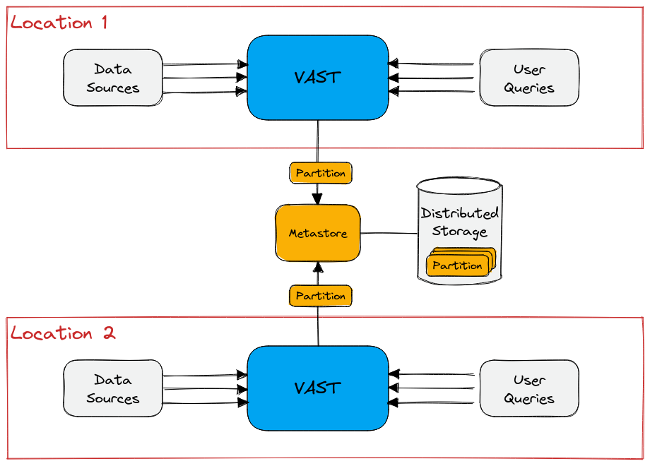

# Fault Tolerance

- **Status**: WIP
- **Created**: Sep 5, 2022
- **ETA**: Oct 5, 2022
- **Authors**:
  - [Tobias Mayer](https://github.com/tobim)
  - [Thomas Peiselt](https://github.com/dispanser)
  - [Matthias Vallentin](https://github.com/mavam)
- **Contributors**:
  - [Dominik Lohmann](https://github.com/dominiklohmann)
- **Discussion**: [PR #2562](https://github.com/tenzir/vast/pull/2562)

## Overview

This proposal discusses the theme of fault tolerance and proposes an
architectural solution to achieve a resilient system. We define *fault
tolerance* as the ability of a distributed system to continue functioning in the
event of a partial failure.

## Problem Statement

To date, VAST has no application-level mechanisms for achieving fault tolerance.
Prudent engineering practices help in avoiding catastrophic state corruption in
the face of crashes (e.g., all data is unreadable), but there exists no
principled architectural element that makes fault tolerance easy. Operators who
would like more reliability currently have no control over the degree of
redundancy in the system.

The scope of the problem becomes clearer when imposing three different views on
the system:

1. **Write Path**: Get data into the system
2. **Read Path**: Get data out of the system
3. **System Core**: The data "service" that sits between (1) and (2)

VAST's architecture lends itself already today to replicating and scaling the
write path. We would like to have a similar capability for the read path. But
most importantly, the system core deserves the most attention, as it is the
central component that maintains the internal state of VAST.

From a fault-tolerance perspective, the system core is the *catalog*, as it owns
all data and metadata. VAST stores data into partitions. Mutating operations
like compaction, rollup, or deletion of partitions must leave the catalog in an
internally consistent state. The catalog provides atomic functions for
insertion, replacement and removal of partitions to support this requirement.
The current implementation of the catalog is based on a custom in-memory store,
without support for distribution or replication. It is therefore not suitable
for environments with stronger fault tolerance requirements.

## Requirements

We can frame the requirements we are facing more generally in terms of the CAP
theorem. Given that availability is of utmost importance for processing security
data, we cannot compromise on it. On the contrary, we can compromise on
consistency, given that telemetry data is fundamentally incomplete. Security
analysts are always working with a subset of descriptions of activity, and
stitching together analytics based on partial knowledge is the norm. For this
reason, it makes sense to also prioritize availability when facing a network
partition.

Unlike a transactional RDBMS, the system expectations for our use case center
around *eventual consistency*. For example, it is acceptable for the system to
have slightly different knowledge about existing data, and thereby produce
slightly different query results in the short term, as long these discrepancies
consolidate eventually.

With respect to the system core, this implies that the catalog must support
transactions when processing partition operations. For example, a compaction
operation may remove N partitions and replace them with a new one. These
operations break down to a sequence of deletes, followed by an insert.

### Non-requirements

Infrastructure approaches for hardware redundancy are considered out of scope.
In particular, we do not consider fault tolerance at the storage layer. There
are many different ways to provide redundant storage, e.g., RAID storage,
distributed file systems or NAS. Cloud storage, like S3 or Azure blob storage,
are replicated three times, and adding an additional layer of fault tolerance on
top does not provide a lot of additional safety but considerably increases the
cost.

## Solution Proposal

The most important architectural effort concerns making the catalog a
fault-tolerant component. To this end, we propose to factor the logic that
operates on partition metadata into a dedicated **metastore** component. As a
first point of contact for queries, the catalog also keeps per-partition index
structures in memory. This catalog functionality is out of scope, as it
represents derived, immutable state from the metastore.

Adjacent fault-tolerance efforts outside the catalog scope involve replication
of components. For example, the failure domain of the read path is a single
query, which we can deploy in a dedicated operating system process (that extends
to a single cloud function or container execution). Likewise, we can isolate
failure domains on the write path by spawning each data source (or pipeline) in
its own process. This flexibility is a by-product of the actor model
architecture that treats internal components as microservices. The spectrum of
fate sharing is the OS process boundary. The choice highly depends on the
specifics of the deployment environment.

We briefly touch on how the mechanism for making the write and read path
resilient, and then focus the discussion on fault tolerance within the VAST
server node, specifically the catalog.

### Resilient Write Path

Data sources provide a stream of events. VAST parses them and bundles them into
units of partitions. Assuming that we can build a fault-tolerant catalog, the
problem of making the write path fault-tolerant reduces to ensuring exactly-once
processing semantics on the ingest stream.

If the circumstances require high-fidelity data acquisition, we can resort to an
external data plane with exactly-once processing stream semantics, such as
Apache Kafka. VAST must not acknowledge events from the data plane until having
received a confirmation that the corresponding partition is durable. In the
presence of a crash, VAST must restart from the last acknowledged position in
the stream.

Because security telemetry data is already lossy upstream (e.g., due to packet
loss or lacking instrumentation), operators are often willing to accept looser
guarantees. Therefore, we deem it sufficient to offer a mechanism that
implements interaction with a durable message bus.

### Resilient Read Path

The desired fault isolation domain of the read path is the individual query that
may crash or become a straggler. To date, VAST does not perform distributed
query execution, so we can consider a single query an atomic execution unit.
When a query fails, the remainder of the system remains unaffected if the query
ran in its own execution context. For example, a crashing cloud function will
not affect other running queries. But when VAST executes multiple queries in the
same server node, all queries exhibit fate sharing. We leave it to the operator
to decide what model works best for the scenario at hand.

Regardless of component distribution, the recovery of a failing query involves a
restart. We may consider snapshotting in the future, in case users demand more
fine-grained fault tolerance over longer-running queries.

### Resilient Metastore

We would like to treat the metastore of the catalog as a globally consistent
service. We propose to use a battle-tested implementation for this purpose, as
opposed to hand-rolling it ourselves.

Once a resilient metastore exists, we can deploy an arbitrary number of catalog
instances to achieve the desired level of redundancy.

### Case Studies

We now turn to deployment case studies to validate the architectural approach of
a fault-tolerant catalog. Furthermore, we assume that VAST has a resilient
write path, e.g., by reading data from Kafka. Consequently, faulty data sources
will not cause a global inconsistency and simply respawn upon failure. We also
assume that VAST has a resilient read path, assuming that downstream workloads
operate correctly when a query needs to restart. For example, when using the
system interactively during threat hunting, the analyst would get an error
instead of a result, causing them to resubmit the query.

This leaves the fault tolerance discussion to the scope of the catalog. The
following scenarios illustrate how this can work in practice.

#### Scenario: Single Deployment

In the scenario where VAST runs on an embedded appliance, potentially co-located
with visibility and detection providers (e.g., Zeek and Suricata sensors), there
exists a strong dependency on the hardware. We assume that operators have
configured their hardware in terms of redundancy according to the desired
cost-benefit spectrum, e.g., power, networking, or disk. We treat failure of any
of the core components as complete system failure. For example, if the network
interface dies, the machine is unreachable, which we treat as an entire system
failure.

No fault tolerance mechanism can work around an entire system failure. The only
requirement is that VAST crashes safely, without corrupting its existing state.
The resilient read/write path and metastore achieve this goal.

#### Scenario: Distributed Filesystem

If we extend the above scenario from a single system into a configuration where
storage remains outside the failure domain of the machine, we can build an
architecture for high availability.

We consider two approaches:

1. **Active-passive:** (or hot-spare) a redundant machine replaces the primary system that failed.
2. **Load sharing**: there exist multiple system instances that operate on the same metastore.

Option (1) falls into the high-availability (HA) category that requires
substantial involvement from operations, as it requires non-trivial
re-allocation of resources in realtime. It often provides a first-order solution
when the performance requirements are met.

When operators require higher degrees of reliability that goes beyond HA
failover, or when scaling out for performance reasons becomes a necessity, we
need to consider option (2) with a distributed operation of VAST. In this case,
we treat the metastore of the catalog as a _shared service_ between multiple
VAST nodes.

In the above diagram, both VAST nodes serve as a valid entry point for data, as
well as queries. If one location fails, the other remains fully operational.
This architecture scales beyond two locations, with the metastore remaining the
bottleneck. Therefore, finding a high-performance and scalable metastore is of
essence.

#### Example: Load-based Scaling

When VAST is deployed on top of an auto scaling engine, like Kubernetes or
Nomad, we naturally model the components that are concerned with read and write
paths into separate scaling groups. In this scenario new instances come and go
depending on demand. The elasticity of the write side is automatically handled
with the architecture, because there is no data sharing between writing
instances, and the multiple ingest problem is handled in the same way as for the
other scenarios.

For the read side we need the ability to start additional nodes quickly, which
adds the requirement for a quick resynchronization ability to the metastore.

The most extreme variant of this scenario would be to create a dedicated
instance for each query, which can be realized on top of serverless
architectures such as AWS Lambda or Azure Cloud Functions. However, for systems
with an at-least medium query rate we recommend to use longer-running read nodes
to exploit IO synergies and in-memory caches.

## Implementation

We briefly touch on the implementation of write and read path, before dedicating
the majority of attention to the metastore

### Write Path

To achieve fault-tolerance on the write path, we need an acknowledgement
mechanism to confirm whether events at the source have been successfully
processed. The current architecture looks as follows:

We are assuming that we can begin with reading from a reliable medium that
supports an indexed stream of events, such as Apache Kafka. If no such data
acquisition mechanism is available, we may consider a local disk buffer to
emulate a reliable medium. For this proposal, working around an unreliable data
transport channel is out of scope.

A transaction that writes one or more partitions needs to store additional
metadata, containing the offsets this partition is based on. This atomic commit
of both the transaction and its source position allows the source to pick up
exactly at the point of failure, without risk of re-ingesting twice or missing
any events. It thus provides exactly-once semantics for our write path.

In technical terms, we can extend the CAF Streaming message type to include a
handle to the source and source specific position, and then trigger an ACK once
the data has been persisted. VAST already implements a similar mechanism today
that acknowledges when events arrived at an active partition, which (almost)
guarantees that they are queryable.

When an exising source reconnects to an index component after a fault, it
needs to request the most recently acknowlegded source position from the
catalog and advance to the returned position to prevent double ingestion.

### Read Path

For historical queries, we can achieve fault-tolerance on the read part by
moving query execution into a dedicated process. This requires that the catalog
is the sole owner of partitions, and that the catalog returns the set of
candidate partitions relevant to answer a query.

Live queries bypass the catalog and would therefore need to implement ACK'ing
independently, at the granularity of table slices. We do not cover this process
in detail, as it constitutes a subset of the ACK'ing for the write path outlined
above.

### Metastore

The metastore primarily stores the state of partition data. We restrict our
analysis to this use case. From the perspective of the catalog, the metastore
API should expose itself as an actor that encapsulates the implementation
details. This actor can rely on VAST's plugin architecture to implement the
metastore-specific integration.

#### Request-Response API

The catalog requires the following interface from the metastore:

1. `get: [uuid] → [partition]`
2. `add: [partition] → ACK`
3. `delete: [uuid] → ACK`
4. `replace: [uuid], [partition] → ACK`

The semantics of the mentioned types are as follows:

- `partition`: metadata about a partition, such as its URL and its schema.
- `uuid`: a globally unique identifier for a partition.
- `ACK`: a confirmation about an action.

The semantics the function signatures are as follows:

1. `get`: retrieves a list of `partition` objects corresponding one-to-one to
   the requested list of partition UUIDs.

2. `add`: registers a list of new partitions.

3. `delete`: removes a list of partition from the metastore (doesn't delete the
   underlying data)

4. `replace`: performs an atomic deletion and addition of partition data, by
   deleting the given UUIDs and adding new partition metadata.

In theory, the functionality of `replace` is a superset of `add` and `delete`.
For ease of exposition, we kept them as separate API functions.

#### Subscription API

The metastore must also expose a subscription mechanism to hook into the feed of
updates, such that the catalog can learn about new partitions from other catalog
instances.

Once a catalog learns about a new partition, it will load its sketches so that
they become available for querying.

Given these requirements, we briefly looked at the following systems with regard
to their suitability.

#### Candidates

##### FoundationDB

FoundationDB (FDB) is a distributed key-value store which supports composing
sets of read and write operations into atomic transactions. It also supports
single-key watches.

Unfortunately there is no way to hook into a feed of all committed transactions,
so a layer for the CDC requirement must be implemented on top of the primitive
operations. This could be implemented by writing the transaction log into a
separate key space and keeping a dedicated key that counts the transactions to
be watched by all participants. Whenever the watch triggers on a node it can
consume the latest updates to synchronize the local representation of the state.
The original key space that tracks the set of existing partitions would only
serve to verify the validity of the transaction on request.

To get a feel for the system, we briefly experimented with mapping our API to
FDB primitives. We found the following:

* Transactions are “all or nothing”, i.e., you can sequence multiple operations,
  and if you commit and it goes through, they are all applied, otherwise rolled
  back.

* Multiple transactions that modify (read to or write from) the same key are not
  forbidden, even if they overlap - to enable our use case, we’d have to verify
  the existence of all the partitions we intend to delete, followed by doing all
  the (SET, CLEAR) operations OR rollback / cancel the transaction.

* While this strategy allows for serializing the transactions into a
  conflict-free state, it does not help with each VAST node "seeing the full
  picture", i.e., being aware of the transactions that are triggered from within
  other VAST nodes.

* There doesn’t seem to be a full CDC (change data capture) functionality, only
  watching single keys - there could be a key for a "transaction_id" (an integer
  increment for every transaction), and from there we could work around the
  problem by requesting all recent transactions whenever this key is modified.

##### etcd

Etcd is a distributed key-value store that uses Raft for quorum-based consensus.
From a CAP theorem perspective, this brings us into the CP realm, because a
master must be elected to perform writes. Stale reads may be supported, though,
which we can tolerate.

Here are some incomplete notes of taking a first look:

- Multi-write transactions are shaped like if-then-else statements, they always
  have a comparison, a list of writes on success and a list of writes on failure

- Watches are possible on single keys and prefixes in the key-space, which would
  allow us to model our use-case naturally. Importantly, key updates are
  streamed to the client, allowing a gap-free observation of changes in the
  key-space.

- Etcd comes with a gRPC API, making it easy to embed for us. We're already
  depending on gRPC transitively via Apache Arrow (cf. Flight).

- An official C++ client library exists:
  https://github.com/etcd-cpp-apiv3/etcd-cpp-apiv3.

##### Consul

Consul is a service discovery and distributed configuration system that contains
a distributed key-value store (consul KV). Apart from the bare key-value store
it also provides service mesh, traffic management, and service to service
encryption. For the use case at hand we identified the following relevant
properties:

- The only way to interact with a Consul service is through an HTTP API, meaning
  there would be some overhead for each transaction. This also means that we
  would have to use HTTP long polling to observe changes on a specific key.

- Transactions are supported with a dedicated API endpoint
  (https://developer.hashicorp.com/consul/api-docs/txn). Failure conditions have
  to be modeled into a key-specific `index` variable, which is less flexible
  compared to the predicate interface of FoundationDB.

- A `get-tree` operation is available and would allow efficient joining of a new
  node to an existing cluster.

- A seemingly maintained third party client library with the relevant features
  exists: https://github.com/oliora/ppconsul. The relevant transaction API is
  supported.

- While it is possible to add run a blocking query to a single key or a prefix,
  such a query has to be re-registered after every return. If multiple changes
  have been applied before the new query is registered the client misses
  updates. We can not observe changes in the key space directly, only the
  current values. That means modeling a change feed as desired requires a custom
  protocol.

##### Native Raft

Instead of depending on etcd, we may consider our own actor-based Raft
implementation. In this case, Raft would be a frontend for a key-value store
that supports the desired transactional operations natively.

The shape of a metastore would be dedicated CAF service that VAST can speak
natively to. Not every VAST node should include a Raft metastore, as a typical
number of Raft nodes remains in the single digits. That is, multiple VAST nodes
share a single metastore. We would need at least 3 Raft instances to obtain a
quorum majority when 1 node fails, 5 Raft nodes to tolerate 2 node failures.

VAST already had a
[working-albeit-minimal](https://github.com/tenzir/vast/pull/926) implementation
in the past that we removed, given that we didn't need the functionality at the
time. There are some [open questions on composability of log and state
machine](https://groups.google.com/g/raft-dev/c/O80OSWrQieo) that we should
revisit.

#### Recommendation

As of our current understanding etcd and the home grown Raft implementation
match the requirements most closely. Of those two etc is the mature product
which has been hardened and improved over many years of heavy use. For that
reason **we recommend etcd for the backend** of the fault tolerant catalog.

## Alternatives

### Autonomous Neighbors

The catalog component could be extended with a bespoke replication mechanism to
track the state update of all other catalogs in the same cluster. A recovering
node would receive a delta of the updates that it missed during downtime to
synchronize with its peers.

The advantage of doing this in the application layer is that it could naturally
extend from the metadata to the data plane, freeing VAST from the dependency on
a distributed storage layer.

This idea has two major drawbacks: It would complicate the API surface of the
catalog component and require far-reaching refactorings in many client
components. Additionally, the difficulty in designing and implementing a correct
resynchronization protocol is not to be underestimated.

## Annex

### A1: Considerations Regarding the Persistence Layer as a Shared Component

As partitions are identified by UUID we consider the write end mostly
conflict-free. In case a name clash happens anyways the filesystem abstraction
can just reject one of the writes, this problem can be solved client side by
renaming the partition. As all this happens before insertion into the metastore
it isn't observable for queries.

However, the question of when to actually delete data from persistent storage is
not trivial to answer. As discussed above we want to introduce mandatory
synchronization for each store listing. The thus-far favored approach of an
in-memory copy of the metastore state will lag behind a bit, and the states are
necessarily skewed across multiple nodes as well.

Ideally, a partition shall be removed from persistent storage when it is not
reachable from any node any more.

Deletions are executed with a delay after the transaction was ACK'ed. The
deletion would be triggered from the metastore that submitted the transaction,
on whichever node it lives.

This approach introduces a new tuning knob, namely the duration of the delay
before the deletion takes place on disk.
