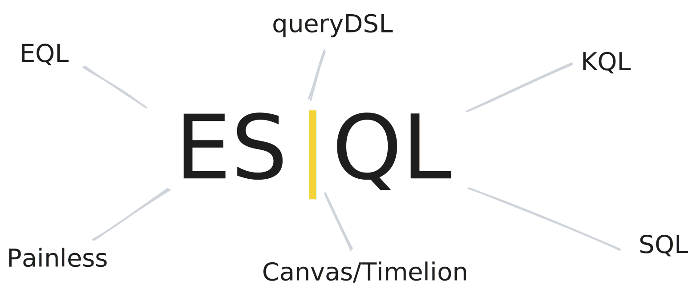

Elastic [just released][esql-blog] their new pipeline query language called
**ES|QL**. This is a conscious attempt to consolidate the language zoo in the
Elastic ecosystem
([queryDSL](https://www.elastic.co/guide/en/elasticsearch/reference/current/query-dsl.html),
[EQL](https://www.elastic.co/guide/en/elasticsearch/reference/current/eql.html),
[KQL](https://www.elastic.co/guide/en/kibana/current/kuery-query.html),
[SQL](https://www.elastic.co/guide/en/elasticsearch/reference/current/xpack-sql.html),
[Painless](https://www.elastic.co/guide/en/elasticsearch/reference/current/modules-scripting-painless.html),
[Canvas/Timelion](https://www.elastic.co/guide/en/kibana/current/timelion.html)).
Elastic said that they worked on this effort for over a year. The
[documentation][esql-docs] is still sparse, but we still tried to read between
the lines to understand what this new pipeline language has to offer.

[esql-blog]: https://www.elastic.co/blog/elasticsearch-query-language-esql
[esql-docs]: https://esql-latest.docs-preview.app.elstc.co/guide/en/elasticsearch/reference/master/esql.html



<!--truncate-->

The reason why we are excited about this announcement is because we have *also*
designed and implemented a pipeline language over the past 8 months that we just
[launched at BlackHat](/blog/introducing-tenzir-security-data-pipelines). First,
we see the release of ES|QL as a confirmation for pipeline model. In our [blog
post about Splunk's Search Processing Language
(SPL)](/blog/tenzir-for-splunk-users), we briefly mentioned why SQL might not be
the best choice for analysts, and why thinking about one operator at a time
provides an easier user experience. Second, we'd like to look under the hood of
ES|QL to compare and reflect on our own [Tenzir Query Language
(TQL)](/language).

## Walk-through by Example

So, ES|QL, how does it feel?

```
  FROM employees
| EVAL hired_year = TO_INTEGER(DATE_FORMAT(hire_date, "YYYY"))
| WHERE hired_year > 1984
| STATS avg_salary = AVG(salary) BY languages
| EVAL avg_salary = ROUND(avg_salary)
| EVAL lang_code = TO_STRING(languages)
| ENRICH languages_policy ON lang_code WITH lang = language_name
| WHERE NOT IS_NULL(lang)
| KEEP avg_salary, lang
| SORT avg_salary ASC
| LIMIT 3
```

This syntax reads very straight-forward. Splunk users will immediately grasp
what it does, as there is a remarkable similarity in operator naming. Let's go
through each pipeline operator individually:

- [`FROM`][esql-from] generates a table with up to 10k rows from a data stream,
  index, or alias. We asked ourselves why there is a hard-baked 10k limit?
  Shouldn't that be the job of [`LIMIT`][esql-limit]? The limit feels a
  technical limitation rather than a conscious design decision. In TQL, we have
  unbounded streams but also follow the single responsibility principle: one
  operator has exactly one job.
- [`EVAL`][esql-eval] appends new or replaces existing columns. We named this
  operator [`extend`](/operators/transformations/extend) because we found the
  Splunk-inspired command name "eval" too generic for this use case.[^1]
- [`WHERE`][esql-where] filters the input with an expression. We have the same
  [`where`](/operators/transformations/where) in TQL.
- [`STATS`][esql-stats] groups its input via `BY` and applies aggregation
  functions on select fields of each group.  Elastic went with Splunk
  nomenclature for this central operation, perhaps also to make the transition
  from Splunk to Elastic as easy as possible.
- [`ENRICH`][esql-enrich] adds data from existing indexes. It's effectively a
  join operation, and the `ON` keywords makes it possible to select the join
  field. Interestingly, the word "join" doesn't appear on the documentation. We
  hypothesize that this was a conscious choice, as a database join may feel
  intimidating for beginning and intermediate users.
- [`KEEP`][esql-keep] selects a set of columns from the input and drops all
  others. It is the inverse of [`DROP`][esql-drop]. In TQL, we call these
  projection operators [`select`](/operators/transformations/select) and also
  [`drop`](/operators/transformations/drop).
- [`SORT`][esql-sort]
  sorts rows by one or more fields. `SORT height DESC, first_name ASC` sorts the
  field `height` in descending order and the field `first_name` in ascending
  order. The syntax of our [`sort`](/operators/transformations/sort) is
  identical. Controlling the position of null values works with `NULLS FIRST`
  and `NULLS LAST`. In TQL, we went Kusto-like with `nulls-first` and
  `nulls-last`.
- [`LIMIT`][esql-limit] restricts the number of output rows. In TQL, we have
  [`head`](/operators/transformations/head) and
  [`tail`](/operators/transformations/tail) for this purpose.

[esql-from]: https://esql-latest.docs-preview.app.elstc.co/guide/en/elasticsearch/reference/master/esql-from.html
[esql-eval]: https://esql-latest.docs-preview.app.elstc.co/guide/en/elasticsearch/reference/master/esql-eval.html
[esql-where]: https://esql-latest.docs-preview.app.elstc.co/guide/en/elasticsearch/reference/master/esql-where.html
[esql-stats]: https://esql-latest.docs-preview.app.elstc.co/guide/en/elasticsearch/reference/master/esql-stats-by.html
[esql-enrich]: https://esql-latest.docs-preview.app.elstc.co/guide/en/elasticsearch/reference/master/esql-enrich.html
[esql-keep]: https://esql-latest.docs-preview.app.elstc.co/guide/en/elasticsearch/reference/master/esql-keep.html
[esql-drop]: https://esql-latest.docs-preview.app.elstc.co/guide/en/elasticsearch/reference/master/esql-drop.html
[esql-sort]: https://esql-latest.docs-preview.app.elstc.co/guide/en/elasticsearch/reference/master/esql-sort.html
[esql-limit]: https://esql-latest.docs-preview.app.elstc.co/guide/en/elasticsearch/reference/master/esql-limit.html
[^1]: We took the name `extend` from Kusto. In general, we find that Kusto has
    very self-descriptive operator names. During the design of TQL, we compared
    many different languages and often favored Kusto's choice of name.

## Sources, Transformations, ... but Sinks?

ES|QL differentiates two types of commands (which we call *operators* in TQL):

1. [Source commands](https://esql-latest.docs-preview.app.elstc.co/guide/en/elasticsearch/reference/master/esql-source-commands.html)
2. [Processing commands](https://esql-latest.docs-preview.app.elstc.co/guide/en/elasticsearch/reference/master/esql-processing-commands.html)

In TQL, an operator is a *source*, a *transformation*, or a *sink*. Some
operators can be of multiple categories, like
[`shell`](/operators/sources/shell).

Maybe this is still coming, but ES|QL doesn't appear to offer sinks. We
hypothesize that users should consume pipeline output uniformly as JSON through
a REST API.

## Syntax

Syntactically, the [ES|QL language][esql-syntax] is similar to TQL. The
following points stood out:

[esql-syntax]: https://esql-latest.docs-preview.app.elstc.co/guide/en/elasticsearch/reference/master/esql-syntax.html

- The `|` (pipe) symbol separates commands that describe the dataflow.
- Comments work as in C++: `//` for single line and `/*` and `*/` for multi-line
  comments.
- Expressions can occur in `WHERE`, `STATS`, and other commands. The following
  relational operators exist:
  - Arithmetic comparisons via `<`, `<=`, `==`, `>=`, `>`
  - Set membership via `IN`
  - Glob-like wildcard search via `LIKE`
  - Regular expressions via `RLIKE`
- Date-time literals make it easier to express dates (`seconds`, `hours`, etc.)
  and timespans (e.g., `1 day`). We found that expressing numeric values across
  multiple orders of magnitude is common, e.g., when dealing with GBs. This is
  why we also offer SI literals in TQL, allowing you to write large numbers as
  `1 Mi` or `1 M`.
- ES|QL features multiple scalar [functions][esql-funcs].
  that perform value-to-value transformations. Functions can occur in `ROW`,
  `EVAL`, and `WHERE`.
- Similarly, [aggregation functions][esql-agg-funcs] perform a vector-to-scalar
  transformation per group in `STATS`.

[esql-funcs]: https://esql-latest.docs-preview.app.elstc.co/guide/en/elasticsearch/reference/master/esql-functions.html
[esql-agg-funcs]: https://esql-latest.docs-preview.app.elstc.co/guide/en/elasticsearch/reference/master/esql-agg-functions.html

## Engine

ES|QL comes with its own executor, i.e., it's not transpiled into any of the
existing engines. A running pipelines is a *task* and there exists an
[API][esql-api] for querying their state, which may return something like:

[esql-api]: https://esql-latest.docs-preview.app.elstc.co/guide/en/elasticsearch/reference/master/esql-task-management.html

```json
{
  "node" : "2j8UKw1bRO283PMwDugNNg",
  "id" : 5326,
  "type" : "transport",
  "action" : "indices:data/read/esql",
  "description" : "FROM test | STATS MAX(d) by a, b",
  "start_time" : "2023-07-31T15:46:32.328Z",
  "start_time_in_millis" : 1690818392328,
  "running_time" : "41.7ms",
  "running_time_in_nanos" : 41770830,
  "cancellable" : true,
  "cancelled" : false,
  "headers" : { }
}
```

## Data Model

The concept of [multi-valued fields][esql-mv-fields] exists to bridge the world
between JSON records and 2D tables. This shows the heritage of the type system,
which evolved from document stores as opposed to structured data stores. In
document land, every record may have a different shape (or schema). The term
*multi-valued* effectively means *list*, e.g., `[1, 2, 3]`.

[esql-mv-fields]: https://esql-latest.docs-preview.app.elstc.co/guide/en/elasticsearch/reference/master/esql-multivalued-fields.html

Noteworthy:

- The order of multi-valued fields is undefined.
- It's possible to impose set semantics by using the `keyword` type. Specifying
  this type causes duplicate removal on ingest.
- Other types, like `long`, do not cause removal of duplicates on ingest.

The output is still semi-structured in that listness is something dynamic on a
per-value basis. Consider this output:

```json
{
  "columns": [
    { "name": "a", "type": "long"},
    { "name": "b", "type": "long"}
  ],
  "values": [
    [1, [1, 2]],
    [2,      3]
  ]
}
```

The column `b` has the list value `[1, 2]` in the first row and `3` in the
second. In a strict type system (like TQL), the type of `b` could be
`list<long>` but then the second row would have value `[3]` instead of `3`. Sum
types (called `union` or `variant` in many languages) are another way to
represent heterogeneous data as in the above example. If we described `b` with
the type `union<long, list<long>>` instead of `long`, then it would be perfectly
fine for `b` to take one value `[1, 2]` in one row and `3` in another.

For TQL, we built our data model on top of data frames. We express structure in
terms of *records* and *lists*, and arbitrarily nested combinations of them. It
would be up the user to define set semantics that ensures unique values. We
consider adding such a set type in the future (possible as type constraint or
attribute) as we gain more complete support of the underlying Arrow type system.
Similarly, we plan on adding sum types in the future.

## Summary

The release of ES|QL witnesses a current trend of convergence in terms of query
languages. The pipeline concept now exists for several decades. Splunk was the
first company to successfully commercialize this interface with SPL, but today
there are many players in the market that have a similar language. Microsoft
open-sourced their Kusto language, and we see other vendors embedding it into
their products, such as Cribl Search. Most SIEM vendors also have their own
inhouse pipeline language.

The data ecosystem has numerous languages for advanced users to offer, such as
[dplyr](https://dplyr.tidyverse.org/), [jq](https://stedolan.github.io/jq/),
[pandas](https://pandas.pydata.org/), and [polars](https://www.pola.rs/). And
new ones are mushrooming everywhere, e.g., [PRQL](https://prql-lang.org/),
[Zed](https://zed.brimdata.io/).

With our own TQL, we seek to bridge the data and security analytics world, by
offering an intuitive language that is easy to grasp, but that internally maps
to vectorized execution on top of data frames that can be easily shared with other
runtimes.

If you want to look deeper at ES|QL, check out the branch
[`feature/esql`][esql-branch]. Find something interesting about pipelines to
discuss? Swing by our [Discord](/discord) and start a conversation.

[esql-branch]: https://github.com/elastic/elasticsearch/tree/feature/esql/x-pack/plugin/esql
