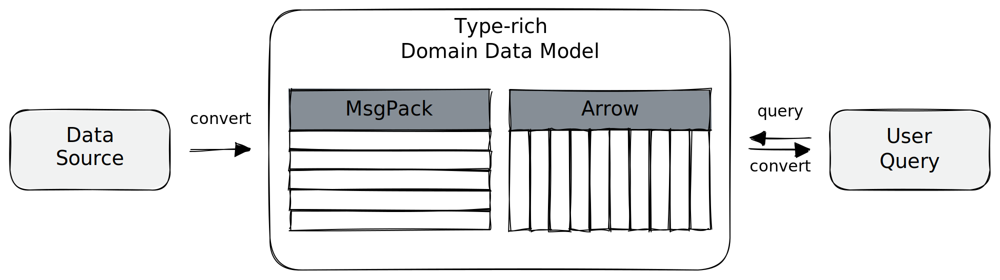
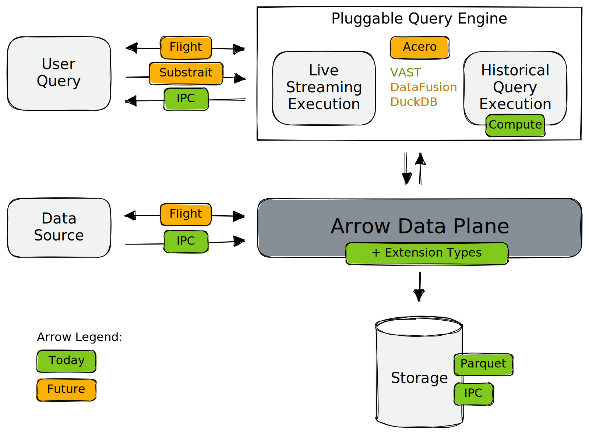

# Apache Arrow as Platform for Security Data Engineering

VAST bets on [Apache Arrow][arrow] as the open interface to structured data. By
"bet," we mean that VAST does not work without Arrow. And we are not alone.
Influx's [IOx][iox], DataDog's [Husky][husky], Anyscale's [Ray][ray],
[TensorBase][tensorbase], and [others][arrow-projects] committed themselves to
making Arrow a corner stone of their system architecture. For us, Arrow was not
always a required dependency. We shifted to a tighter integration over the years
as the Arrow ecosystem matured. In this blog post we explain our journey of
becoming an Arrow-native engine.

[arrow]: https://arrow.apache.org
[iox]: https://github.com/influxdata/influxdb_iox
[husky]: https://www.datadoghq.com/blog/engineering/introducing-husky/
[ray]: https://github.com/ray-project/ray
[tensorbase]: https://github.com/tensorbase/tensorbase
[arrow-projects]: https://arrow.apache.org/powered_by/

<!--truncate-->

Today, the need to bring advanced security analytics and data engineering
together is stronger than ever, but there is a huge gap between the two fields.
We see Arrow as the vehicle to close this gap, allowing us developers to
practice *security data engineering* to make security analytics easy for users.
That is, the experience should allow experts to interact with the data in the
security domain, end-to-end without context switching. To achieve this, we began
our journey with VAST by developing a data model for structured security
telemetry. Having worked for a decade with the [Zeek][zeek] (fka. Bro) network
security monitor, we understood the value of having first-class support for
domain-specific entities (e.g., native representation of IPv4 and IPv6
addresses) and type-specific operations (e.g., the ability to perform top-k
prefix search to answer subnet membership queries). In addition, the ability to
embed domain semantics with user-defined types (e.g., IP addresses, subnets, and
URLs) was central to expressing complex relationships to develop effective
analytical models. It was clear that we needed the domain model deep in the core
of the system to successfully support security analytics.

After having identified the data model requirements, the question of
representation came next. At first, we unified the internal representation with
a row-oriented representation using [MsgPack][msgpack], which comes with a
mechanism for adding custom types. The assumption was that a row-based data
representation more closely matches typical event data (e.g., JSONL) and
therefore allows for much higher processing rates. Moreover, early use cases of
VAST were limited to interactive, multi-dimensional search to extract a subset
of *entire* records, spread over a longitudinal archive of data. The
row-oriented encoding worked well for this.

But as security operations were maturing, requirements extended to analytical
processing of structured data, making a columnar format increasingly beneficial.
After having witnessed first-hand the early commitment of [Ray][ray] to Arrow,
we started using Arrow as optional dependency as additional column-oriented
encoding. We abstracted a batch of data encoding-independent behind a "table
slice":

Hiding the concrete encoding behind a cell-based access interface worked for
low-volume use cases, but backfired as we scaled up and slowed us down
substantially in development. We needed to make a choice. This is where timing
was right: our perception of the rapidly evolving Arrow ecosystem changed.
Arrow-based runtimes were mushrooming all over the place. Nowadays it requires
only a few lines of code to integrate Arrow data into the central logic of
applications. We realized that the primary value proposition of Arrow is to
*make data interoperability easy*.

But data interoperability is only a sufficient condition for enabling
sustainable security analytics. The differentiating value of a *security* data
platform is support for the *security* domain. This is where Arrow's [extension
types][extension-types] come into play. They add *semantics* to otherwise
generic types, e.g., by telling the user "this is a transport-layer port" and
not just a 16-bit unsigned integer, or "this is a connection 4-tuple to
represent a network flow" instead of "this is a record with 4 fields of type
string and unsigned integer". Extension types are composable and allow for
creating a rich typing layer with meaningful domain objects on top of a
standardized data representation. Since they are embedded in the data, they do
not have to be made available out-of-band when crossing the boundaries of
different tools. Now we have self-describing security data.

Interoperability plus support for a domain-specific data model makes Arrow a
solid *data plane*. It turns out that Arrow is much more than a standardized
data representation. Arrow also comes with bag of tools for working with the
standardized data. In the diagram below, we show the various Arrow pieces that
power the architecture of VAST:

In the center we have the Arrow data plane that powers other parts of the
system. Green elements highlight Arrow building blocks that we use today, and
orange pieces elements we plan to use in the future. There are several aspects
worth pointing out:

1. **Unified Data Plane**: When users ingest data into VAST, the
   parsing process converts the native data into Arrow. Similarly, a
   conversation boundary exists when data leaves the system, e.g., when a user
   wants a query result shown in JSON, CSV, or some custom format. Source and
   sink data formats are [exchangeable
   plugins](/docs/VAST%20v3.0/understand/architecture/plugins).

2. **Read/Write Path Separation**: one design goal of VAST is a strict
   separation of read and write path, in order to scale them independently. The
   write path follows a horizontally scalable architecture where builders (one per
   schema) turn the in-memory record batches into a persistent representation.
   VAST currently has support for Parquet and Feather.

3. **Pluggable Query Engine**: VAST has live/continuous queries that simply run
   over the stream of incoming data, and historical queries that operate on
   persistent data. The harboring execution engine is something we are about to
   make pluggable. The reason is that VAST runs in extremely different
   environments, from cluster to edge. Query engines are usually optimized for a
   specific use case, so why not use the best engine for the job at hand? Arrow
   makes this possible. [DuckDB][duckdb] and [DataFusion][datafusion] are great
   example of embeddable query engines.

4. **Unified Control Plane**: to realize a pluggable query engine, we also need
   a standardized control plane. This is where [Substrait][substrait] and
   [Flight][flight] come into play. Flight for communication and Substrait as
   canonical query representation. We already experimented with Substrait,
   converting VAST queries into a logical query plan. In fact, VAST has a "query
   language" plugin to make it possible to translate security content. (For
   example, our [Sigma plugin][sigma-plugin] translates [Sigma rules][sigma]
   into VAST queries.) In short: Substrait is to the control plane what Arrow is
   to the data plane. Both are needed to modularize the concept of a query
   engine.

Making our own query engine more suitable for analytical workloads has
received less attention in the past, as we prioritized high-performance data
acquisition, low-latency search, in-stream matching using [Compute][compute],
and expressiveness of the underlying domain data model. We did so because VAST
must run robustly in production on numerous appliances all over the world in a
security service provider setting, with confined processing and storage where
efficiency is key.

Moving forward, we are excited to bring more analytical horse power to the
system, while opening up the arena for third-party engines. With the bag of
tools from the Arrow ecosystem, plus all other embeddable Arrow engines that are
emerging, we have a modular architecture to can cover a very wide spectrum of
use cases.

[compute]: https://arrow.apache.org/docs/VAST%20v3.0/cpp/compute.html
[extension-types]: https://arrow.apache.org/docs/VAST%20v3.0/format/Columnar.html#extension-types
[flight]: https://arrow.apache.org/docs/VAST%20v3.0/format/Flight.html
[substrait]: https://substrait.io/
[datafusion]: https://arrow.apache.org/datafusion/
[msgpack]: https://msgpack.org/index.html
[duckdb]: https://duckdb.org/
[sigma]: https://github.com/SigmaHQ/sigma
[sigma-plugin]: /docs/VAST%20v3.0/understand/language/frontends/sigma
[zeek]: https://zeek.org
