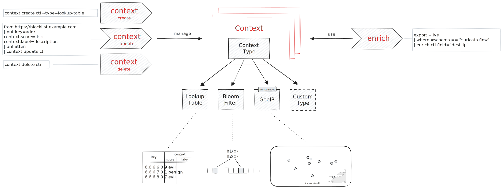
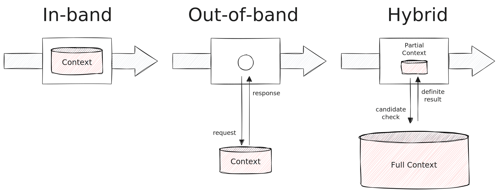
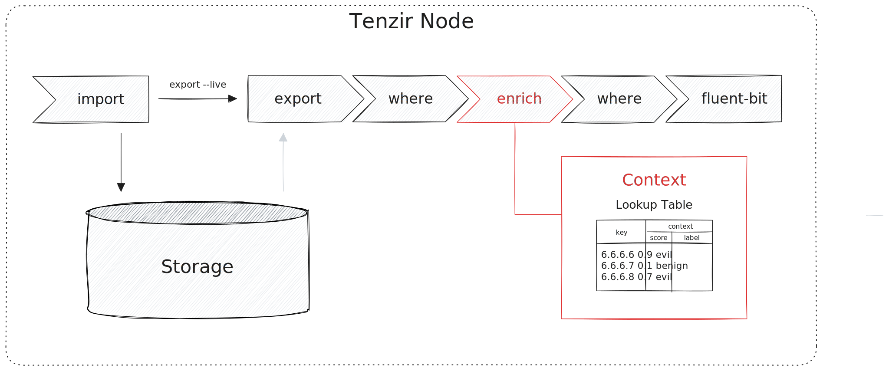

How would you create a contextualization engine? What are the essential building
blocks? We asked ourselves these questions after studying what's out there and
built from scratch a high-performance contextualization framework in Tenzir.
This blog post introduces this brand-new framework, provides usage examples, and
describes how you can build your own context plugin.



<!--truncate-->

This is the second post of the our contextualization series. If you haven't read
the first post, go check it out and learn [how Splunk, Elastic, and Sentinel
support contextualization](/blog/enrichment-complexity-in-the-wild).

## Requirements

After studying how others tackle the enrichment use case and talking to numerous
practitioners in the SecOps community, we went to the drawing board to identify
what we really need.

1. **Dynamic context state updates**. In security, we're especially interested
   in use cases where the enrichment context is dynamic and changes over time.
   For example, the threat landscape is often represented in the form of
   observables, IoCs, or TTPs. Their utility quickly decays over time. Many
   indicators are only useful for a couple of days, as attacker infrastructure
   can be ephemeral and change rapidly. As a result, we need the ability to
   change our context state to keep a useful representation.

2. **Decoupled context management and use**. Conceptually, a context has a write
   path to update its state, and a read path access its state. These two paths
   operate independently and its the job of the context to coordinate access to
   its shared state so that reads and writes do not conflict.

3. **Flexible notions of context type**. Most systems out there treat enrichment
   as a join that brings two tables together. But what about Bloom filters? And
   ML model inference? What about API calls? Or custom libraries that shield a
   context? We're not always enriching with just a table, but many other types
   of context. Hence we need a dedicated abstraction what constitutes a context.

A corollary of (3) is that we would like to support various *lookup modes*:



We define these lookup modes as follows:

1. **In-band**. The context data is colocated with the dataflow where it should
   act upon. This is especially important for high-velocity dataflows where
   there's a small time budget to perform an enrichment . For example, we've
   seen network monitors like Zeek and Suricata links produce structured logs at
   250k EPS, which would mean that enrichment cannot take more than 4
   microseconds per event.
2. **Out-of-band**. The context data is far away from the to-be-contextualized
   dataflow. We encounter this mode when the context is intellectual property,
   when the context state is massive and maintenance is complex,  or when it's
   created on-the-fly based on request by a service. A REST API is the most
   common example.
3. **Hybrid**. When both performance matters and state is not possible to ship
   to the contextualization point itself, then a hybrid approach can be a viable
   middle ground. [Google Safe Browsing][safebrowsing] is an example of this
   kind, where the Chrome browser keeps a subset of context state that
   represents threat actor URLs in the form of partial hashes, and when a users
   visits a URL where a partial match occurs, Chrome performs a candidate check
   using an API call. More than 99% of checked URLs never make it to the remote
   API, making this approach scalable. Note that the extra layer of hashing also
   protects the privacy of the entity performing the context lookup.

[safebrowsing]: https://security.googleblog.com/2022/08/how-hash-based-safe-browsing-works-in.html

## The Tenzir Contextualization Framework

As principled engineers, we took those requirements to the drawing board and
built a solution that meets all of them. Two foundations of the Tenzir
architecture made it possible to arrive at an elegant solution that results in a
simple yet powerful user experience : (1) a pipeline-based data flow model, and
(2) the ability to manage state at continuously running Tenzir nodes. Let's walk
through a typical use case that explains the building blocks.

:::info Example Scenario
During a compromise assessment, the security engineer Pada Wan is tasked with
finding out whether the constituency  performs any connections to known
command-and-control servers. As an intelligence-driven trained mind, Pada
identifies that  threat actors targeting the constituency use the malware
families Dridex, Heodo (aka Emotet), TrickBot, QakBot (aka QuakBot / Qbot) and
BazarLoader (aka BazarBackdoor). Pada then finds the OSINT feed [Feodo
Tracker](https://feodotracker.abuse.ch/) that tracks attacker infrastructure of
these malware families.

The organization uses a combination of Zeek and Suricata to monitor their
networks. Pada now wants to leverage flow logs to identify possible connections
to botnets. How do they bring the Feodo data to the network logs?

Pada, follwing first principles, remembers: *"Through a pipeline strong and wise,
safe the constituency will stay, hmm."*
:::

### Create a context

Let's first create a **context** instance. This requires a running Tenzir node.

```
context create feodo --type=lookup-table
```

The `context` operator manages context instances. The **context type** here is
`lookup-table`, which is a key-value mapping where the key is used to perform
the context lookup and the value can be any structured additional data.

### Populate the context

Next we fill the context with the contents of the Feodo blocklist:

```
load https://feodotracker.abuse.ch/downloads/ipblocklist_recommended.json
| parse json
| context update feodo
```

This outputs:

```json
{"to": "do"}
```

The result means that XXX entries have been added successfully to the context
in. We can always inspect existings contexts using `shows contexts`:

```
show contexts
| where #schema == "tenzir.context.lookup-table"
| yield entries[]
```

### Use the context

We've now preloaded the context and can use it in any other pipeline. As we're
in a compromise assessment as example, we're interested in a realtime view of
the network traffic. So we'd like to hook the feed of all flow logs streaming
into a Tenzir node:

```
export --live
| where #schema == "suricata.flow"
| enrich feodo key=dest_ip
| where key != null
| fluent-bit slack webhook=IR_TEAM_SLACK_CHANNEL_URL
```

This pipeline hooks into the full feed using [`export
--live`](/operators/sources/export), selects the Suricata flow events using
[]`where`](/operators/transformations/where), and pushes that subset through
`feodo` context using the [`enrich`](/next/operators/transformations/enrich)
operator. The [`fluent-bit`](/operators/sinks/fluent-bit) operator closes the
pipeline by forwarding the matching events to the Slack channel of the
incident response team.

For `export --live` to actually produce something, you need to have set up an ingest pipeline of this form previously:

```
from /path/to/eve.sock --uds read suricata
| import
```

## Summary

Let's recap what we did:

1. Create a context via `context create` that is a lookup table
2. Populate the context via `context update` with the Feodo blocklist
3. Use the context via `enrich`
4. Forward the matches to a Slack channel.

The `enrich` pipeline uses a lookup table to perform an in-band enrichment that
does not incur any noticeable performance overhead. We can visuallize this
pipeline as follows:



## Comparison

How is this diffeerent to others, e.g., Splunk, Elastic, and Sentinel? If you
don't recall how these three work, go back to our [previous blog
post](/blog/enrichment-complexity-in-the-wild).

1. **Simplicity**. The core abstraction is incredibly simple—an opaque context
   that can be used from two sides. You can simultaneously feed the context with
   a pipeline to update its state, and use it many other places to enrich your
   dataflows.

2. **Flexibility**. The `enrich` operator gives you full control where you want
   to perform the contextualization. Place it before `import`, and it's an
   ingest-time enrichment. Put it after `export`, and it's a search-time
   enrichment. The abstraction is always same, regardless of the location.

3. **Extensibility**. This blog post showed only one context type, the lookup
   table. This covers the most common enrichment scenario. But you can implement
   your own context types. A context plugin recieves the full pipeline dataflow,
   and as a developer, you get [Apache Arrow](https://arrow.apache.org) record
   batches. This columnar representation works seamlessly with many data tools.

Stay tuned for more context plugins. Up next on our roadmap are two other
in-band context types: a Bloom filter and a
[MaxMind](https://github.com/maxmind/libmaxminddb)-based GeoIP context.

You can try all of this yourself by heading over to
[app.tenzir.com](https://app.tenzir.com). Deploy a cloud-based demo node and
enrich your life. As always, we're here to help and are looking forward to
meeting you in our [Discord community](/discord).
