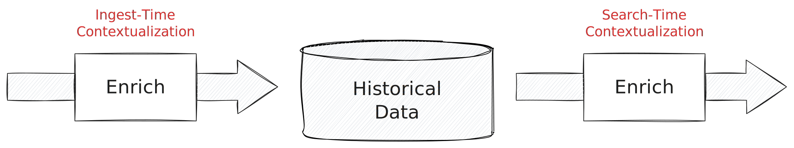

Enrichment is a major part of a security data lifecycle and can take on many
forms: adding GeoIP locations for all IP addresses in a log, attaching asset
inventory data via user or hostname lookups, or extending alerts with magic
score to bump it up the triaging queue. The goal is always to make the data more
*actionable* by providing a better ground for decision making.

This is the first part of series of blog posts on contextualization. We kick
things off by looking at how existing systems do enrichment. In the next blog
post, we introduce how we address this use case with pipeline-first mindset in
the Tenzir stack.



<!-- truncate -->

When we refer to "enrichment" we typically mean performing an API call, joining
the data at hand with another table/index in a SIEM, or a doing a lookup with
static data in CSV file. As shown above, we can do this either at *ingest-time*
before persisting the data, or at *search-time* when we retrieve historical
data. There are also streaming-only use cases without historical data, but
these can often be modeled as ingest-time enrichment with a different sink.

## Existing Solutions

Let's see how Splunk, Elastic, and Azure Data Explorer handle enrichment.

### Splunk

[Alex Teixeira](https://www.linkedin.com/in/inode/) wrote a great article on
[maintaining dynamic lookups in
Splunk](https://detect.fyi/the-salamander-method-how-to-maintain-dynamic-splunk-lookups-4fdae5868e7e). Here's the visual summary of his approach:


Suppose we have a Splunk index called `web_access_logs` where we log web access
events, and we want to maintain a weekly updated lookup table of unique visitor
IP addresses and their last visit date. Let's create an initial lookup table,
named `weekly_visitors.csv`, with fields like `ip_address` and
`last_visit_date`. Then we'll set up a scheduled search to run weekly. The
search should:

- Extract the latest week's unique IP addresses and their last visit date
 from `web_access_logs`.
- Load the existing `weekly_visitors.csv` using `inputlookup`.
- Merge and update the data, discarding IPs older than 7 days.
- Output the updated table using `outputlookup`.

Here's the SPL for for the scheduled search:

```spl
index="web_access_logs" earliest=-7d@d latest=@d
| stats latest(_time) as last_visit by ip_address
| eval last_visit_date=strftime(last_visit, "%F")
| inputlookup append=true weekly_visitors.csv
| dedup ip_address sortby -last_visit
| where last_visit >= relative_time(now(), "-7d@d")
| outputlookup weekly_visitors.csv
```

In detail:

- `index="web_access_logs" earliest=-7d@d latest=@d`: Fetches the last week's
  web access logs.
- `stats latest(_time) as last_visit by ip_address`: Aggregates the latest visit
  time for each IP.
- `eval last_visit_date=strftime(last_visit, "%F")`: Formats the last visit
  date.
- `inputlookup append=true weekly_visitors.csv`: Appends current lookup data for
  comparison.
- `dedup ip_address sortby -last_visit`: Removes duplicate IPs, keeping the most
  recent.
- `where last_visit >= relative_time(now(), "-7d@d")`: Filters out IPs older
  than 7 days.
- `outputlookup weekly_visitors.csv`: Updates the lookup table with the new
  data.

This query demonstrates Alex' "Salamander Method" by regularly updating the
lookup table with recent data while discarding outdated records, maintaining an
up-to-date context for data enrichment.

You'd use it as follows:

```
index="network_security_events"
| lookup weekly_visitors.csv ip_address as source_ip OUTPUT last_visit_date
```

The `lookup` command enriches each event with the `last_visit_date` from
`weekly_visitors.csv` based on the matching `ip_address`. In this scenario,
you're adding a temporal context to the security events by identifying when each
IP address involved in these events last visited your network. This can be
particularly useful for quickly assessing whether a security event is related to
a new or returning visitor, potentially aiding in the rapid assessment of the
event's nature and severity.

### Elastic

Elastic's [new ES|QL language](/blog/a-first-look-at-esql) also
[supports
enrichment](https://www.elastic.co/guide/en/elasticsearch/reference/master/esql-enrich-data.html)
using the [`ENRICH`
command](https://www.elastic.co/guide/en/elasticsearch/reference/master/esql-commands.html#esql-enrich).
Enrichment is a key-based lookup using special index type. The diagram below
shows how it works.


Assume you have an index `network_security_logs` with fields like `source_ip`
and an enrich policy `threat_intel_policy` with data based on IP addresses and a
field `threat_level`.

```
SELECT e.*, threat.threat_level
FROM network_security_logs AS e
ENRICH threat_intel_policy
ON e.source_ip
WITH threat_level
```

This query enriches each record in `network_security_logs` with the
`threat_level` field from the threat intelligence data, providing an additional
layer of context.

### Sentinel

In Sentinel or Azure Data Explorer, you have a more data-centric view on the
problem, using a combination of the Kusto operators
[`lookup`](https://docs.microsoft.com/azure/data-explorer/kusto/query/lookupoperator)
and
[`join`](https://docs.microsoft.com/azure/data-explorer/kusto/query/joinoperator):

```
SecurityEvent
| lookup kind=leftouter GeoIPTable on $left.IPAddress == $right.GeoIP
| join kind=leftouter ThreatIntelTable on $left.IPAddress == $right.ThreatIP
```

This query takes a security event, enriches it with the `GeoIPTable` data based
on the source IP, and then joins it with threat intelligence data from the
`ThreatIntelTable`.

## Search vs. Ingest Time Enrichment

We've now seen three examples for *search-time* enrichment. For *ingest-time*
enrichments, Splunk users need to adapt a config file `transforms.conf`.
Elastic users can either use a separate tool
[Logstash](https://www.elastic.co/logstash) or resort to [Node Ingest
Pipelines](https://www.elastic.co/guide/en/elasticsearch/reference/current/ingest.html).
Azure users can user to [Event
Hubs](https://docs.microsoft.com/azure/event-hubs/), [Azure Stream
Analytics](https://docs.microsoft.com/azure/stream-analytics/), or [Azure
Functions](https://docs.microsoft.com/azure/azure-functions/). As a Sentinel
users, you can use Data Collection Rules (DCRs) to apply KQL transformations to
incoming data before it's stored in your workspace. Here's an example of how
this can be done:

```
let GeoIP = externaldata(country:string, city:string, [ip_range:string])
@"https://example.com/geoipdata.csv" 
with (format='csv', ignoreFirstRecord=True);
SecurityEvent
| extend parsedIP = parse_ipv4(ip_address)
| lookup kind=leftouter GeoIP on $left.parsedIP between $right.ip_range
```

What's left is taking this transformation and adding it to the data collection
rule. Here's a diagram from the
[documentation](https://learn.microsoft.com/en-us/azure/sentinel/data-transformation)
on how the Azure pieces fit together:


## Conclusion

We reviewed three existing approaches to enrichment by looking at Splunk,
Elastic, and Sentinel. Common among all systems is the idea of first building a
dataset for contextualization, and then using that in a second step. In
particular, the use of the context is decoupled from the management of the
context.

We could argue a lot about syntax ergonomics and system idiosyncrasies. But that
wouldn't move the needle much. The foundational mechanisms are the same in the
different systems. That said, we did ask ourselves: how can we make enrichment
*as easy, fast, and flexible as possible*? Our next blog will have the answer.

In the meantime, feel free to browse through our docs, read our blog posts, or
join our [Discord server](/discord) to talk to the power users in our
community. You can always skip everything and dive right in at
[app.tenzir.com](https://app.tenzir.com).
