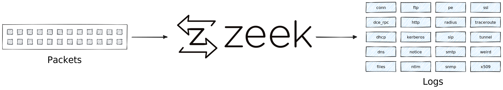

# Mobilizing Zeek Logs

[Zeek](https://zeek.org) offers many ways to produce and consume logs. In this
blog, we explain the various Zeek logging formats and show how you can get the
most out of Zeek with Tenzir. We conclude with recommendations for when to use
what Zeek format based on your use case.



<!--truncate-->

## Zeek Logging 101

Zeek's main function is turning live network traffic or trace files into
structured logs.[^1] Zeek logs span the entire network stack, including
link-layer analytics with MAC address to application-layer fingerprinting of
applications. These rich logs are invaluable for any network-based detection and
response activities. Many users also simply appreciate the myriad of protocol
analyzers, each of which generates a dedicated log file, like `smb.log`,
`http.log`, `x509.log`, and others.

[^1]: Zeek also comes with a Touring-complete scripting language for executing
arbiatrary logic. The event-based language resembles Javascript and is
especially useful for performing in-depth protocol analysis and engineering
detections.

In the default configuration, Zeek writes logs into the current directory, one
file per log type. There are options on how to render them. TSV, JSON, and
more. Let's take a look.

### Tab-Separated Values (TSV)

Zeek's custom tab-separated value (TSV) format is variant of CSV with additional
metadata, similar to a data frame.

Here's how you create TSV logs from a trace:

```bash
zeek -C -r trace.pcap [scripts]
```

:::info disable checksumming
We add `-C` to disable checksumming, telling Zeek to ignore mismatches and use
all packets in the trace. This is good practice to process all packets in a
trace, as some capturing setups may perturb the checksums.
:::

And here's a snippet of the corresponding `conn.log`:

```
#separator \x09
#set_separator	,
#empty_field	(empty)
#unset_field	-
#path	conn
#open	2019-06-07-14-30-44
#fields	ts	uid	id.orig_h	id.orig_p	id.resp_h	id.resp_p	proto	service	duration	orig_bytes	resp_bytes	conn_state	local_orig	local_resp	missed_bytes	history	orig_pkts	orig_ip_bytes	resp_pkts	resp_ip_bytes	tunnel_parents	community_id
#types	time	string	addr	port	addr	port	enum	string	interval	count	count	string	bool	bool	count	string	count	count	count	count	set[string]	string
1258531221.486539	Cz8F3O3rmUNrd0OxS5	192.168.1.102	68	192.168.1.6
7	udp	dhcp	0.163820	301	300	SF	-	-	0	Dd	1	329	1	328	-	1:aWZfLIquYlCxKGuJ62fQGlgFzAI=
1258531680.237254	CeJFOE1CNssyQjfJo1	192.168.1.103	137	192.168.1.255	137	udp	dns	3.780125	350	0	S0	-	-	546	0	0	-	1:fLbpXGtS1VgDhqUW+WYaP0v+NuA=
```

Many Zeek users would now resort to their downstream log management tool,
assuming it supports the custom TSV format. Zeek also comes with small helper
utility `zeek-cut` for light-weight reshaping of this TSV format. For example:

```bash
zeek-cut id.orig_h id.resp_h < conn.log
```

This selects the columns `id.orig_h` and `id.resp_h`. Back in the days, many
folks used `awk` to extract fields by their position, e.g., with `$4`, `$7`,
`$9`. This is not only difficult to understand, but also brittle, since Zeek
schemas can change based on configuration. With `zeek-cut`, it's at least a bit
more robust.

With Tenzir, it's as easy to process Zeek TSV logs using the native
[`zeek-tsv`](/next/formats/zeek-tsv) parser:

```bash
cat *.log | tenzir 'read zeek-tsv | select id.orig_h, id.resp_h'
```

Tenzir takes care of parsing the type information properly and keeps IP
addresses and timestamps as native data types. You can also see in the examples
that Tenzir handles multiple concatenated TSV logs of different schemas as you'd
expect.

Now that Zeek logs are flowing, you can do a lot more than selecting specific
columns. Check out the [reshaping guide](/next/user-guides/reshape-data) for
filtering rows, performing aggregations, or routing them elsewhere.

### JSON

Zeek can also render logs as JSON by setting
[`LogAscii::use_json=T`](https://docs.zeek.org/en/master/frameworks/logging.html):

```bash
zeek -r trace.pcap LogAscii::use_json=T
```

As with TSV, this generates one file per log type containing the NDJSON records.
Here are the same three entries from above in NDJSON:

```json
{"ts":1258531221.486539,"uid":"C8b0xF1gjm7rOZXemg","id.orig_h":"192.168.1.102","id.orig_p":68,"id.resp_h":"192.168.1.1","id.resp_p":67,"proto":"udp","service":"dhcp","duration":0.1638200283050537,"orig_bytes":301,"resp_bytes":300,"conn_state":"SF","missed_bytes":0,"history":"Dd","orig_pkts":1,"orig_ip_bytes":329,"resp_pkts":1,"resp_ip_bytes":328}
{"ts":1258531680.237254,"uid":"CMsxKW3uTZ3tSLsN0g","id.orig_h":"192.168.1.103","id.orig_p":137,"id.resp_h":"192.168.1.255","id.resp_p":137,"proto":"udp","service":"dns","duration":3.780125141143799,"orig_bytes":350,"resp_bytes":0,"conn_state":"S0","missed_bytes":0,"history":"D","orig_pkts":7,"orig_ip_bytes":546,"resp_pkts":0,"resp_ip_bytes":0}
{"ts":1258531693.816224,"uid":"CtTLWk44k1eOCdSjBf","id.orig_h":"192.168.1.102","id.orig_p":137,"id.resp_h":"192.168.1.255","id.resp_p":137,"proto":"udp","service":"dns","duration":3.7486469745635986,"orig_bytes":350,"resp_bytes":0,"conn_state":"S0","missed_bytes":0,"history":"D","orig_pkts":7,"orig_ip_bytes":546,"resp_pkts":0,"resp_ip_bytes":0}
```

Use the regular [`json`](/next/formats/json) parser to get the data flowing:

```bash
cat conn.log | tenzir 'read json --schema "zeek.conn" | taste 1'
```

The option `--schema` of the `json` reader passes a name of a known schema to
validate the input against.

:::note Zeek Schemas
Tenzir comes with schemas for a stock Zeek. We have planned an operator that
makes it also possible to simple rename the schema, akin to
[`rename`](/next/operators/transformations/rename) for fields.
:::

### Streaming JSON

The above one-file-per-log format is not conducive to stream processing because
a critical piece of information is missing: the type of the log (or *schema*),
which is only contained in the file name. So you can't just ship the data away
and infer the type later at ease. And carrying the filename around in a side
channel is cumbersome. Enter [JSON streaming
logs](https://github.com/corelight/json-streaming-logs). This package adds two
new fields: `_path` with the log type and `_write_ts` with the timestamp when
the log was written. For example, the old `http.log` is now has an additional
field `{"_path": "http" , ...}`. This makes it a lot easier to consume, because
you can now concatenate the entire output and multiplex it over a single stream.

This format doesn't come with stock Zeek. Use Zeek's package manager `zkg` to
install it:

```bash
zkg install json-streaming-logs
```

Then pass the package name to the list of scripts on the command line:

```bash
zeek -r trace.pcap json-streaming-logs
```

And now you get JSON logs in the current directory. Here's the same `conn.log`
example from above, this time as NDJSON:

```json
{"_path":"conn","_write_ts":"2009-11-18T16:45:06.678526Z","ts":"2009-11-18T16:43:56.223671Z","uid":"CzFMRp2difzeGYponk","id.orig_h":"192.168.1.104","id.orig_p":1387,"id.resp_h":"74.125.164.85","id.resp_p":80,"proto":"tcp","service":"http","duration":65.45066595077515,"orig_bytes":694,"resp_bytes":11708,"conn_state":"SF","missed_bytes":0,"history":"ShADadfF","orig_pkts":9,"orig_ip_bytes":1062,"resp_pkts":14,"resp_ip_bytes":12276}
{"_path":"conn","_write_ts":"2009-11-18T16:45:11.786059Z","ts":"2009-11-18T16:44:37.280644Z","uid":"CoalykVnjXndRUGP9","id.orig_h":"192.168.1.104","id.orig_p":1389,"id.resp_h":"67.195.146.230","id.resp_p":80,"proto":"tcp","service":"http","duration":29.393054962158203,"orig_bytes":791,"resp_bytes":38971,"conn_state":"SF","missed_bytes":0,"history":"ShADadfF","orig_pkts":14,"orig_ip_bytes":1359,"resp_pkts":35,"resp_ip_bytes":40379}
{"_path":"conn","_write_ts":"2009-11-18T16:46:11.952479Z","ts":"2009-11-18T16:45:01.674828Z","uid":"Cz6QmkUOAQNigU7Ve","id.orig_h":"192.168.1.104","id.orig_p":1423,"id.resp_h":"74.125.164.85","id.resp_p":80,"proto":"tcp","service":"http","duration":65.16959500312805,"orig_bytes":3467,"resp_bytes":60310,"conn_state":"SF","missed_bytes":0,"history":"ShADadfF","orig_pkts":21,"orig_ip_bytes":4315,"resp_pkts":54,"resp_ip_bytes":62478}
```

A lot of tools have much less trouble with consuming such a single stream. That
said, JSON is always "dumbed down" compared to TSV, which contains additional
type information, such as timestamps, durations, IP addresses, etc. This type
information is lost in the JSON output and up to the downstream tooling to bring
back.

To read JSON Streaming Logs, use the [`zeek-json`](/next/formats/zeek-json)
parser:

```bash
cat *.log | tenzir 'read zeek-json | taste 1'
```

The `zeek-json` parser just an alias for `json --selector=zeek:_path`, i.e.,
Tenzir extracts the schema name from the `_path` field to demultiplex the JSON
stream. As with any JSON, Tenzir's parser infers the richer types from strings,
such as IP addresses and timestamps. Some information is lost, though, e.g., the
fact that durations are simply floating point numbers.

### Writer Plugin

If the stock options of Zeek's logging framework do not work for you, you can
still write a C++ *Writer Plugins* to produce any output of your choice.

For example, the [zeek-kafka](https://github.com/SeisoLLC/zeek-kafka) plugin
connects to a Kafka instance and writes JSON logs to specific topics. For this
specific example, you could as well leverage Tenzir's
[`kafka`](/next/connectors/kafka) loader and write:

```bash
cat *.log | tenzir '
  read zeek-tsv
  | extend _path=#schema
  | write json to kafka -t zeek
  '
```

This pipeline starts with Zeek TSV, appends the `_path` field to emulate
Streaming JSON, and then writes the events to the Kafka topic `zeek`.

## Conclusion

In this blog, we presented the most common Zeek logging formats. We also
provided examples how you can mobilize any of them in a Tenzir pipeline. If
you're unsure when to use what Zeek logging format, here are our
recommendations:

:::tip Recommendation
- **Use TSV when you can.** If your downstream tooling can parse TSV, it is the
  best choice because it retains Zeek's rich type annotation as metadata—without
  the need for downstream schema wrangling.
- **Use Streaming JSON for the easy button**. The single stream of NDJSON
  logs is most versatile, since most downstream tooling supports it well. Use it
  when you need to get in business quickly.
- **Use stock JSON when you must**. There's marginal utility in the
  one-JSON-file-per-log format. It requires extra effort in keeping track of
  filenames and mapping them to their corresponding types.
- **Use plugins for everything else**. If none of these suit the bill or you
  need a tighter integration, leverage Zeek's Writer Plugins to create a custom
  logger.
:::

If you're a Zeek power user and need heavy-duty machinery to process them, take
a closer look at what we do at Tenzir.
