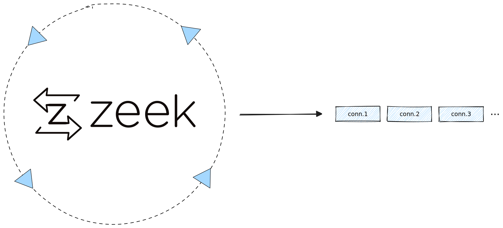

Did you know that [Zeek](http://zeek.org) supports log rotation triggers, so
that you can do anything you want with a newly rotated batch of logs?



<!-- truncate -->

This blog post shows you how to use Zeek's native log rotation feature to
conveniently invoke any post-processor, such as a log shipper. In our examples
we show how to to ingest data into Tenzir, but you can plug in any downstream
tooling.

## External Log Shipping (pull)

In case you're not using Zeek's native log rotation trigger, you may observe a
directory to which Zeek periodically writes files. For example, the utility
[zeek-archiver](https://github.com/zeek/zeek-archiver) does that.

Generic log shippers can take care of that as well. Your mileage may vary. For
example, [Filebeat][filebeat] works for stock Zeek only. The parsing logic is
hard-coded for every log type. If you have custom scripts or extend some logs,
you're left alone. Filebeat also uses the stock Zeek JSON output, which has no
type information. Filebeat then brings the typing back manually later as it
converts the logs to the Elastic Common Schema (ECS).

[filebeat]: https://www.elastic.co/guide/en/beats/filebeat/current/filebeat-module-zeek.html

## Native Log Shipping (push)

There's also a lesser known, push-based option using [Zeek's logging
framework](https://docs.zeek.org/en/master/frameworks/logging.html). You can
provide a shell script that Zeek invokes *whenever it rotates a file*. The shell
script receives the filename of the rotated file plus some additional metadata
as arguments.

First, to activate log rotation, you need to set
`Log::default_rotation_interval` to a non-zero value. The default of `0 secs`
means that log rotation is disabled.

Second, to customize what's happening on rotation you can redefine
[`Log::default_rotation_postprocessor_cmd`](https://docs.zeek.org/en/master/scripts/base/frameworks/logging/main.zeek.html#id-Log::default_rotation_postprocessor_cmd)
to point to a shell script.

For example, to rotate all log files every 10 minutes with a custom `ingest`
script, you can invoke Zeek as follows:

```bash
zeek -r trace.pcap \
  Log::default_rotation_postprocessor_cmd=ingest \
  Log::default_rotation_interval=10mins
```

Let's take a look at this `ingest` shell script in more detail. Zeek always
passes 6 arguments to the post-processing script:

1. The filename of the log, e.g., `/path/to/conn.log`
2. The type of the log (aka. `path`), such as `conn` or `http`
3. Timestamp when Zeek opened the log file
4. Timestamp when Zeek closed (= rotated) the log file
5. A flag that is true when rotation occurred due to Zeek terminating
6. The format of the log, which is either `ascii` (=
   [`zeek-tsv`](/formats/zeek-tsv)) or [`json`](/formats/json)

Here's a complete example that uses (1), (2), and (6):

```bash title="ingest"
#!/bin/sh

file_name="$1"
base_name="$2"
from="$3"
to="$4"
terminating="$5"
writer="$6"

if [ "$writer" = "ascii" ]; then
  format="zeek-tsv"
elif [ "$writer" = "json" ]; then
  format="json --schema zeek.$base_name"
else
  echo "unsupported Zeek writer: $writer"
  exit 1
fi

pipeline="from file $file_name read $format | import"

tenzir "$pipeline"
```

### Post-processing with Tenzir pipelines

When you run Zeek as above, the `ingest` script dynamically constructs an
ingestion pipeline based on the type of the Zeek log at hand. Given your logging
format (TSV or JSON), the pipelines for a rotated `conn.log` file may look like
this:

```
from file /path/to/conn.log read zeek-tsv | import
from file /path/to/conn.log read json --schema zeek.conn | import
```

This pipeline reads the Zeek log and pipes it to the
[`import`](/next/operators/import) operator, which stores all your logs at a
running Tenzir node. You could also use the
[`extend`](/next/operators/extend) operator to include the filename in the data:

```bash
pipeline="from file $file_name read $format \
          | extend filename=$file_name \
          | import"
```

Take a look at the [list of operators](/operators) for further inspiration
on things you can do, or check out the [user guides](/usage) for concrete
ideas.

### Zeek package

If you want post-processing with Tenzir pipelines out of the box, use our
official [Zeek package](https://github.com/tenzir/zeek-tenzir):

```bash
zkg install zeek-tenzir
```

After installing the package, you have two options to run pipelines on rotated
Zeek logs:

1. Load the `tenzir-import` Zeek script to ship logs to a local Tenzir node

   ```bash
   # Start a node.
   tenzir-node
   # Ship logs to it and delete the original files.
   zeek -r trace.pcap tenzir/import
   ```

  Pass `Tenzir::delete_after_postprocesing=F` to `zeek` to keep the original
  logs.

2. Write Zeek scripts to register pipelines manually:

   ```zeek
   # Activate log rotation by setting a non-zero value.
   redef Log::default_rotation_interval = 10 mins;
 
   event zeek_init()
     {
     Tenzir::postprocess("import");
     Tenzir::postprocess("to directory /tmp/logs write parquet");
     }
   ```

   The above Zeek script hooks up two pipelines via the function
   `Tenzir::postprocess`. Each pipeline executes upon log rotation and receives
   the Zeek log file as input. The first imports all data via
   [`import`](/next/operators/import) and the second writes the logs as
   [`parquet`](/formats/parquet) files using [`to`](/next/operators/to).

## Reliability

Zeek implements the log rotation logic by spawning a separate child process.
When the (parent) Zeek process dies, the children become orphaned and keep
running until completion.

The implication is that Zeek cannot re-trigger a failed post-processing command.
So you have exactly one shot. This may not be a problem for trace file analysis,
but live deployments may require higher reliability guarantees. For such
scenarios, we recommend to use the post-processing script as a notifier, e.g.,
to signal another tool that it can now process a file.

For ultimate control over logging, you can always develop your own [writer
plugin](/blog/mobilizing-zeek-logs#writer-plugin) that immediately ship logs
instead of going through the file system.

## Conclusion

This blog post shows how you can use Zeek's native log rotation feature to
invoke an arbitrary command as soon as a log file gets rotated. This approach
provides an attractive alternative that turns pull-based file monitoring into
more flexible push-based delivery.

|              |   Push   |     Pull     |
| ------------ |:--------:|:------------:|
| Trigger      | rotation | new file/dir |
| Complexity   |   low    |    medium    |
| Reliability  |   low    |    high      |

If you are looking for an efficient way to get your Zeek logs flowing, [give
Tenzir a try](/overview). [Our Zeek
package](https://github.com/tenzir/zeek-tenzir) makes it easy to launch
post-processing pipelines natively from Zeek. And don't forget to check out our
[other Zeek blogs](/blog/tags/zeek).
