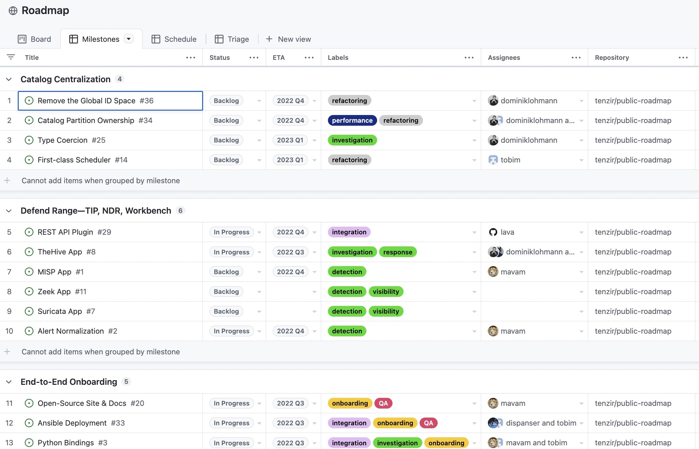

We are happy to announce that we have published [our engineering
roadmap][roadmap] along with an [RFC process][rfc] to actively participate in
shaping upcoming topics. This blog post explains why and how we did it.

[roadmap]: https://vast.io/roadmap
[rfc]: /docs/contribute/rfc

<!--truncate-->

As a community-first open-source project, we constantly strive for increasing
transparency. Our long-term goal is establishing a fully open governance model.
This will allow for a clear delineation of the open-source project and unbiased
commercial offerings that we, the engineering team behind VAST at
[Tenzir](https://tenzir.com), provide on top. Until we have bootstrapped
ourselves and an active community, we aim for the right balance between open
and closed.

One step in the direction of open is publishing our [roadmap][roadmap] and
enabling the community to participate in the planning through an [Request For
Comments (RFC)][rfc] process.

## Public Roadmap

In the process of opening the roadmap, we had to answer several questions:

1. **Audience**: should the content be for users only? What about developers?
   Should we only mention features or also refactorings?

2. **Interaction**: should this just be a read-only page or something the
   community can directly interact with?

3. **Tooling**: what is the right tool to encode the roadmap?

Let's go through them one by one.

Regarding audience, we want to avoid an overly narrow target group, as we are in
phase of growth where breadth instead of depth is more important. Moreover, we
gain more transparency if we can unveil all ongoing thrusts. Therefore, we want
to cover the full spectrum of personas, but make it possible for each individual
type of persona to get a relevant view.

Regarding interaction, we are actively looking for engagement. Throwing a
read-only version over the fence to the community is certainly informational,
but we are looking for creating dialogue. Therefore, we want to allow everyone
to discuss the various roadmap items in the open.

Regarding tooling, we are in need for something that integrates well with the
existing environment. Our GitHub presence includes code, documentation, website
content, and third-party integrations. We also promote use of GitHub Discussions
to engage with us. This makes GitHub the focal point to engage with the content.
Therefore, we decided to encode the roadmap as GitHub issues; for clarity in a
dedicated repository at <https://github.com/tenzir/public-roadmap>.

We decided against dual-purposing the issue tracker of our main repository
<https://github.com/tenzir/vast> because it would add roadmap items as many
open, long-running issues that scatter the attention and potentially confuse the
community. That said, the primary value of the issue tracker is the layer on top
of issues: [GitHub Projects][github-projects], which allows for organizing
issues across multiple dimensions in a visually appealing way.

[github-projects]: https://docs.github.com/en/issues/planning-and-tracking-with-projects

The quarterly board view make it easy to understand ongoing thrusts:

[][roadmap]

The milestones view provides a different perspective that focuses more on the
bigger-picture theme:

[][roadmap]

## Open RFCs

The roadmap provides a lens into the short-term future. We don't want it to be
just read-only. Fundamentally, we want to build something that our users love.
We also want to tap into the full potential of our enthusiasts by making it
possible to engage in technical depth with upcoming changes. Therefore, we are
establishing a formal [Request for Comments (RFC) process][rfc].

To get an idea, how an RFC looks like, here's the [RFC template][rfc-template]:

[rfc-template]: https://github.com/tenzir/vast/blob/master/rfc/000-template/README.md

import CodeBlock from '@theme/CodeBlock';
import Template from '!!raw-loader!@site/../rfc/000-template/README.md';

<CodeBlock language="markdown">{Template}</CodeBlock>

[RFC-001: Composable Pipelines](https://github.com/tenzir/vast/pull/2511) is an
example instantiation of this template.

The RFC reviews take place 100% in the open. As of today, reviewers constitute
members from Tenzir's engineering team. Given our current resource constraints
and project state, we can only support a corporate-backed governance model. That
said, opening ourselves up is laying the foundation of trust and committment
that we want to go beyond a walled garden. We understand that this is a long
journey and are excited about what's ahead of us.

When an RFC gets accepted, it means that we put it on the roadmap, adjacent to
existing items that compete for prioritization. In other words, even though we
accepted an RFC, there will be an indeterminate period of time until we can
devote resources. We will always encourage community-led efforts and are
enthusiastic about supporting external projects that we can support within our
capacities.

These are our "growing pains" that we can hopefully overcome together while
building a thriving community. We still have our [community chat](/discord)
where we are looking forward to interact with everyone with questions or
feedback. See you there!
