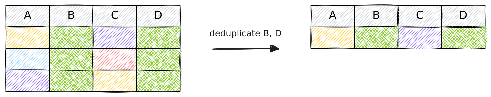

In the bustling world of data operations, handling large volumes of information
is an everyday affair. Each day, countless bytes of data move around in systems,
challenging organizations to maintain data accuracy, efficiency, and
cost-effectiveness. Amid this vast data landscape, one concept has emerged as a
critical ally—**deduplication**.

<!-- truncate -->

Deduplication, the process of eliminating duplicate copies of repeating data,
isn't just about reducing storage needs—it's about clarity, precision, and
reducing computational overload. It refines data to its most essential elements,
allowing us to gain vital insights with fewer extraneous distractions. And as
our data continues to grow in both volume and complexity, the need for effective
and efficient deduplication strategies cannot be underestimated. To make this
task of deduplication easier, we're introducing an efficient and robust tool:
the [`deduplicate`](/operators/deduplicate) operator. This operator serves
as a powerful ally in the fight against redundant data, enabling easy removal of
duplicate entries directly within a data stream or data set—delivering cleaner,
leaner, and more useful data that holds the genuine insights your business
seeks.

Join us as we dive into the world of deduplication, explore the mechanics and
benefits of the [`deduplicate`](/operators/deduplicate) operator, and
understand how it can redefine the way your organization approaches data
management and analysis. The journey towards more effective and efficient data
operations starts here.

:::note Available in Tenzir v4.12
We're releasing Tenzir v4.12 next week, which will include the `deduplicate`
operator. Until then, you can play with it on the main branch on our [GitHub
repo](https://github.com/tenzir/tenzir). Stay tuned.
:::

## Why Deduplicate?

Deduplication of operational event data is vital in various contexts dealing
with large volumes of data, as it helps streamline information, eliminate
redundancies, and save storage. Here are three reasons for why you may want to
consider deduplication as central tool for your data operations:

### Enhanced Monitoring and Analytics

Deduplication plays a crucial role in system and network monitoring, increasing
the visibility of genuine operational patterns. In anomaly detection and
intrusion detection, deduplication refines the focus towards unique
inconsistencies or intrusions, paving the way for precise identification of
threats, and thus, enhancing the accuracy and effectiveness of monitoring
systems.

### Efficient Threat Detection & Response

Deduplication filters out multiple instances of the same security alert,
enabling a focus on unique threats. This allows for a swift, focused respons to
actual incidents, minimizing the distraction caused by redundant alerts and
enhancing overall operational efficiency and mean-time-to-respond (MTTR)
significantly.

### Cost Optimization

For log management and SIEM systems, deduplication decreases ingest volume to
reduce costs associated with ingest-based pricing models. Additionally,
deduplication reduces storage demands, optimizes search performance, and enables
more effective threat detection, thus achieving both economic efficiency and
operational optimization in SIEM operations.

## How Tenzir solves Deduplication

Let's dive deeper into the `deduplicate` operator. It functions by marking out
duplicate events within a data stream, scrutinizing these duplicates based on
the values of one or more fields. This discernment allows the operator to
differentiate between truly repetitive data and individually unique events. You
can alter this behavioral pattern to suit your specific needs by manipulating
three primary control knobs: **Limit**, **Distance**, and **Timeout**.

The diagram below illustrates these knobs intuitively:

Here's a more in-depth description of the controls:

1. **Limit**: This knob controls the quantity of duplicate events that are
   permissible before they're classified as duplicates. Setting a limit of 1
   allows the emission of only unique events, making it the most stringent level
   of deduplication. A limit of N allows for the emission of a unique event N
   times before considering subsequent instances as duplicates. For instance,
   given a data stream `AAABAABBAC` with a limit of 2, the output
   post-deduplication would be `AABBC`.

2. **Distance**: This knob is a measure of how far apart two events can be for
   them to be regarded as duplicates. Deduplicating a stream `AABABACBABB` with
   a distance set to 3 would yield `ABC`. A low distance value means that only
   closely placed events will be considered duplicates, while a higher value (or
   0 for infinity) broadens this criterion.

3. **Timeout**: This parameter introduces a temporal aspect to the concept of
   duplicates. The timeout value dictates the duration that needs to elapse
   before a previously suppressed duplicate is considered a unique event again.
   If a duplicate event occurs before the specified timeout, the timer resets.

You can decide the fields to apply these knobs on by specifying a list of field
extractors. By default, the operator works on the entire event.

:::tip Real-world examples
Let's make the abstract concrete and dive right in! Read our [user
guide](/next/usage/deduplicate-events) on deduplicating events for hands-on
examples.
:::

By bringing together these strategically implemented parameters, the
`deduplicate` becomes a flexible, customizable tool for decluttering your data
streams. It makes the daunting process of manual deduplication a thing of the
past and allows data operators to focus on the rich insights that uniquely
occurring events can provide.
