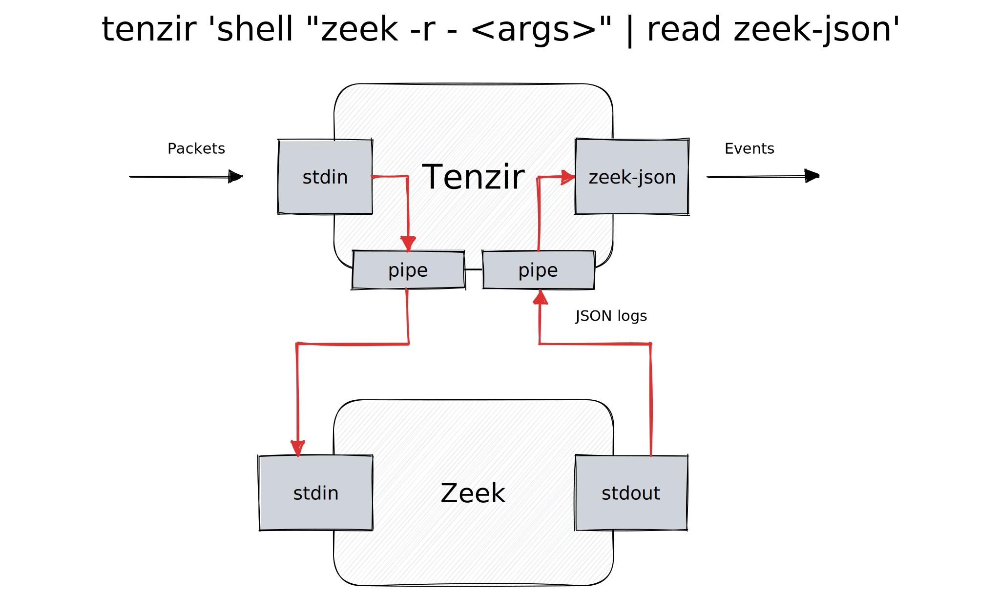

As an incident responder, threat hunter, or detection engineer, getting quickly
to your analytics is key for productivity. For network-based visibility and
detection, [Zeek](https://zeek.org) and [Suricata](https://suricata.io) are the
bedrock for many security teams. But operationalizing these tools can take a
good chunk of time.

So we asked ourselves: **How can we make it super easy to work with Zeek and
Suricata logs?**


<!--truncate-->

## Purring like a Suricat

In our [previous blog post](/blog/zeek-and-ye-shall-pipe/) we adapted Zeek to
behave like a good ol' Unix tool, taking input via stdin and producing output
via stdout. Turns out you can do the same fudgery with Suricata:[^1]

[^1]: Suricata outputs [EVE
JSON](https://suricata.readthedocs.io/en/latest/output/eve/eve-json-output.html)
by default, which is equivalent to Zeek's streaming JSON output, with the
difference being that Zeek's `_path` field is called `event_type` in Suricata
logs.

```bash title=suricatify
#!/bin/sh
suricata -r /dev/stdin \
  --set outputs.1.eve-log.filename=/dev/stdout \
  --set logging.outputs.0.console.enabled=no
```

Let's break this down:

- The `--set` option take a `name=value` parameter that overrides the settings
  in your `suricata.yaml` config file.
- The key `outputs.1.eve-log.filename` refers to the `outputs` array, takes
  element at index `1`, treats that as object and goes to the nested field
  `eve-log.filename`. Setting `/dev/stdout` as filename makes Suricata write to
  stdout.
- We must set `logging.outputs.0.console.enabled` to `no` because Suricata
  writes startup log messages to stdout. Since they are not valid JSON, we
  would otherwise create an invalid JSON output stream.

## User-defined Operators

Now that we have both Zeek and Suricata at our fingertips, how can we work with
their output more easily? This is where Tenzir comes into play—easy
[pipelines](/pipelines) for security teams to acquire,
[shape](/next/usage/shape-data), and route event data.

Here are two examples that count the number of unique source IP addresses per
destination IP address, on both Zeek and Suricata data:

```bash
# Zeek
zcat pcap.gz | zeekify | tenzir \
  'read zeek-json
   | where #schema == "zeek.conn"
   | summarize n=count_distinct(id.orig_h) by id.resp_h
   | sort n desc'
# Suricata
zcat pcap.gz | suricatify | tenzir \
  'read suricata
   | where #schema == "suricata.flow"
   | summarize n=count_distinct(src_ip) by dst_ip
   | sort n desc'
```

It's a bit unwieldy to write such a command line that requires an external shell
script to work. This is where [user-defined
operators](/next/language/user-defined-operators) come into play. In combination
with the [`shell`](/next/operators/shell) operator, you can write a custom
`zeek` and `suricata` operator and ditch the shell script:

```yaml title="tenzir.yaml"
tenzir:
  operators:
    zeek:
     shell "zeek -r - LogAscii::output_to_stdout=T
            JSONStreaming::disable_default_logs=T
            JSONStreaming::enable_log_rotation=F
            json-streaming-logs"
     | read zeek-json
    suricata:
     shell "suricata -r /dev/stdin
            --set outputs.1.eve-log.filename=/dev/stdout
            --set logging.outputs.0.console.enabled=no"
     | read suricata
```

The difference stands out when you look now at the pipeline definition:

```text title=Zeek
zeek
| where #schema == "zeek.conn"
| summarize n=count_distinct(id.orig_h) by id.resp_h
| sort n desc
```

```text bash title=Suricata
suricata
| where #schema == "suricata.flow"
| summarize n=count_distinct(src_ip) by dst_ip
| sort n desc
```

It's pretty convenient to drop packets into a Tenzir pipeline, process them with
our favorite tools, and then perform fast in-situ analytics on them. The nice
thing is that operators compose: a new operator automatically works with all
existing ones.

## How does it work?

First, let's take a look at the standard approach where one process pipes the
output into the next:


When using the `shell` operator, the `tenzir` process spawns `zeek` or
`suricata` as child process. The operator then forwards the bytes from stdin of
the `tenzir` process to the child's stdin, and uses the child's stdout as input
to the subsequent [`read`](/next/operators/read) operator.



In the above example, `shell` acts as a *source* operator, i.e., it does not
consume input and only produces output. The `shell` operator can also act as
*transformation*, i.e., additionally accept input. This makes it possible to use
it more flexibly in combination with other operators, e.g., the
[`load`](/next/operators/load) operator emitting bytes from a
[loader](/connectors):

```
load file trace.pcap
| zeek
| where 6.6.6.6
| write json
```

Got a PCAP trace via Kafka? Just exchange the `file` loader with the
[`kafka`](/connectors/kafka) loader:

```
load kafka -t artifact
| zeek
| where 6.6.6.6
| write json
```

You may not always sit in front of a command line and are able to pipe data from
a Unix tool into a Tenzir pipeline. For example, when you use our
[app](https://app.tenzir.com) or the [REST API](/rest-api). This is where the
`shell` operator shines. The diagram above shows how `shell` shifts the entry
point of data from a tool to the Tenzir process. You can consider `shell` your
escape hatch to reach deeper into a specific Tenzir node, as if you had a native
shell.

## Conclusion

In this blog post we showed you the [`shell`](/next/operators/shell) operator
and how you can use it to integrate third-party tooling into a Tenzir pipeline
when coupled with [user-defined
operators](/next/language/user-defined-operators).

Using Zeek or Suricata? Tenzir makes 'em fun to work with. Check out our other
blogs tagged with [`#zeek`](/blog/tags/zeek) and
[`#suricata`](/blog/tags/suricata), and [give it a shot](/overview) yourself.
