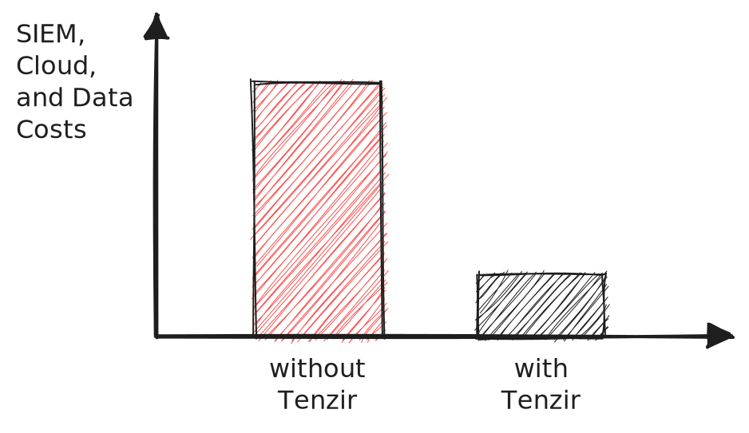

# Slash Your SIEM, Cloud, and Data Costs with Tenzir Security Data Pipelines

Staying ahead in the realm of cybersecurity means relentlessly navigating an
endless sea of emerging threats and ever-increasing data volumes. The battle to
stay one step ahead can often feel overwhelming, especially when your
organization's data costs are skyrocketing.

<!--truncate-->

**Imagine you can simultaneously cut costs, improve security, and optimize your
detection and response infrastructure.**

Introducing our latest whitepaper: *Slashing SIEM, Cloud, and Data Costs with
Tenzir*

By reading this whitepaper, you will learn how Tenzir security data pipelines
make your cybersecurity infrastructure more cost-effective and robust, and why
you should consider leveraging them to future proof your security data
operations.

**What you'll find inside:**
* A clear breakdown of the challenges around skyrocketing SIEM, cloud and data
  costs (and why they're eating into your security budget).
* An expert's take on why solid security data management is your secret weapon
  against evolving cyber threats.
* A sneak peek at [Security Data Operations
  (SecDataOps)](https://tenzir.com/secdataops?utm_source=Blog)—a fresh approach
  to reduce data costs and data wrangling, while maximizing data utility.
* A detailed look at how Tenzir's clever security data pipelines make data
  filtering, reduction, and deduplication a breeze.

Equip yourself with the knowledge to transform your security data operations.
Download Tenzir's whitepaper today and step into the future of cybersecurity
with confidence.

  <a class="button button--primary" href="https://tenzir.com/whitepaper.pdf">Download Now</a>

