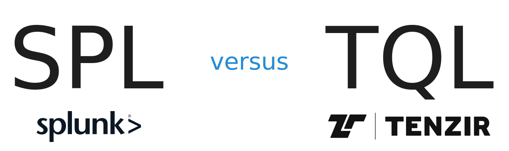

Our [Tenzir Query Language (TQL)](/language) is a pipeline language that works
by chaining operators into data flows. When we designed TQL, we specifically
studied Splunk's [Search Processing Language (SPL)][spl], as it generally leaves
a positive impression for security analysts that are not data engineers. Our
goal was to take all the good things of SPL, but provide a more powerful
language without compromising simplicity. In this blog post, we explain how the
two languages differ using concrete threat hunting examples.

[spl]: https://docs.splunk.com/Documentation/SplunkCloud/latest/Search/Aboutthesearchlanguage



<!--truncate-->

## Why not SQL?

Splunk was the first tool that provided an integrated solution from interactive
data exploration to management-grade dashboards—all powered by dataflow
pipelines. The success of Splunk is not only resulting from their first-mover
advantage in the market, but also because their likable user experience: it is
*easy* to get things done.

At Tenzir, we have a very clear target audience: security practitioners. They
are not necessarily data engineers and fluent in SQL and low-level data tools,
but rather identify as blue teamers, incident responders, threat hunters,
detection engineers, threat intelligence analysts, and other domain experts. Our
goal is cater to these folks, without requiring them to have deep understanding
of relational algebra.

We opted for a dataflow language because it simplifies reasoning—one step at a
time. At least conceptually, because a smart system optimizes the execution
under the hood. As long as the observable behavior remains the same, the
underlying implementation can optimize the actual computation at will. This is
especially noticeable with declarative languages, such as SQL, where the user
describes the *what* instead of the *how*. A dataflow language is a bit more
concrete in that it's closer to the *how*, but that's precisely the trade-off
that simplifies the reasoning: the focus is on a single operation at a time as
opposed to an entire large expression.

This dataflow pipeline style is becoming more and more popular. Most SIEMs have
a language of their own, like Splunk. [Kusto][kusto] is another great example
with a wide user base in security. Even in the data space,
[PRQL](https://prql-lang.org) witnesses a strong support for this way of
thinking.

[kusto]: https://learn.microsoft.com/en-us/azure/data-explorer/kusto/query/

In fact, for a given dataflow pipeline there's often an equivalent SQL
expression, because the underlying engines frequently map to the same execution
model. This gives rise to [transpiling dataflow languages to other execution
platforms][splunk-transpiler]. Ultimately, our goal is that security
practitioners do not have to think about *any* of this and stay in their happy
place, which means avoiding context switches to lower-level data primitives.

[splunk-transpiler]: https://www.databricks.com/blog/2022/12/16/accelerating-siem-migrations-spl-pyspark-transpiler.html

Now that we got the SQL topic out of the way, let's dive into some hands-on
examples that illustrate the similarities and differences between SPL and TQL.

## Examples

Back in 2020, Eric Ooi wrote about [threat hunting with
Zeek](https://www.ericooi.com/zeekurity-zen-part-iv-threat-hunting-with-zeek/),
providing a set of Splunk queries that are corner stones for threat hunting.

### Connections to destination port > 1024

Splunk:

```splunk-spl
index=zeek sourcetype=zeek_conn id.resp_p > 1024
| chart count over service by id.resp_p
```

Tenzir:

```
export
| where #schema == "zeek.conn" && id.resp_p > 1024
| summarize count(.) by service, id.resp_p
```

Analysis:

- In SPL, you typically start with an `index=X` to specify your dataset. In
  TQL, you start with a source operator. To run a query over historical data, we
  use the [`export`](/next/operators/export) operator.

- The subsequent [`where`](/next/operators/where) operator is a
  transformation to filter the stream of events with the
  [expression](/language/expressions) `#schema == "zeek.conn" && id.resp_p >
  1024`. In SPL, you write that expression directly into `index`. In TQL, we
  logically separate this because one operator should have exactly one purpose.
  Under the hood, the TQL optimizer does predicate pushdown to avoid first
  exporting the entire database and only then applying the filter.

  Why does this single responsibility principle matter? Because it's critical
  for *composition*: we can now replace `export` with another data source, like
  [`from`](/next/operators/from) [`kafka`](/connectors/kafka), and the rest
  of the pipeline stays the same.

- TQL's `#schema` is an expression that is responsible for filtering the data
  sources. This is because all TQL pipelines are *multi-schema*, i.e., they can
  process more than a single type of data. The ability to specify a regular
  expression makes for a powerful way to select the desired input.

- SPL's [`chart X by Y, Z`][chart] (or equivalently `chart X over Y by Z`)
  performs an implicit
  [pivot-wider](https://epirhandbook.com/en/pivoting-data.html) operation on
  `Z`. This different tabular format has the same underlying data produced by
  `summarize X by Y, Z`, which is why we are replacing it accordingly in our
  examples.

[chart]: https://www.splunk.com/en_us/blog/tips-and-tricks/search-commands-stats-chart-and-timechart.html

### Top 10 sources by number of connections

Splunk:

```splunk-spl
index=zeek sourcetype=zeek_conn
| top id.orig_h
| head 10
```

Tenzir:

```splunk-spl
export
| where #schema == "zeek.conn"
| top id.orig_h
| head 10
```

Note the similarity. We opted to add [`top`](/next/operators/top) and
[`rare`](/next/operators/rare) to make SPL users feel at home.

### Top 10 sources by bytes sent

Splunk:

```splunk-spl
index=zeek sourcetype=zeek_conn
| stats values(service) as Services sum(orig_bytes) as B by id.orig_h
| sort -B
| head 10
| eval MB = round(B/1024/1024,2)
| eval GB = round(MB/1024,2)
| rename id.orig_h as Source
| fields Source B MB GB Services
```

Tenzir:

```splunk-spl
export
| where #schema == "zeek.conn"
| summarize Services=distinct(service), B=sum(orig_bytes) by id.orig_h
| sort B desc
| head 10
| extend MB=round(B/1024/1024,2)
| extend GB=round(MB/1024,2)
| put Source=id.orig_h, B, MB, GB, Services
```

Analysis:

- We opted for Kusto's syntax of sorting (for technical reasons), by appending
  an `asc` or `desc` qualifier after the field name. `sort -B` translates into
  `sort B desc`, whereas `sort B` into `sort B asc`. However, we want to adopt
  the SPL syntax in the future.

- SPL's `eval` maps to [`extend`](/next/operators/extend).

- The difference between `extend` and [`put`](/next/operators/put) is
  that `extend` keeps all fields as is, whereas `put` reorders fields and
  performs an explicit projection with the provided fields.

- We don't have functions in TQL. *Yet*. It's one of our most important roadmap
  items at the time of writing, so stay tuned.

### Bytes transferred over time by service

Splunk:

```splunk-spl
index=zeek sourcetype="zeek_conn" OR sourcetype="zeek_conn_long"
| eval orig_megabytes = round(orig_bytes/1024/1024,2)
| eval resp_megabytes = round(resp_bytes/1024/1024,2)
| eval orig_gigabytes = round(orig_megabytes/1024,2)
| eval resp_gigabytes = round(resp_megabytes/1024,2)
| timechart sum(orig_gigabytes) AS 'Outgoing',sum(resp_gigabytes) AS 'Incoming' by service span=1h
```

Tenzir:

```splunk-spl
export
| where #schema == /zeek\.conn.*/
| extend orig_megabytes=round(orig_bytes/1024/1024, 2)
| extend resp_megabytes=round(orig_bytes/1024/1024, 2)
| extend orig_gigabytes=round(orig_megabytes/1024, 2)
| extend resp_gigabytes=round(orig_megabytes/1024, 2)
| summarize Outgoing=sum(orig_gigabytes), Incoming=sum(resp_gigabytes) by ts, service resolution 1h
```

Analysis:

- SPL's `timechart` does an implicit group by timestamp. As we use TQL's
  `summarize` operator, we need to explicitly provide the grouping field `ts`.
  In the future, you will be able to use `:timestamp` in a grouping expression,
  i.e., group by the field with the type named `timestamp`.

- This query spreads over two data sources: the event `zeek.conn` and
  `zeek.conn_long`. The latter tracks long-running connections and is available
  as [separate package](https://github.com/corelight/zeek-long-connections).

### Rare JA3 hashes

Splunk:

```splunk-spl
index=zeek sourcetype=zeek_ssl
| rare ja3
```

Tenzir:

```splunk-spl
export
| where #schema == "zeek.ssl"
| rare ja3
| head 10
```

Analysis:

- This example shows again how to select a specific data source and perform
  "stack counting". Unlike SPL, our version of `rare` does not limit the output
  to 10 events by default, which is why add `head 10`. This goes back to the
  single responsibility principle: one operator should do exactly one thing. The
  act of limiting the output should always be associated with
  [`head`](/next/operators/head).

### Expired certificates

Splunk:

```splunk-spl
index=zeek sourcetype=zeek_x509
| convert num(certificate.not_valid_after) AS cert_expire
| eval current_time = now(), cert_expire_readable = strftime(cert_expire,"%Y-%m-%dT%H:%M:%S.%Q"), current_time_readable=strftime(current_time,"%Y-%m-%dT%H:%M:%S.%Q")
| where current_time > cert_expire
```

Tenzir:

```splunk-spl
export
| where certificate.not_valid_after > now()
```

Analysis:

- This example shows the benefit of native time types (and Tenzir's rich type
  system in general).

- TQL's [type system](/data-model/type-system) has first-class support for times
  and durations.

- TQL's [`zeek-tsv`](/formats/zeek-tsv) parser preserves `time` types natively,
  so you don't have to massage strings at query-time.

### Large DNS queries

Splunk:

```splunk-spl
index=zeek sourcetype=zeek_dns
| eval query_length = len(query)
| where query_length > 75
| table _time id.orig_h id.resp_h proto query query_length answer
```

Tenzir:

```splunk-spl
export
| where #schema == "zeek.dns"
| extend query_length = length(query)
| where query_length > 75
| select :timestamp, id.orig_h, id.resp_h, proto, query, query_length, answer
```

Analysis:

- As mentioned above, we don't have functions in TQL yet. Once we have them,
  SPL's `len` will map to `length` in TQL.

- The SPL-generated `_time` field maps to the `:timestamp` type extractor in
  TQL.

### Query responses with NXDOMAIN

Splunk:

```splunk-spl
index=zeek sourcetype=zeek_dns rcode_name=NXDOMAIN
| table _time id.orig_h id.resp_h proto query
```

Tenzir:

```splunk-spl
export
| where #schema == "zeek.dns" && rcode_name == "NXDOMAIN"
| select :timestamp, id.orig_h, id.resp_h, proto, query
```

Analysis:

- The `table` operator in splunk outputs the data in tabular form. This is the
  default for our [app](https://app.tenzir.com).

- There's also an [upcoming](https://github.com/tenzir/tenzir/pull/3113) `write
  table` format to generate a tabular representation outside the app.

## Summary

In this blog post we've juxtaposed the languages of Splunk (SPL) and Tenzir
(TQL). They are remarkably similar—and that's not accidental. When we talked to
security analysts we often heard that Splunk has a great UX. Even our own
engineers that live on the command line find this mindset natural. But Splunk
was not our only inspiration, we also drew inspiration from Kusto and others.

As we created TQL, we wanted to learn from missed opportunities while doubling
down on SPL's great user experience.

If you'd like to give Tenzir a spin, [try our community edition](/overview)
for free. A demo node with example pipelines is waiting for you. For more
details about TQL, head over to the [language documentation](/pipelines).
