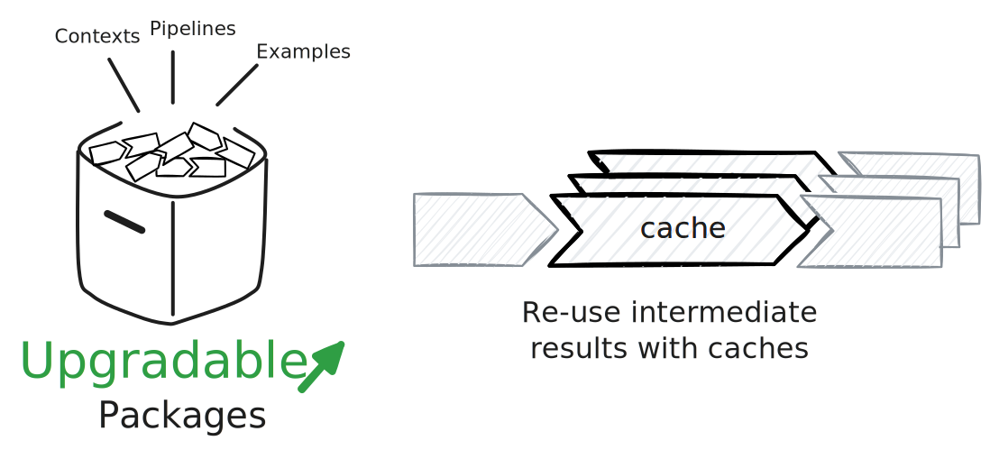

[Tenzir Node v4.20][github-release] is here, bringing a host of under-the-hood
improvements that pave the way for exciting upcoming changes to the Tenzir
Platform.



[github-release]: https://github.com/tenzir/tenzir/releases/tag/v4.20.0

<!-- truncate -->

## Under-the-hood Improvements

In this release, we've focused on improvements that will enable upcoming
features of the Tenzir Platform.

### Package Management

We've enhanced package management in the node, enabling seamless package
upgrades on [app.tenzir.com](https://app.tenzir.com) without the need to
uninstall them first. This improvement sets the stage for smoother and more
efficient updates in the future.

:::tip Slack Integration
Introducing the new _Send to Slack_ package! Now, sending a message to a Slack
channel from a Tenzir Node is as simple as publishing events on the `slack`
topic:

```tql
// tql2
from {
  message: "Hello, world!"
}
publish "slack"
```
:::

### Caching

We're also happy to unveil the experimental `cache` operator. This operator
creates an in-memory cache of events, allowing subsequent uses of the same cache
to skip running the pipeline leading up to it. This enhancement promises to
drive significant improvements to the Explorer and Dashboards, making data
exploration more interactive and efficient.

## Stabilizing the `metrics` Operator

Since the introduction of the `metrics` operator in Tenzir Node v4.8, our goal
has been to replace the old metrics subsystem with a new, pipeline-first
approach that enhances our dashboards. With the release of `metrics rebuild`,
we've successfully ported all metrics to the new system. The old metrics
subsystem configured under `tenzir.metrics` in the configuration file is now
obsolete.

:::info Migrating to the `metrics` operator
If you're still using the old metrics subsystem, be sure to check out our guide
on [collecting metrics](/usage/collect-metrics) and the [`metrics` operator
reference](/operators/metrics), which includes a comprehensive list of available
metrics and their values.
:::

## Progress on TQL2

We've made significant strides in enhancing TQL2 over the past month. New
features include string classification and transformation
(`<string>.to_upper()`, `<string>.is_lower()`), computing [CommunityID flow
hashes](/blog/unifying-network-and-endpoint-data-with-community-ids), indexing
into lists, and accessing secrets and environment variables (`secret(<string>)`,
`env(<string>)`), among others.

We're currently in the process of porting all remaining functionality from TQL1
to TQL2 and will soon introduce a comprehensive reference for TQL2's operators
and functions.

## Other Changes

This release also includes numerous small bug fixes and additional
under-the-hood improvements. For a detailed list of changes, be sure to check
out the [changelog][changelog].

:::info Talk to us
Join us for our office hours every second Tuesday at 8 AM EST / 11 AM EST / 5 PM
CET / 9:30 PM IST on [our Discord server][discord]. Whether you have ideas for
new packages, want to preview our plans for them in the app, or have an idea
you'd like to discuss with us—come chat with us!
:::

[discord]: /discord  
[changelog]: /changelog#v4200  
