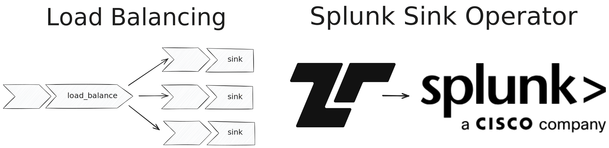

[Tenzir Node v4.23][github-release] comes with a new `load_balance` operator,
a dedicated `to_splunk` sink, Universal Function Call Syntax and much more!



[github-release]: https://github.com/tenzir/tenzir/releases/tag/v4.23.0

<!-- truncate -->

## Load Balancing

With the new [`load_balance`](../next/tql2/operators/load_balance) operator, you
can distribute the output of a Tenzir pipeline over multiple sinks. This allows
you to balance the output load, which is especially useful for network connections.

The operator accepts a pipeline and a list of values, which
can be used in the pipeline:

```tql title="Load balance over multiple TCP endpoints"
let $cfg = ["192.168.0.30:8080", "192.168.0.30:8081"]

subscribe "input"
load_balance $cfg {
  write_json
  save_tcp $cfg
}
```

## Splunk Sink

The new [`to_splunk`](../next/tql2/operators/to_splunk) operator allows you to
send events to a Splunk HTTP Event Collector. Events are send in batches as
compressed JSON.

```tql title="Send events to a Splunk HEC"
load_file "example.json"
read_json
to_splunk "https://localhost:8088", hec_token="example-token-1234"
```

## Universal Function Call Syntax

[UCFS]: https://en.wikipedia.org/wiki/Uniform_Function_Call_Syntax

Additionally, Tenzir now supports [Universal Function Call Syntax][UCFS],
allowing for more natural use of functions using a method call syntax or a free
function style, depending on the situation. In our documentation we make use of
the more appropriate form based on the function.

The TQL2 Documentation is making great progress. In this release we have added
the documentation pages for [functions](../next/tql2/functions).

## Other Changes

In addition to the above, the release also contains a number of small changes
and fixes, so be sure to check out the [changelog][changelog].

## Join Us for Office Hours

Every second Tuesday at 5 PM CET, we hold our office hours on our [Discord
server][discord]. Whether you have ideas for new packages or want to discuss
upcoming features—join us for a chat!

[discord]: /discord
[changelog]: /changelog#v4230
