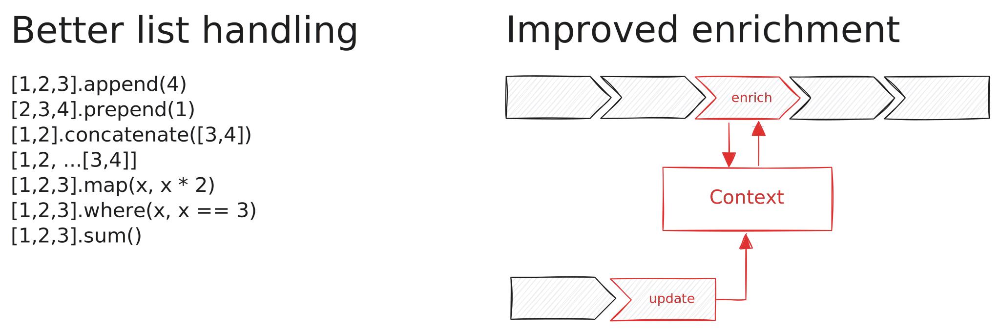

Working with lists is easier than ever with [Tenzir Node v4.24][github-release]
and its new functions for list manipulation. Also, contexts are now first-class
citizens in TQL2.



[github-release]: https://github.com/tenzir/tenzir/releases/tag/v4.24.0

<!-- truncate -->

## Working with Lists

We've added a number of functions that make it easier than before to work with
lists in TQL2.

### Simple List Manipulation

Let's start simple: How do you append to a list, prepend to a list, or concatenate lists?

```tql title="Append to a list"
from {xs: [1, 2, 3]}
xs = xs.append(4)
```

```tql
{xs: [1, 2, 3, 4]}
```

```tql title="Prepend to a list"
from {xs: [1, 2, 3]}
xs = xs.prepend(4)
```

```tql
{xs: [4, 1, 2, 3]}
```

```tql title="Concatenate lists"
from {xs: [1, 2], ys: [3, 4]}
zs = xs.concatenate(ys)
```

```tql
{xs: [1, 2], ys: [3, 4], zs: [1, 2, 3, 4]}
```

### Handling Lists of Strings

Working with lists of strings is also a common task. Here's how you can split a
string, split a string with a regex, and join a list of strings.

```tql title="Split a string"
from {s: "1,2,3"}
xs = s.split(",")
```

```tql
{s: "1,2,3", xs: ["1", "2", "3"]}
```

```tql title="Split a string with a regex"
from {s: "1,2;3"}
xs = s.split_regex("[,;]")
```

```tql
{s: "1,2;3", xs: ["1", "2", "3"]}
```

```tql title="Join a list"
from {xs: ["1", "2", "3"]}
s = xs.join(",")
```

```tql
{xs: ["1", "2", "3"], s: "1,2,3"}
```

### Modify and Remove List Elements

Two new functions `map` and `where` allow you to modify and filter lists.

```tql title="Modify list elements"
from {xs: [1, 2, 3]}
doubled = xs.map(x, x * 2)
```

```tql
{xs: [1, 2, 3], doubled: [2, 4, 6]}
```

```tql title="Remove list elements"
from {xs: [1, 2, 3, 4, 5]}
large = xs.where(x, x > 3)
```

```tql
{xs: [1, 2, 3, 4, 5], large: [4, 5]}
```

### Aggregation Functions

With the `summarize` operator, Tenzir already supports aggregating values across
multiple events. Now, all aggregation functions work on lists as well as regular
functions:

```tql title="Sum of a list"
from {xs: [1, 2, 3]}
total = xs.sum()
```

```tql
{xs: [1, 2, 3], total: 6}
```

```tql title="Minimum of a list"
from {xs: [1, 2, 3]}
lowest = xs.min()
```

```tql
{xs: [1, 2, 3], lowest: 1}
```

```tql title="Distinct values in a list"
from {xs: [1, 2, 2, 3]}
unique = xs.distinct()
```

```tql
{xs: [1, 2, 2, 3], unique: [1, 2, 3]}
```

:::info Aggregation Functions
With this change, all aggregation functions work with lists. Check the
[functions reference](/tql2/functions#aggregation) for a full list of available
functions.
:::

## Contexts in TQL2

Contexts have arrived in TQL2, bringing powerful enrichment capabilities to your
pipelines. Our new [Enrichment](/next/enrichment) documentation explains how
they work in detail, but here's a quick overview of what you can do with
contexts.

Contexts are stateful objects that allow you to add contextual data to your
events. You can use them to:

- Build lookup tables for fast IP-to-asset mapping
- Create Bloom filters for efficient membership testing of large sets
- Leverage GeoIP databases for geographic IP enrichment

Here's a simple example of using a lookup table context:

```tql title="Create a lookup table context"
context::create_lookup_table "ip-to-hostname"
```

```tql title="Populate lookup table with data"
subscribe "suricata"
where event_type == "dns"
unroll dns.answers
where dns.answers.rrtype in ["A", "AAAA"]
context::update "ip-to-hostname", key: dns.answers.rdata
```

```tql title="Enrich other data with context"
subscribe "zeek"
context::enrich "ip-to-hostname", key=id.resp_h, into=hostname
…
```

Each context type has its own strengths:

- **Lookup Tables** excel at key-value mappings with features like subnet
  matching and value aggregation
- **Bloom Filters** provide space-efficient set membership testing
- **GeoIP Databases** offer specialized geographic information lookup for IP
  addresses

Stay tuned for the next Tenzir Platform release, which adds support for
contexts.

## Other Improvements

We've completed the migration of all connectors and formats to TQL2, making them
more powerful and easier to use than ever. Every connector and format now fully
supports TQL2's expressive syntax and features. At this point, just a handful of
operators remain to be migrated to TQL2: `chart`, `deduplicate`, `lookup`,
`parse`, and `print`. We're working hard to complete this migration, but think
that at this point we're already covering 99% of our use cases with TQL2.

In addition to the above, the release also contains numerous quality-of-life
improvements and bug fixes, so be sure to check out the [changelog][changelog].

## Let's Connect!

We're excited to connect with our community! Join us every second Tuesday at 5
PM CET for our office hours on [Discord][discord]. It's a great opportunity to
share your ideas, get a sneak peek at upcoming features, or just chat with
fellow Tenzir users and our team. Bring your questions, use cases, or simply
drop by to say hello!

[discord]: /discord
[changelog]: /changelog#v4240
