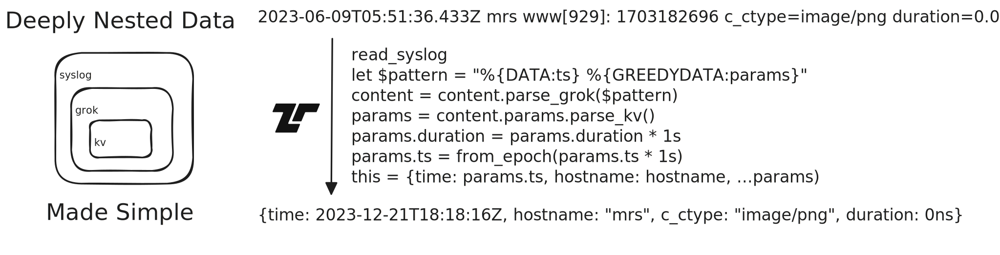

Tenzir Node v4.28 makes it easier than before to parse deeply nested data
structures.



[github-release]: https://github.com/tenzir/tenzir/releases/tag/v4.28.0

<!-- truncate -->

## Parsing Nested Data Structures

Logs are often a mess. There's no other way to put it. Here's an example that we
found in the wild just recently:

```
2023-06-09T05:51:36.433Z mrs www[929]: I103 1703182696 request baddr=194.1.1.1 bport=58630 c_ctype=image/png caddr=194.1.1.1 cin=860 cout=898 cport=58630 duration=0.00 forwarded_for='192.1.1.1, 191.1.1.1' laddr=127.128.11.145 lport=1 method=GET paddr=172.0.0.1 pport=80 proto=6 relay_name=wwwserver response_code=200 rnum=6489895 s_ctype=image/png saddr=172.0.0.1 sin=898 sout=819 sport=80 status=OK url=http://test.de/images/icons/144x144.png
```

Let's take this apart. First, we notice that this looks like Syslog. Let's throw the Syslog parser at it.

```tql
load_file "sample.txt"
read_syslog
```

```tql
{
  facility: null,
  severity: null,
  timestamp: 2023-06-09T05:51:36.433Z,
  hostname: "mrs",
  app_name: "www",
  process_id: "929",
  content: "I103 1703182696 request baddr=194.1.1.1 bport=58630 c_ctype=image/png caddr=194.1.1.1 cin=860 cout=898 cport=58630 duration=0.00 forwarded_for='192.1.1.1, 191.1.1.1' laddr=127.128.11.145 lport=1 method=GET paddr=172.0.0.1 pport=80 proto=6 relay_name=wwwserver response_code=200 rnum=6489895 s_ctype=image/png saddr=172.0.0.1 sin=898 sout=819 sport=80 status=OK url=http://test.de/images/icons/144x144.png",
}
```

The `content` field appears to contain the actual log message. It has four sections:

- `I103` looks like some identifier.
- `1703182696` looks like a Unix timestamp in seconds.
- `request` looks like it specified an action.
- `baddr=194.1.1.1 bport=58630 …` looks like a list of key-value pairs.

Let's start by taking the `content` field apart:

```tql
load_file "sample.txt"
read_syslog
content = content.parse_grok("%{DATA:id} %{DATA:ts} %{DATA:action} %{GREEDYDATA:params}")
```

```tql
{
  facility: null,
  severity: null,
  timestamp: 2023-06-09T05:51:36.433Z,
  hostname: "mrs",
  app_name: "www",
  process_id: "929",
  content: {
    id: "I103",
    ts: 1703182696,
    action: "request",
    params: "baddr=194.1.1.1 bport=58630 c_ctype=image/png caddr=194.1.1.1 cin=860 cout=898 cport=58630 duration=0.00 forwarded_for='192.1.1.1, 191.1.1.1' laddr=127.128.11.145 lport=1 method=GET paddr=172.0.0.1 pport=80 proto=6 relay_name=wwwserver response_code=200 rnum=6489895 s_ctype=image/png saddr=172.0.0.1 sin=898 sout=819 sport=80 status=OK url=http://test.de/images/icons/144x144.png",
  },
}
```

Let's further take apart the `content.params`:

```tql
load_file "sample.txt"
read_syslog
content = content.parse_grok("%{DATA:id} %{DATA:ts} %{DATA:action} %{GREEDYDATA:params}")
content.params = content.params.parse_kv()
```

```tql
{
  facility: null,
  severity: null,
  timestamp: 2023-06-09T05:51:36.433Z,
  hostname: "mrs",
  app_name: "www",
  process_id: "929",
  content: {
    id: "I103",
    ts: 1703182696,
    action: "request",
    params: {
      baddr: 194.1.1.1,
      bport: 58630,
      c_ctype: "image/png",
      caddr: 194.1.1.1,
      cin: 860,
      cout: 898,
      cport: 58630,
      duration: 0.0,
      forwarded_for: "192.1.1.1, 191.1.1.1",
      laddr: 127.128.11.145,
      lport: 1,
      method: "GET",
      paddr: 172.0.0.1,
      pport: 80,
      proto: 6,
      relay_name: "wwwserver",
      response_code: 200,
      rnum: 6489895,
      s_ctype: "image/png",
      saddr: 172.0.0.1,
      sin: 898,
      sout: 819,
      sport: 80,
      status: "OK",
      url: "http://test.de/images/icons/144x144.png",
    },
  },
}
```

Let's fix up a few types:

```tql
load_file "sample.txt"
read_syslog
content = content.parse_grok("%{DATA:id} %{DATA:ts} %{DATA:action} %{GREEDYDATA:params}")
content.params = content.params.parse_kv()
// Interpret the timestamp as a seconds since Unix epoch.
content.ts = from_epoch(content.ts * 1s)
// Interpret the duration parameter as seconds.
content.params.duration = content.params.duration * 1s
// Split the forwarded_for field into an array of IP addresses.
content.params.forwarded_for = content.params.forwarded_for.split(", ").map(x, x.ip())
```

```tql
{
  facility: null,
  severity: null,
  timestamp: 2023-06-09T05:51:36.433Z,
  hostname: "mrs",
  app_name: "www",
  process_id: "929",
  content: {
    id: "I103",
    ts: 2023-12-21T18:18:16Z,
    action: "request",
    params: {
      baddr: 194.1.1.1,
      bport: 58630,
      c_ctype: "image/png",
      caddr: 194.1.1.1,
      cin: 860,
      cout: 898,
      cport: 58630,
      duration: 0ns,
      forwarded_for: [
        192.1.1.1,
        191.1.1.1,
      ],
      laddr: 127.128.11.145,
      lport: 1,
      method: "GET",
      paddr: 172.0.0.1,
      pport: 80,
      proto: 6,
      relay_name: "wwwserver",
      response_code: 200,
      rnum: 6489895,
      s_ctype: "image/png",
      saddr: 172.0.0.1,
      sin: 898,
      sout: 819,
      sport: 80,
      status: "OK",
      url: "http://test.de/images/icons/144x144.png",
    },
  },
}
```

Let's now reshape the data, keeping only the fields we're interested in:

```tql
load_file "sample.txt"
read_syslog
content = content.parse_grok("%{DATA:id} %{DATA:ts} %{DATA:action} %{GREEDYDATA:params}")
content.params = content.params.parse_kv()
// Interpret the timestamp as a seconds since Unix epoch.
content.ts = from_epoch(content.ts * 1s)
// Interpret the duration parameter as seconds.
content.params.duration = content.params.duration * 1s
// Split the forwarded_for field into an array of IP addresses.
content.params.forwarded_for = content.params.forwarded_for.split(", ").map(x, x.ip())
this = {
  // We keep both timestamps, labelling the one from the message `time` and the
  // one from Syslog itself `forwarded_time`:
  time: content.ts,
  forwarded_time: timestamp,
  // Copy the other id and the action from the Syslog message:
  id: content.id,
  action: content.action,
  // Lastly, take all the params:
  ...content.params,
}
```

```tql
{
  time: 2023-12-21T18:18:16Z,
  forwarded_time: 2023-06-09T05:51:36.433Z,
  id: "I103",
  action: "request",
  baddr: 194.1.1.1,
  bport: 58630,
  c_ctype: "image/png",
  caddr: 194.1.1.1,
  cin: 860,
  cout: 898,
  cport: 58630,
  duration: 0ns,
  forwarded_for: [
    192.1.1.1,
    191.1.1.1,
  ],
  laddr: 127.128.11.145,
  lport: 1,
  method: "GET",
  paddr: 172.0.0.1,
  pport: 80,
  proto: 6,
  relay_name: "wwwserver",
  response_code: 200,
  rnum: 6489895,
  s_ctype: "image/png",
  saddr: 172.0.0.1,
  sin: 898,
  sout: 819,
  sport: 80,
  status: "OK",
  url: "http://test.de/images/icons/144x144.png",
}
```

Now we just need to switch from reading from a file to accepting Syslog over UDP
directly, and we're done. That's as simple as replacing `load_file "…"` with
`load_udp "…"` or `load_tcp "…"`.

Besides the `parse_kv` and `parse_grok` functions shown here, we also introduced
other new functions in this release for parsing nested data:

- `parse_csv`, `parse_ssv`, and `parse_tsv` parse comma-, space-, and
  tab-separated values, respectively.
- `parse_leef` and `parse_cef` parse LEEF and CEF data, respectively.
- `parse_syslog` parses Syslog data.
- `parse_json` parses JSON values.
- `parse_yaml` parses YAML values.

The new `parse_*` functions behave similar to the `read_*` operators, except
that they work on one string field at a time instead of a stream of bytes in the
pipeline.

## VSCode TQL Package

If you're writing TQL in Visual Studio Code, you can now enjoy syntax
highlighting just like in the Tenzir Platform: The VSCode TQL package is now
available on the [Visual Studio Marketplace][vscode-tql].

[vscode-tql]: https://marketplace.visualstudio.com/items?itemName=tenzir.vscode-tql

## Let's Connect!

Want to be part of something exciting? Our vibrant community is waiting for you!
Drop into our bi-weekly office hours (every second Tuesday at 5 PM CET) on
[Discord][discord] where ideas flow freely, sneak peeks of new features abound,
and conversations spark between Tenzir enthusiasts and our passionate team.
Whether you've got burning questions, fascinating use cases to share, or just
want to hang out—our virtual door is always open!

[discord]: /discord
[changelog]: /changelog#v4280
