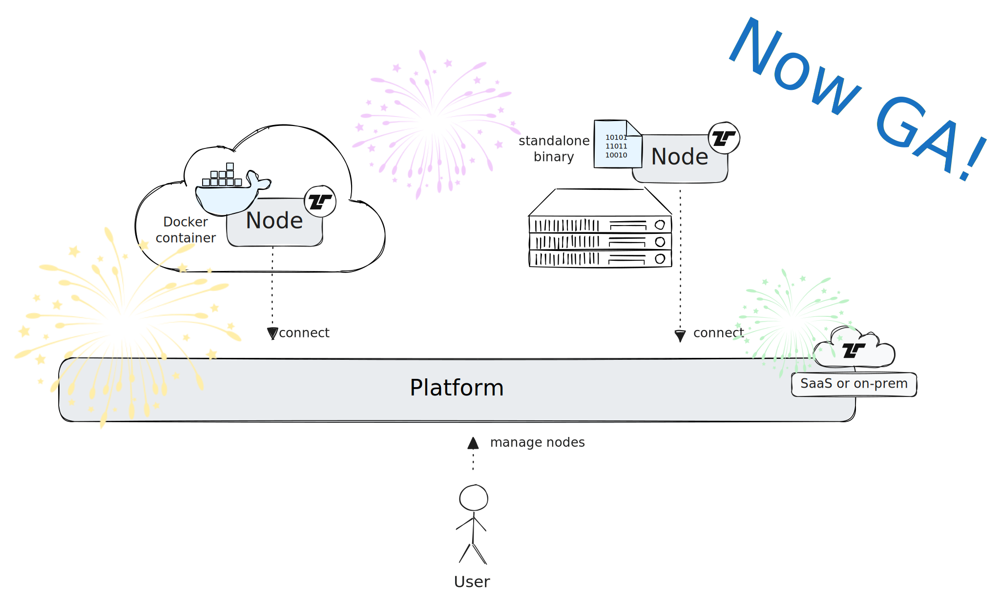
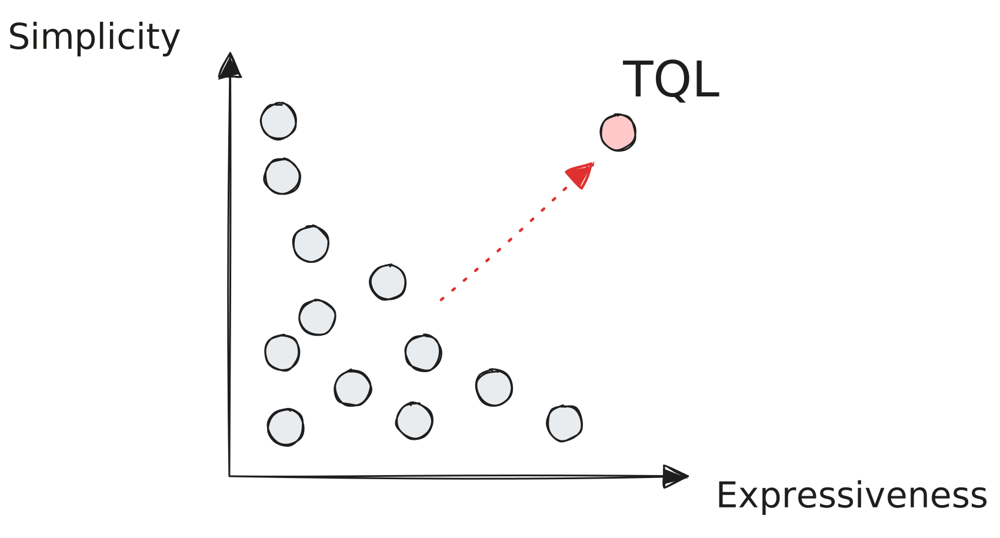

We are thrilled to announce that after a year of rigorous development and
testing, the **Tenzir Platform** is now generally available! Our journey began
at Black Hat 2023, where we first introduced the Tenzir Platform in early access
mode. Over the past year, we've worked diligently, incorporating user feedback
and refining our technology to ensure stability and performance. Today, at Black
Hat 2024, we are proud to officially launch the Tenzir Platform, confident in
its capabilities and excited to bring it to a wider audience.

<!-- truncate -->

## What is the Tenzir Platform?

The Tenzir Platform is a management layer for Tenzir Nodes. Prior to the
existence of the platform, users had to use a command line interface or REST API
to manage their pipelines. The platform exposes a nice web app that makes this
process fun and easy, plus it avoids the need that users need to have access
deep into the infrastructure to connect to each individual node.

There exist two TLS connections: one from the user's browser to the platform,
and one from every node the platform. The platform proxies requests and stores
high-level metadata state. But all the processing via pipelines takes place at
the node. Think of the platform as *control plane* and the connected nodes as
*data plane*.

## What has changed since the launch?

A lot has happened in the last year! We'd love to summarize all the goodness
that we built and shipped, but to keep it concise, here at the three most
exciting things.

### Library & Packages

Users can now one-click deploy a bundle of pipelines by installing a **package**
from the **library**. Over the last year, we heard many times that writing
pipelines from scratch is a time-consuming task, as it also requires learning
our own Tenzir Query Language (TQL). Even though TQL is easy to learn if you
have a Splunk background, there's still a ramp-up phase to become productive
data pipeline wizard.

Packages fix that. Get ready for instant value by simply installing a package
from our community library hosted at GitHub at
[tenzir/library](https://github.com/tenzir/library). Yes, you got it right:
**the community library is open source** and we encourage contributions.

We are ultra-excited about this feature, as it marks a new era of productivity
and time-to-value for our customers. Stay tuned for a lot of packages to arrive
over the next weeks and months!

### TQL2

From day one, we wanted to make working with data easy. This meant that we
needed to deeply understand our target audience and their preferred way of
working. We quickly learned that pipelines offer a sweet spot between
easy-of-use and expressiveness. There are numerous pipeline languages out there,
and after analyzing most of them in great depth, we were still not satisfied by
the state of the art. We wanted to push the boundary in terms of *simplicity*
and *expressiveness* to innovate.

This ambition culminated in our own **Tenzir Query Language (TQL)**. The first
version was powerful, yet limited from a language perspective. After gaining
hands-on experience and user feedback over the last year, we identified various
angles for improvement that resulted TQL2—a full language revamp.

Check out our [TQL migration guide](/next/tql2-migration) to learn about the
technical details.

### Complete Redesign

Finally, the app got a new coat of paint. We went from a playful, monochrome
look to a much sleeker, modern data app. Check out the difference between now
and then:

## How can I use the Platform?

At Tenzir, we host one instance of the platform at
[app.tenzir.com](https://app.tenzir.com) for our users and customers.

Tenzir comes in [four editions](https://tenzir.com/pricing):

1. **Community Edition**: Our free edition! For home labbers, researchers, and
   curious data hackers.
2. **Professional Edition**: For consultants, small businesses, and self-serve
   needs.
3. **Enterprise Edition**: For enterprises, system integrators, and value-added
   resellers.
4. **Sovereign Edition**: For on-prem needs, service providers, and OEM
   solutions.

The first three editions use the platform that we host. If you need to operate
in an air-gapped environment, we also got you covered. The Sovereign Edition
allows you to host the entire platform yourself. Our
[tenzir/platform](https://github.com/tenzir/platform) GitHub repository hosts
example Docker Compose files, and our docs explain [how to deploy the
platform](/next/installation/deploy-the-platform).

### Will the Community Edition remain free?

Yes. Here is why: Because the platform is primarily proxying information, it
doesn't require a lot of resources to operate. As a result, it doesn't incur a
lot infrastructure cost on our end. It's not a loss leader!

### How do I get started?

Just visit [app.tenzir.com](http://app.tenzir.com) and [create a free
account](/next/installation/create-an-account). May your data pipe dreams become
a reality!

:::tip Need help?
Any question or in need for more guidance? Send us an email at info@tenzir.com
or visit our [Discord server](/discord) for a direct line to our team and growing
community.
:::
