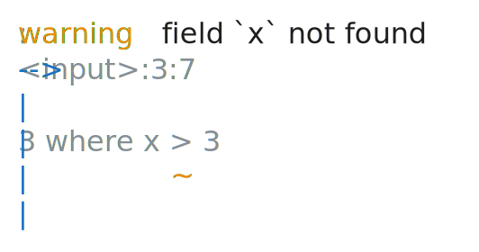
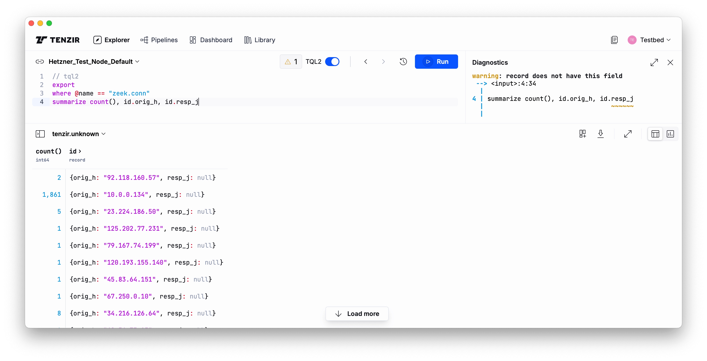

[Tenzir Platform v1.1][github-release] is here! This release brings key
enhancements, including improved diagnostics, authentication updates, and
various bug fixes for a smoother user experience.



[github-release]: https://github.com/tenzir/platform/releases/tag/v1.1.0

<!-- truncate -->

## Diagnostics in the Explorer

Diagnostics now appear directly in the Explorer, with a new badge indicating the
number of errors and warnings directly in the editor. Clicking the badge,
encountering an error, or encountering warnings for pipelines with no results
opens the diagnostics panel.



## Refresh Token Support

We have revamped how we internally handle authentication, and also added support
for OAuth refresh tokens.

:::note Configuration Changes for Sovereign Edition Users
Users of the Sovereign Edition that self-host the Tenzir Platform must set an
additional environment variable in their Docker Compose configuration for the
`app` service:

```diff {0} title=
@@ -110,6 +117,9 @@ services:
       - PRIVATE_WEBAPP_KEY=${TENZIR_PLATFORM_INTERNAL_APP_API_KEY}
       - AUTH_SECRET=${TENZIR_PLATFORM_INTERNAL_AUTH_SECRET}
       - PUBLIC_DISABLE_DEMO_NODE_AND_TOUR=${TENZIR_PLATFORM_DISABLE_LOCAL_DEMO_NODES}
+      - PRIVATE_DRIZZLE_DATABASE_URL=postgres://${TENZIR_PLATFORM_POSTGRES_USER}:${TENZIR_PLATFORM_POSTGRES_PASSWORD}@${TENZIR_PLATFORM_POSTGRES_HOSTNAME}/${TENZIR_PLATFORM_POSTGRES_DB}
+    depends_on:
+      - postgres
     ports:
       - "3000:3000"
```
:::

## Other Fixes

As always, we fixed a bunch of smaller issues on the way:

- Resolved intermittent node disconnections from the platform.
- We fixed the incorrect x-axis positioning when chart values are all zeroes.
- Fixed flashing content after clicking "Load More" in tables and updated the
  button styling.
- Resolved a bug preventing pipeline editing in the details view.
- Improved UX for adding self-hosted nodes—clear instructions are now visible on
  the pipelines page when a node is created and disconnected.

## Join Us for Office Hours

Every second Tuesday at 8 AM EST / 11 AM EST / 5 PM CET / 9:30 PM IST, we hold
office hours on our Discord server. Whether you have ideas for new packages or
want to discuss upcoming features—join us for a chat!
