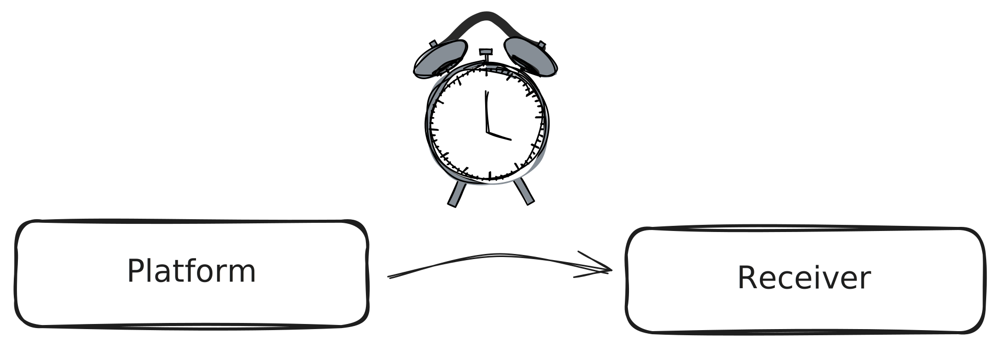

[Tenzir Platform v1.4][github-release] adds platform alerts and
many fixes and improvements to the frontend.

[github-release]: https://github.com/tenzir/platform/releases/tag/v1.4.0

<!-- truncate -->

## Platform Alerts

The platform now supports monitoring individual nodes and triggering an
alert when the node stays disconnected for more than a configurable
threshold.

This is useful for nodes that are supposed to be online 24/7.
With alerts, it becomes easier to notice unexpected downtime and stay
aware of the health of your cluster.

See the [Platform CLI](/platform-cli) docs page for an overview and a usage
example.

## Other Improvements

As usual there's also a slew of additional improvements and bug fixes
provided in this release:

 - The workspace switcher is now significantly faster
 - A new diagnostics drawer on the dashboard page makes warnings and errors more accessible
 - The image download of charts now works as expected

## Join Us for Office Hours

Every second Tuesday at 5 PM CET, we hold our office hours on our [Discord
server][discord]. We love hearing your feedback—come join us for a chat!

[discord]: /discord
