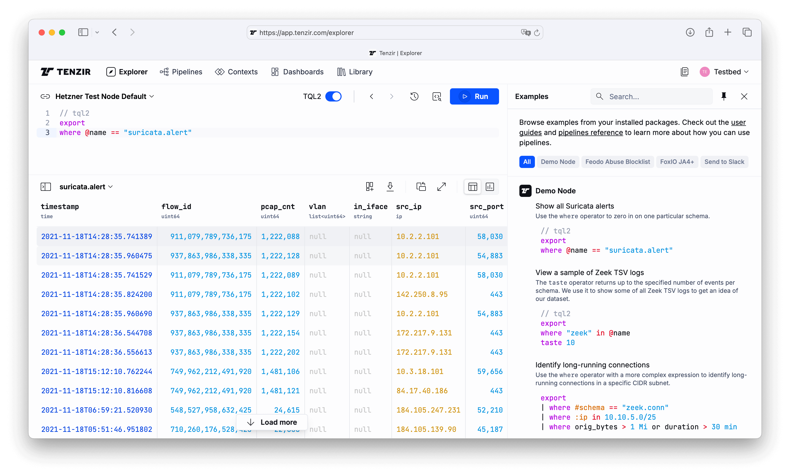

We're happy to announce [Tenzir Platform v1.6][github-release], featuring a new UI
for example pipelines and support for the new TQL2 mode for nodes.

[github-release]: https://github.com/tenzir/platform/releases/tag/v1.6.0

<!-- truncate -->

:::warning Minimum Node Version
Tenzir Platform v1.6 requires Tenzir Node v4.24 or later.

You must upgrade older nodes before they can reconnect to the newest Tenzir Platform version.
:::

## Pipeline Examples

We've added a new Examples pane to the Explorer for getting started with Tenzir
quickly.

The pane includes example pipelines from all installed packages. Head to the
Library to install packages for your integrations and see the examples in the
Explorer right away.

## TQL2-only Mode

As part of our ongoing [migration
efforts](https://docs.tenzir.com/tql2-migration) from TQL1 to TQL2, the upcoming
Tenzir Node v4.25 release will include a TQL2-only mode that has the effect of
treating all pipelines on that node as TQL2 pipelines.

This platform version includes support for this feature, including locking the
TQL version toggle in the explorer to be always set to TQL2 and switching all
internal pipelines to use TQL2.

If you're using a development version of the node, run `tenzir-node --tql2` or
set `TENZIR_TQL2=true` in your environment to enable this mode. It will become
the default in the next major release.

## Other Improvements

This release also includes a number of additional bugfixes:

- Fixed an issue that could lead to an internal server error with some identity
  providers when using an on-prem version of the Tenzir Platform with refresh
  tokens.
- Revised the placement of context actions within context items.
- A lot of general refactoring of our code base to increase type safety and
  stability.

## Join Us for Office Hours

Join us for our bi-weekly office hours every other Tuesday at 5 PM CET on our
[Discord server][discord]. It's a great opportunity to share your experiences,
ask questions, and help shape the future of Tenzir with your valuable feedback!

[discord]: /discord
