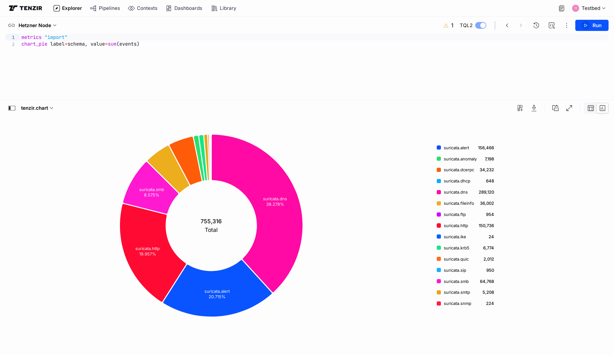
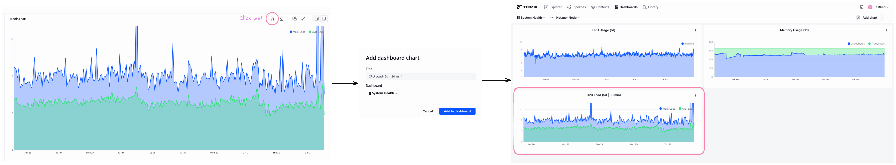

We're happy to announce [Tenzir Platform v1.8][github-release], with
new and improved charting as well as a new single-user mode for
Sovereign Edition users.


[github-release]: https://github.com/tenzir/platform/releases/tag/v1.8.0

<!-- truncate -->

## Charting

[Tenzir Node v4.27.0](/blog/tenzir-node-v4.27) introduced four new charting
operators for TQL2 -- `chart_line`, `chart_area`, `chart_bar` and `chart_pie`.

These new operators offer easy ways to aggregate, pivot, bucket and visualize
your data. Combine these with [metrics](/tql2/operators/metrics) from the
Tenzir Node and you have a powerful way to digest information about Node health
and more.

### Examples

#### Visualizing load

The following pipeline uses the `chart_area` operator to display the CPU metrics
of the last 5 days, with the x axis representing time and the y axis having two
separate graphs for mean and maximum load per interval that are computed directly
from the data:

```tql
metrics "cpu"
chart_area x=timestamp, y={"Avg. Load": mean(loadavg_1m), "Max. Load": max(loadavg_1m)},
          resolution=30min,
          x_min=now()-5d,
          y_max=10
```


#### Visualizing schema counts

The following pipeline uses the `chart_pie` operator to show a pie chart of all
events stored in the internal database of the Tenzir Node, grouped by schema name.

```tql
metrics "import"
chart_pie label=schema, value=sum(events)
```



### Dashboards

Charts can also be added to your [Tenzir
dashboards](https://app.tenzir.com/dashboards) to be readily viewed at any time.

To do so, click the "Add to Dashboard" button in the results pane and assign
a name to the chart. Afterwards, it will be visible in Dashboards tab
of the Tenzir Platform.



## Single-User Mode

We added a new, simplified example setup for users of the Sovereign Edition
that gets rid of all manual setup and just has a single default user that
is automatically signed in.

To try it out, just start a docker compose stack in the `examples/localdev`
folder of your platform checkout.

```sh
git clone https://github.com/tenzir/platform
cd platform/examples/localdev
docker compose up
```

## Bug fixes

Some other noteworthy changes in this release include:

- For Sovereign Edition users, the `platform` and `websocket-gateway`
  containers now support the environment variables `TLS_CERTFILE`,
  `TLS_KEYFILE` and `TLS_CAFILE` that can be used to enable native TLS
  support.
- Disabled TQL autocomplete in the editor.
- Label Filters are now fully clickable.

## Join Us for Office Hours

Join us for our bi-weekly office hours every other Tuesday at 5 PM CET on our
[Discord server][discord]. It's a great opportunity to share your experiences,
ask questions, and help shape the future of Tenzir with your valuable feedback!

[discord]: /discord
