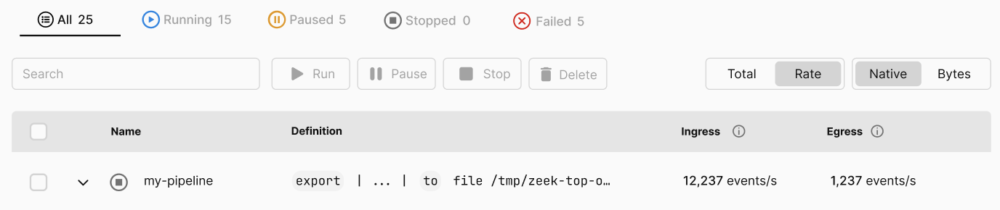

After our successful launch of [app.tenzir.com][tenzir-app] of Tenzir v4.0 at
Black Hat, [the new v4.1 release][github-release] continues with several
enhancements based on early feedback. We bring to you a (i) new mechanism to
pause pipelines, (ii) a new operator to match Sigma rules, (iii) new operators
for in-pipeline (de)compression, and (iv) a revamp of the `show` operator.

[github-release]: https://github.com/tenzir/vast/releases/tag/v4.1.0
[tenzir-app]: https://app.tenzir.com


<!--truncate-->

## Pausing Pipelines

Tenzir now supports pausing pipelines. Previously, users were able to deploy and
start pipelines, and to let them run until they completed (or failed) or
manually stopped. With new paused state, we now have the following five possible
states of a pipeline:

- *Created*: The pipeline was created, but never started
- *Running*: The pipeline is processing data
- *Paused*: A running pipeline has been suspended but still retains its
  in-memory state
- *Stopped*: A pipeline is not running and has no in-memory state
- *Failed*: The pipeline stopped unexpectedly

Pausing suspends a pipeline in an instant, causing its execution to stop. When a
paused pipeline is started, it resumes right where it left off as opposed to
restarting all the way from the beginning.

We're also making use of this feature in the app with a new pause action button.
A new tab bar at the top makes it easy to see all pipeline states at a glance.
These features will be enabled in the coming days in the app. Here's a sneak
preview of a mock from our designer:



You can also pause a pipeline through the API. Use the [/pipeline/update
endpoint][update-endpoint] with the new `pause` action to suspend a pipeline.
The `start` action resumes a pipeline that is currently paused.

[update-endpoint]: https://docs.tenzir.com/api#/paths/~1pipeline~1update/post

## Sigma Operator

The experimental [`sigma` operator](/next/operators/sigma) executes [Sigma
rules][sigma-github] on its input and outputs matching events. The operator can
work both on files and on directories of rules. Rule directories may be updated
while the operator is running, so that adding a new rule to an already deployed
pipeline is as simple as dropping a Sigma rule into the configured directory.

Consider the `sigma` operator as one concrete instance of security content
execution that we enable live and retrospectively. For example, you can perform
historical matching via `export | sigma` and streaming execution over a Kafka
source via `from kafka --topic events | sigma`. Now that we have the capability
in place, we are working on a unified interface to live and retro matching.

[sigma-github]: https://github.com/SigmaHQ/sigma

## Show Operator

The experimental [`show` operator](/next/operators/show) supersedes the
`version` operator. Use `show <aspect>` to show various aspects of a Tenzir
node. The following aspects are currently available:

- `build`: shows compile-time build information.
- `config`: shows all current configuration options.
- `connectors`: shows all available [connectors][connectors-docs].
- `dependencies`: shows information about build-time dependencies.
- `fields`: shows all fields of existing tables at a remote node.
- `formats`: shows all available [formats][formats-docs].
- `operators`: shows all available [operators][operators-docs].
- `partitions`: shows all table partitions of a remote node.
- `pipelines`: shows all managed pipelines of a remote node.
- `plugins`: shows all loaded plugins.
- `types`: shows all known types at a remote node.
- `version`: shows the Tenzir version.

This enables powerful introspection use-cases. Here are some examples that we
found useful at Tenzir.

Show all running pipelines with an ingress of over 10 MiB:

```
show pipelines
| where total.ingress.num_approx_bytes > 10 Mi
```

Show the memory usage of the node's catalog by schema in descending order:

```
show partitions
| summarize memory_usage=sum(memory_usage) by schema
| sort memory_usage desc
```

Print the configured endpoint of the node (returns `null` if not customized):

```
show config
| put tenzir.endpoint
```

## Compress and Decompress Operators

The [`compress`][compress-docs] and [`decompress`][decompress-docs] operators
make it easy to read and write compressed data. The operator uses Apache Arrow's
compression utilities under the hood, and transparently supports all options
that Apache Arrow supports for streaming compression. The currently supported
codecs are `brotli`, `bz2`, `gzip`, `lz4`, and `zstd`.

For example, the following pipeline creates a Gzip-compressed NDJSON file that
contains all events that were previously imported at the node:

```
export
| write json --compact-output
| compress gzip
| save file /tmp/backup.json.gz
```

[compress-docs]: /next/operators/compress
[decompress-docs]: /next/operators/decompress

## Small Things

We're constantly polishing the node's pipeline execution engine, and improving
the app's usability. Since the last release, we've improved pipeline execution
to make slow pipelines return their first results faster, and have improved the
rendering of the Explorer's results table for small result sets. The inline help
in the Explorer's pipeline editor is now more reliable.
