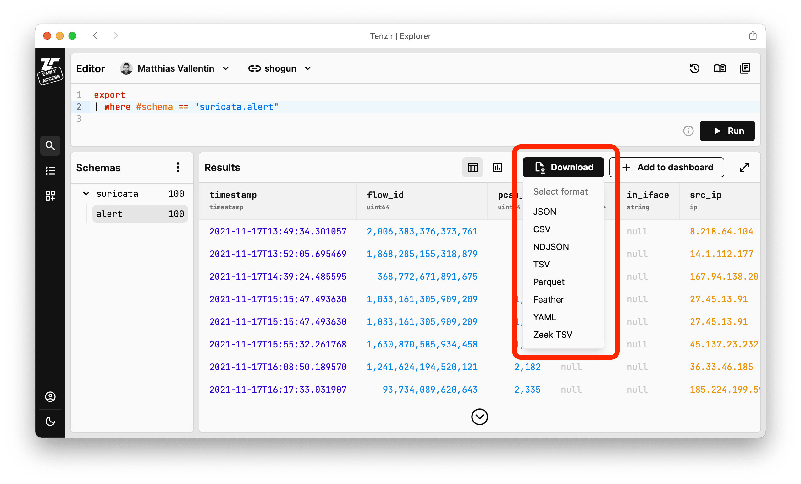

We are thrilled to announce Tenzir
[v4.12](https://github.com/tenzir/tenzir/releases/tag/v4.12.1), a feature-packed
release introducing numerous enhancements. Notable additions include list
unrolling, event deduplication, and the deployment of advanced pipeline
architectures with publish-subscribe. We've also added a download button,
extended support for UDP, and implemented many other refinements to improve your
experience.


<!-- truncate -->

## Unroll and Deduplicate Events

In today's data-driven world, many data sources deliver information in the form
of lists/arrays. While seemingly simple, working with these lists can sometimes
pose challenges, particularly when the data structure becomes intricate. Let's
take the example of a connection summary stream in JSON format:

```json
{
  "src": "192.0.2.1",
  "dst": [
    "192.0.2.143",
    "203.0.113.2"
  ]
}
// after 1min:
{
  "src": "192.0.2.1",
  "dst": [
    "203.0.113.2",
    "172.16.76.150",
    "192.0.2.143"
  ]
}
```

To overcome the hurdles of JSON list manipulation, we introduce the new
[`unroll`](/next/operators/unroll) operator, allowing the creation of an event
for each item in the list. Let's `unroll dst`:

```json
{"src": "192.0.2.1", "dst": "192.0.2.143"}
{"src": "192.0.2.1", "dst": "203.0.113.2"}
// after 1min:
{"src": "192.0.2.1", "dst": "203.0.113.2"}
{"src": "192.0.2.1", "dst": "172.16.76.150"}
{"src": "192.0.2.1", "dst": "192.0.2.143"}
```

The data is now significantly easier to work with.

Do you see the duplicate host pairs? Let's remove them with the new
[`deduplicate`](/next/operators/deduplicate) operator. Run `deduplicate src, dst
--timeout 24h` to condense the above output to:

```json
{"src": "192.0.2.1", "dst": "192.0.2.143"}
{"src": "192.0.2.1", "dst": "203.0.113.2"}
// after 1min:
{"src": "192.0.2.1", "dst": "172.16.76.150"}
```

The `--timeout` option is useful for controlling expiration of entries. In this
example, if the same connection tuple doesn't come up within a 24h interval, the
corresponding entry is removed from the operator's internal state.

We delved deeper into the power of the `deduplicate` operator in a [previous
blog post](reduce-cost-and-noise-with-deduplication).

Building on this, the
[`every`](/language/operator-modifiers#scheduled-executions) operator
(prominently featured in the [previous
release](tenzir-v4.11#execute-sources-on-a-schedule)) can now also accompany
transformations and sinks. To illustrate, let's answer this question: "With how
many new destinations did each device communicate in the last minute?"

Using `every 1min summarize num=count(.) by src`, we get:

```json
{"src": "192.0.2.1", "num": 2}
// after 1min:
{"src": "192.0.2.1", "num": 1}
```

In summary, these transformations provide powerful in-band capabilities leading
to substantial data reduction, simplifying the analysis, and making data shaping
more efficient.

## Publish and Subscribe

Exciting are also the new [`publish`](/next/operators/publish) and
[`subscribe`](/next/operators/publish) operators, which open up endless
possibilities for creating arbitrary dataflow topologies. For instance,
you can set a publishing point within your data stream. It's as simple as `from
tcp://0.0.0.0:8000 | publish input`. This defines a channel `input` that you can
now subscribe to with `subscribe`.

Let's consider a case where we aim to route all alerts into Splunk, and
concurrently import all other non-alert events into Tenzir's storage for further
analysis and monitoring:

``` title="1st subscriber"
subscribe input
| where alert == true
| to splunk
```

``` title="2nd subscriber"
subscribe input
| where alert == false
| import
```

Here, the first subscriber takes the events from the `input` channel where the
alert field is `true` and routes them to Splunk. In parallel, the second
subscriber takes the remaining events with the alert field marked as `false` and
imports them into Tenzir’s storage. Our new feature enables this precise,
dynamic routing, making data management more efficient and streamlined.

## Contexts as Code

[Tenzir v4.10](tenzir-v4.10) introduced introduced the ability to statically
define pipelines in Tenzir's configuration file: **Pipelines as Code (PaC)**.
This release expands upon that capability by also allowing static configuration
of contexts.

```yaml title="tenzir.yaml"
tenzir:
  contexts:
    # A unique name for the context that's used in the context, enrich, and
    # lookup operators to refer to the context.
    indicators:
      # The type of the context (e.g., `lookup-table`, `geoip`, ...).
      type: bloom-filter
      # Arguments for creating the context, as described by the documentation of
      # the chosen context type.
      arguments:
        capacity: 1B
        fp-probability: 0.001
```

On a related note: The operators `context create`, `context reset`,
`context update`, and `context load` were changed to no longer return
information about the associated context. Instead, they now act as a sink.

## Download Button

Ever wanted to just save the output from Explorer to your computer? With the new
**Download** button, you can do precisely that:



Just select one of the available formats and you're good to go!

## Other Changes

- There's a new [`udp`](/next/connectors/udp) connector for sending and receiving
  UDP datagrams. Finally, you can now receive Syslog natively.
- Speaking of Syslog: we've enhanced our parser to be *multi-line*. In case the
  next line isn't a valid Syslog message by itself, we interpret it as the
  continuation of the previous message.
- The [`tcp`](/next/connectors/tcp) loader now accepts multiple connections in
  parallel, e.g., when used as `from tcp://127.0.0.1:8000 read json`.
- We've massively improved performance of our [Parquet](/next/formats/parquet)
  and [Feather](/next/formats/feather) formats for large files. For writing,
  they now both support streaming row groups and record batches, respectively,
  and for reading Feather now supports streaming via the Arrow IPC format as
  well. This comes in handy for those of you working in the Apache Arrow
  ecosystem and seeking seamless interoperability without loss of rich typing.

As usual, the complete list of bug fixes, adjustments, and enhancements
delivered with this version can be found in our [changelog](/changelog#v4120).

Explore the latest features at [app.tenzir.com](https://app.tenzir.com) and
chat with us at [our Discord server](/discord).
