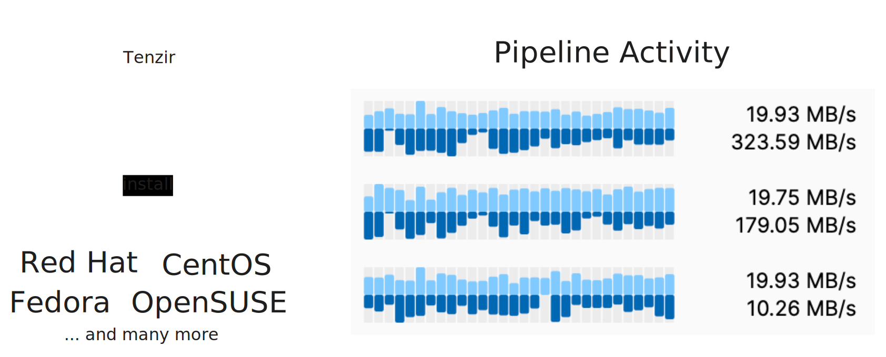

[Tenzir v4.15](https://github.com/tenzir/tenzir/releases/tag/v4.15.0) is now
available for download. The Tenzir Platform now shows live-updating pipeline
activity, and the Tenzir Node has improved support for subnet keys in lookup
tables, and installs natively for RedHat Linux and its derivatives.



<!-- truncate -->

## Pipeline Activity

The pipeline overview page on [app.tenzir.com](https://app.tenzir.com) now
features a live-updating view of recent pipeline activity.

Grab some popcorn, sit back, and watch the data flow! 🍿

:::info Join the conversation!
We plan to make pipelines easier to introspect and to manage. Do you have ideas,
or want to take a sneak peek at what's coming up?

Every Tuesday at at 8 AM EST / 11 AM EST / 5 PM CET / 9.30 PM IST, we're hosting
[Office Hours](/blog/introducing-office-hours) in our [Discord](/discord). Come
join the discussion.
:::

## RedHat Linux Support

Installing a Tenzir Node is now easier than ever on RedHat Linux and its
derivatives. As of this release, it is now possible to install Tenzir as an RPM
package. Just run the installer script to get started:

```bash
curl https://get.tenzir.app | sh
```

## Subnet Keys in Lookup Tables

The [`lookup-table` context](/contexts/lookup-table) now handles subnet keys
correctly. Lookups with an IP address or subnet value now match if the key is
within any of the subnets used as keys. If multiple subnets match, then the best
match is returned.

:::info Want to learn more?
We wrote a new user guide about using subnet keys in lookup tables: [Enrich with
Network Inventory](/next/usage/enrich-with-network-inventory).
:::

## Sort by Multiple Fields

The `sort` operator now supports sorting by multiple fields, specified in order
of precedence. The following two examples have the exact same behavior, making
sorting by multiple fields much easier:

```text {0} title="Before: sorting was limited to one field at a time"
sort baz
| sort --stable bar
| sort --stable foo
```

```text {0} title="After: sorting now supports multiple fields"
sort foo, bar, baz
```

## Edit Pipelines

The `/pipeline/update` API endpoint now supports updating the definition of a
pipeline. This functionality will soon be available in the app for nodes that
support it. Gone are the times where editing a pipeline required copying its
definition, redeploying it, deleting the old and starting the new version.

## Other Changes

For a full list of enhancements, adjustments, and bug fixes in this release,
please check our [changelog](/changelog#v4150).

Explore the latest features at [app.tenzir.com](https://app.tenzir.com) and
join the conversation on [our Discord server](/discord).
