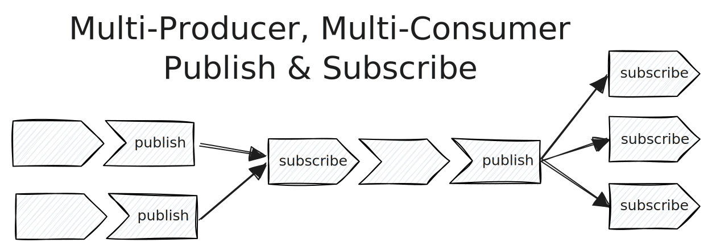

Pipelines now connect more flexibly than ever before with [Tenzir
v4.16](https://github.com/tenzir/tenzir/releases/tag/v4.16.0) and its upgraded
[`publish`](/operators/publish) and [`subscribe`](/operators/subscribe)
operators.



<!-- truncate -->

## Multi-Producer Multi-Consumer

The introduction of the `publish` operator with [Tenzir
v4.12](/blog/tenzir-v4.12) enabled split-routing of events. We frequently saw
users write pipelines like this:

```text {0} title="Pipeline 1: Publish alerts"
…
| publish alerts
```

```text {0} title="Pipeline 2: Save alerts with a high risk score to Splunk"
subscribe alerts
| where risk_score >= 90
| fluent-bit splunk …
```

```text {0} title="Pipeline 3: Save all alerts to S3 for later reference"
subscribe alerts
| to s3://bucket/alerts.json.zst write json --compact-output
```

This approach, however, fell apart as soon as another data source tried to
publish to the topic `alerts`. Trying to do so just displayed an  error.
Fundamentally, the `publish` and `subscribe` operators were single-producer,
multi-consumer (SPMC).

With Tenzir v4.16, the `publish` operator's topics no longer have to be unique,
making it possible to easily merge data flows back together:

```text {0} title="Pipeline 4: Publish further alerts"
…
| publish alerts
```

This seemingly small change makes Tenzir's pipelines more flexible than ever
before. Now, you can write modular pipelines for individual parts of your use
cases.

For example, imagine that you have a pipeline that persists events to "cold
storage" by writing them to S3 in a strongly compressed format:

```text
subscribe to-cold-storage
| to s3://bucket/cold_storage.json.zst write json --compact-output
```

Now, you can re-use this building block easily from any pipeline:

```text
…
| publish to-cold-storage
```

## Aggregation Functions for Percentiles

We've added new aggregation functions for calculating percentiles: `p99`, `p95`,
`p90`, `p75`, and `p50`. For example, to plot the 99th percentile of the number
of packets sent per flow, you can now write:

```text
…
| where #schema == "suricata.flow"
| summarize p99(flow.pkts_toserver)
```

We've additionally renamed the `approximate_median` function to `median`. We
found the longer name to be unintuitive and cumbersome to write, so we decided
to simplify it.

## Erase Lookup Table Entries

A user recently showed me this abomination consisting of three pipelines:

```text {0} title="Pipeline 1: Save lookup table"
context inspect my-lookup-table
| to /tmp/my-lookup-table.json
```

```text {0} title="Pipeline 2: Wipe the lookup table"
context reset my-lookup-table
```

```text {0} title="Pipeline 3: Restore the lookup table without some keys"
from /tmp/my-lookup-table.json
| yield value
| where key !in ["foo", "bar", "baz"]
| context update my-lookup-table
```

This is a lot of work just to erase three values from a lookup table. With
Tenzir v4.16, you can now erase entries from a lookup table directly.

```text
context inspect my-lookup-table
| yield value
| where key in ["foo", "bar", "baz"]
| context update my-lookup-table --erase
```

## Other Changes

For a full list of changes in this release, please check our
[changelog](/changelog#v4160), and play with the new changes at
[app.tenzir.com](https://app.tenzir.com).

Are you using `publish` and `subscribe` to connect your pipelines already? We'd
like to hear your thoughts! Join [our Discord server](/discord).
