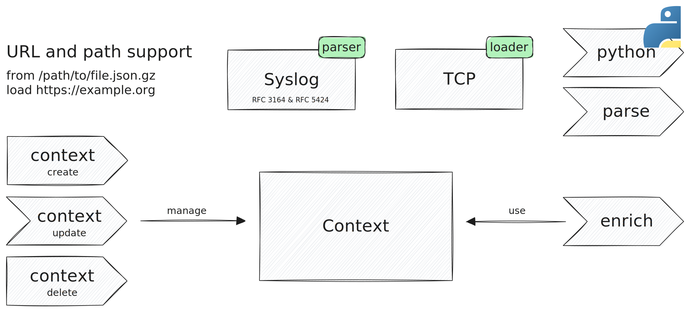
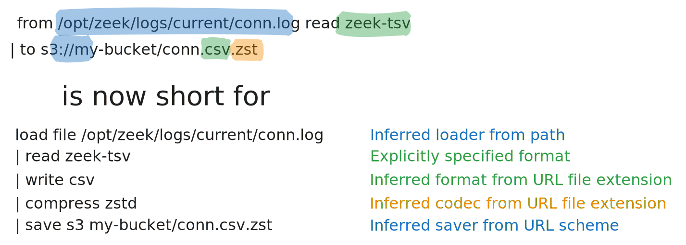

[Tenzir v4.6](https://github.com/tenzir/tenzir/releases/tag/v4.6.0) is here, and
it is our biggest release yet. The headlining feature is the all-new **context**
feature, powered by the `context` and `enrich` operators and the new **context
plugin** type.



<!-- truncate -->

## Enrich with Contexts

Contexts enable enriching events in real-time with additional information.

This is best explained on an example. We'll use the publicly available [Feodo IP
Block List](https://feodotracker.abuse.ch) to enrich events with information
that have a source IP address that is on the block list.

```text {0} title="Create a 'lookup-table' context named 'feodo'"
context create feodo lookup-table
```

```text {0} title="Fill the 'feodo' context with information"
from https://feodotracker.abuse.ch/downloads/ipblocklist_aggressive.csv read csv --allow-comments
| context update feodo --key dst_ip
```

```text {0} title="Enrich Suricata events with the 'feodo' context"
export
| where #schema == /suricata.*/
| enrich feodo --field dest_ip
```

```json {0} title="Possible output"
{
  "timestamp": "2023-11-30T14:52:57.716360+0200",
  "event_type": "alert",
  "dest_ip": "167.179.103.206",
  // ...
  "feodo": {
    "key": "167.179.103.206",
    "context": {
      "first_seen_utc": "2023-11-03T07:55:23",
      "dst_ip": "167.179.103.206",
      "dst_port": 2083,
      "c2_status": "offline",
      "last_online": "2023-11-03T00:00:00",
      "malware": "Pikabot"
    },
    "timestamp": "2023-11-30T14:58:23.172832+0200"
  }
}
```

Contexts are—just like formats, connectors, and operators—designed to be a
building block of TQL. We're starting out with just the open-source
`lookup-table` context plugin, and already have plans for more context plugins
and other operators besides `enrich` that use context plugins in the near
future. Stay tuned!

:::info Follow our Blog Post Series
We're so excited about enrichments that we wrote an entire blog post series on
it. The [first post](/blog/enrichment-complexity-in-the-wild) is already live,
and sets the scene. The second post will soon follow to explain in-depth just
how Tenzir makes enrichments easy. Stay tuned!
:::

## Onboard Data Faster Than Ever

Want to read CEF over syslog from TCP? Not a problem with four all-new features
of Tenzir v4.6—are you able to spot all four?

```
from tcp://localhost:514 read syslog
| parse content cef
```

Here's an example input and output:

```syslog {0} title="Input"
Nov 13 16:59:59 host123 FOO: CEF:0|FORCEPOINT|Firewall|6.6.1|0|Generic|0|deviceExternalId=Master FW node 1 dvc=10.1.1.40 dvchost=10.1.1.40 msg=log server connection established deviceFacility=Logging System rt=Jan 17 2020 08:52:10
```

```json {0} title="Output"
{
  "facility": null,
  "severity": null,
  "timestamp": "Nov 13 16:59:59",
  "hostname": "host123",
  "tag": "FOO",
  "content": {
    "cef_version": 0,
    "device_vendor": "FORCEPOINT",
    "device_product": "Firewall",
    "device_version": "6.6.1",
    "signature_id": "0",
    "name": "Generic",
    "severity": "0",
    "extension": {
      "deviceExternalId": "Master FW node 1",
      "dvc": "10.1.1.40",
      "dvchost": "10.1.1.40",
      "msg": "log server connection established",
      "deviceFacility": "Logging System",
      "rt": "Jan 17 2020 08:52:10"
    }
  }
}
```

### URLs and Paths

`from`, `load`, `to` and `save` now support working with URLs and paths
directly, and no longer require specifying a connector and format explicitly.
Additionally, they now support automatic compression and decompression.

For example, this pipeline reads events from a Zeek TSV log file in the local
file system, and stores them as Zstd-compressed CSV file in an S3 bucket:



### TCP Connector

Acquire data over TCP (or TLS) directly with the new `tcp` loader. Use the
`--tls` option to read from TLS instead, and `--listen` to open a server rather
than connect as a client.

### Syslog Format

Read syslog RFC 3164 and RFC 5424 with the new `syslog` parser. The parser
automatically disambiguates between the two common syslog standards.

### Parse Operator

Use the `parse` operator to structurally decompose fields with any parser. This
enables parsing of structured data embedded as strings inside another format.

Onboarding custom data sources is a pain for every SOC operations team. We've
seen CSV where some columns are NDJSON, CEF in syslog, and grok patterns in CEF
in syslog. With the `parse` operator, this no longer has to be as painful, and
you can finally spend more time working with your data than onboarding it.

## Rapid Prototyping with the Python Operator

The `python` operator allows for modifying events using Python. Here are some
cool things that we've done in the first days of playing with the operator:

```text {0} title="Calculate the square root of a field"
python '
  import math
  self.sq_x = math.sqrt(self.x)
'
```

```text {0} title="Add a duration field to Suricata flow events"
where #schema == "suricata.flow"
| python 'self.flow.duration = self.flow.end - self.flow.start'
```

```text {0} title="Parse a URL into components"
where #schema == "suricata.flow"
| python '
  import urllib
  from collections import namedtuple
  self.http.url = f"http://{self.http.hostname}{self.http.url}"
  self.http.parsed = urllib.parse.urlsplit(self.http.url)._asdict()
  self.http.parsed.qs = urllib.parse.parse_qs(self.http.parsed.query)
'
```

:::caution Renamed Python Package
As part of this release, we completely remodeled our Python package and renamed
it from `pytenzir` to `tenzir`. The old package continues to work, but is
deprecated and no longer maintained.
:::

## Long-Poll Support for Serve

The `/serve` endpoint, which allows for fetching events from a REST API for
pipelines with the `serve` sink operator, now supports long-polling.

Previously, the endpoint had `timeout` and `max_events` parameters. The latter
defines how many events the response may contain at most. The former defines an
upper bound for the duration that the endpoint waits before it returns less than
the desired number of events.

In addition, the endpoint now supports a `min_events` parameter, which makes it
return eagerly as soon as at least the specified number of events arrived at the
sink of the pipeline. Setting a low value for the minimum number of events in
combination with a high timeout effectively enables long-polling.

Pipelines run in the Explorer on [app.tenzir.com](https://app.tenzir.com) use an
implicit `serve` sink to transport events to the results table. For slow-running
pipelines with few results we found long-polling to improve responsiveness of
the Explorer noticeably, as first results will be displayed much earlier now.

## Changes to Ingress and Egress

Interacting with the node no longer counts as pipeline ingress or egress. This
is best explained visually:


## Want More?

- The CSV, SSV, and TSV parsers are now more robust and consistent with their
  respective printers for null values, empty strings, and lists of values. A new
  `--allow-comments` option allows for stripping away lines that begin with `#`.

- The JSON parser supports a new option `--arrays-of-objects` to read a stream
  of arrays of objects rather than a stream of objects. This is particularly
  useful when fetching events from REST APIs, which usually aim to return all
  events at in one array rather than stream objects one at a time.

- The new `yield` operator "zooms in" on a record field.

- Use the `show` operator without any arguments to see all aspects of a node
  instead of just the specified aspect.

- The new `apply` operator includes a pipeline defined in an external file. For
  example, `apply frobnify` will search for a file named `frobnify.tql`, first
  in the current directory, and then in the `apply/` sub-directories of the
  config directory of Tenzir.

We provide a full list of changes [in our changelog](/changelog#v460).

Head over to [app.tenzir.com](https://app.tenzir.com) to play with the new
features and join [our Discord server](/discord)—the perfect place to ask
questions, chat with Tenzir users and developers, and to discuss your feature
ideas!
