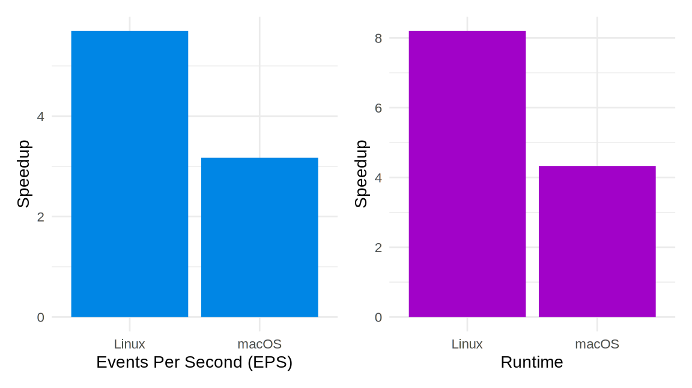

Hot off the press: [Tenzir
v4.8](https://github.com/tenzir/tenzir/releases/tag/v4.8.0). This release is
filled with goodness.


<!-- truncate -->

## Lookup Operator

The new [`lookup`](/next/operators/lookup) operator is a unique vehicle to
perform live- and retro-matching simultaneously. Think of it as enrichment of
all data that gets ingested into a node, plus a historical query for every
change in the enrichment context.

## Graylog Support

The new [`gelf`](/next/formats/gelf) parser makes it possible to read a stream
of [Graylog Extended Log Format
(GELF)](https://go2docs.graylog.org/5-0/getting_in_log_data/gelf.html) messages.

You can now point your GELF feed to a Tenzir pipeline. Read our [Graylog
integration page](/next/integrations/graylog) for the details. The TL;DR is:

```
from tcp://0.0.0.0:12201 read gelf
| import
```

## Shift Timestamps and Delay Events

The new [`timeshift`](/next/operators/timeshift) and
[`delay`](/next/operators/timeshift) operators make it possible to rewrite
timestamps and act on them to replay data flexibly.

The `timeshift` operator adjusts a series of time values by anchoring them
around a given start time. You can rewrite and scale timestamps:


For example, use `timeshift` to re-align our Zeek example dataset to January 1,
1984, and make the trace 100x slower:

```
from https://storage.googleapis.com/tenzir-datasets/M57/zeek-all.log.zst read zeek-tsv
| timeshift --start 1984-01-01 --speed 0.01 ts
```

While `timeshift` rewrites timestamps, `delay` acts on them by yielding events
according to a given time field. Delaying events comes in handy when replaying a
trace or logs. Delaying means effectively introducing sleeping periods
proportional to the inter-arrival times of the events. As with `timeshift`, you
can scale the behavior with a multiplicative constant to speed things up.

Here is visual explanation of how `delay` works:


## HTTP Saver

The [`http`](/next/connectors/http) connector now also has a saver in addition
to the already existing loader. Here's how they work in a nutshell:


For the loader, you specify the request body and the response body is input for
the pipeline. For the saver, the pipeline contents determine the request body
and the response body isn't processed.

## Fluent Bit Performance

The [`fluent-bit`](/operators/fluent-bit) source operator got a significant
performance boost as a byproduct of changing the Fluent Bit data exchange format
from JSON to MsgPack:



Read the [dedicated blog post on this
issue](/blog/switching-fluentbit-from-json-to-msgpack).

Thanks to Christoph Lobmeyer and Yannik Meinhardt for reporting this issue! 🙏

## Improved Pipeline State Persistence

We've improved the [state management of
pipelines](/next/usage/manage-a-pipeline) when nodes restart or crash.
Recall the state machine of a pipeline:


The gray buttons on the state transition arrows correspond to actions you can
take.

Here's what changed on node restart and/or crash:

- Running pipelines remain in *Running* state. Previously, the node stopped all
  running pipelines when shutting down. The unexpected behavior was that a
  restart of a node didn't automatically resume previously running pipelines.
  This is now the case.
- Paused pipelines transition to the *Stopped* state. The difference between
  *Paused* and *Stopped* is that paused pipelines can be quickly resumed without
  losing in-memory state. Stopping a pipeline fully evicts it. A node restart
  necessarily evicts the state of a pipeline, hence the transition from *Paused*
  to *Stopped*. Previously, paused pipelines were considered *Failed* after a
  node restart.

## Here & There

Lots of smaller bug fixes landed in this release. We urge everyone to upgrade.
If you're curious, [our changelog](/changelog#v480) has the full list of
changes.

Visit [app.tenzir.com](https://app.tenzir.com) to try the new
features and swing by [our Discord server](/discord) to get help and talk about
your use cases.
