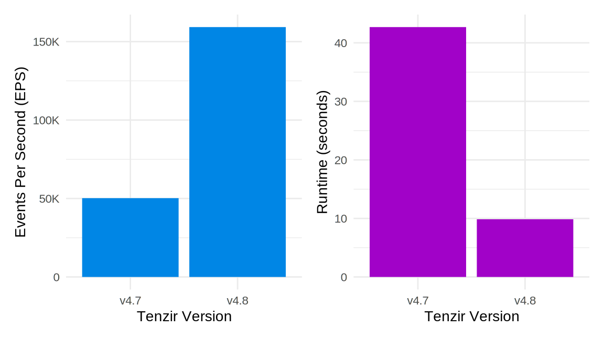

[Tenzir v4.8](https://github.com/tenzir/tenzir/releases/tag/v4.8.0) .

<!---->

<!-- truncate -->

## Theme A

TBD

## Theme B

TBD

## Theme C

TBD

## Fluent Bit Performance

The [`fluent-bit`](/operators/fluent-bit) source operator got a 3–4x
throughput boost:



We used the following pipeline to generate these numbers:

```bash
tenzir --dump-metrics 'fluent-bit stdin | head 10M | discard' < eve.json
```

For this Suricata dataset from our [user guides](/user-guides), events per
second (EPS) increased from 50k to 150k (3x), and the operator runtime decreased
from 40s to 10x (4x). We measured this on a 2021 MacBook Pro with Apple M1 Max.

Our primary goal was actually working around a bug in the Fluent Bit `lib`
output plugin. The TL;DR of the bug is that Fluent Bit's `lib` output produces
messages of the form `[timestamp, JSON]`, but if the JSON object is too large,
it simply gets cropped. The workaround involved switching the exchange format
of the `lib` output plugin from JSON to MsgPack. If you're curious, take a look
at [#3770](https://github.com/tenzir/tenzir/pull/3770) for the full scoop.

Thanks to Christoph Lobmeyer and Yannik Meinhardt for tracking this issue! 🙏

## Here & There

If you're curious, [our changelog](/changelog#v480) has the full list of
changes.

Visit [app.tenzir.com](https://app.tenzir.com) to try the new
features and swing by [our Discord server](/discord) to get help and talk about
your use cases.
