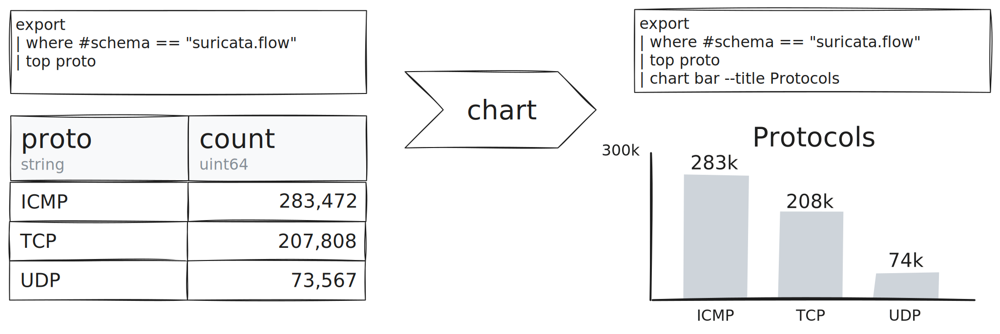

We're thrilled to announce the release of [Tenzir
v4.9](https://github.com/tenzir/tenzir/releases/tag/v4.9.0), enhancing the
Explorer further to empower you with the capability of rendering your data as a
chart.



<!-- truncate -->

## Chart Operator

The new [`chart`](/next/operators/chart) operator transforms the way you
visualize your data on [app.tenzir.com](https://app.tenzir.com). It lets you
depict your events graphically instead of in table form.

Charting integrates seamlessly into your pipelines by simply adding the `chart`
operator. For instance, plotting a bar chart representing the frequency of
occurrences for each protocol in `zeek.conn` events can be as simple as this:

```
export
| where #schema == "zeek.conn"
| top proto
| chart bar --title "Protocols"
```


This line chart depicts the load average over 15 minutes, making use of the
recently added `metrics` operator:

```
metrics
| where #schema == "tenzir.metrics.cpu"
| sort timestamp
| chart line -x timestamp -y loadavg_15m --title "Load Average (15 min)"
```


This area chart displays the total ingress across all pipelines for the past 10
minutes in MiB/s.

```
metrics
| where #schema == "tenzir.metrics.operator"
| where timestamp > 10 min ago
| where source == true
| where internal == false
| sort timestamp
| python 'self.egress_rate = self.output.approx_bytes / self.duration.total_seconds() / 2**20'
| chart area -x timestamp -y egress_rate --title "Total Ingress (MiB/s)"
```


This pie chart shows the distribution of events stored at the node by disk
usage:

```
show partitions
| summarize diskusage=sum(diskusage) by schema
| chart pie --title "Disk Usage (bytes)"
```


We're just getting started with charting! If you want to see further chart types
added, have feedback on charting, or want to share examples of your
visualizations with the chart operator, we would love to [hear from
you](/discord).

:::info Coming Soon: Dashboards
The `chart` operator is a first step towards having dashboards directly in
Tenzir. Any result that you see in the Explorer you will soon be able to pin and
freely arrange on a customizable dashboard.
:::

## Bloom Filter Context

The new `bloom-filter` context makes it possible to use large datasets for
enrichment. It uses a [Bloom filter](https://en.wikipedia.org/wiki/Bloom_filter)
to store sets in a compact way, at the cost of potential false positives when
looking up an item.

If you have massive amounts of indicators or a large amount of things you would
like to contextualize, this feature is for you.

Create a Bloom filter context by using `bloom-filter` as context type:

```
context create indicators bloom-filter
```

Then populate it with a pipeline, exactly like a lookup table:

```
from /tmp/iocs.csv
| context update bloom-filter --key ioc
```

Thereafter use it for enrichment, e.g., in this example pipeline:

```
export --live
| where #schema == "suricata.dns"
| enrich indicators --field dns.rrname
```

The `enrich` operator gained a new `--filter` option to remove events it could
not enrich. Use the new option to remove anything that is not included in the
Bloom filter:

```
export --live
| where #schema == "suricata.dns"
| enrich indicators --field dns.rrname --filter
```

## Housekeeping

Other noteworthy changes and improvements:
- `tenzir.db-directory` is now `tenzir.state-directory`. The old option remains
  functional, but will be phased out in an upcoming release.
- On the command-line, Tenzir now respects [`NO_COLOR`](https://no-color.org)
  when printing diagnostics. Additionally, colors are automatically disabled
  when the output device is not a terminal.
- RFC 5424-style Syslog parsing now emits a record with the structured data
  fields.
- The `--selector` option for the JSON parser now works with nested and
  non-string fields.
- The `python` operator gained a `--file` option to read from a file instead of
  expecting the Python code as a positional argument.
- The `csv`, `tsv`, and `ssv` parsers now fill in nulls for missing values.

For the curious, [the changelog](/changelog#v490) has the full scoop.

Experience the new features at [app.tenzir.com](https://app.tenzir.com) and join
us on [our Discord server](/discord).
