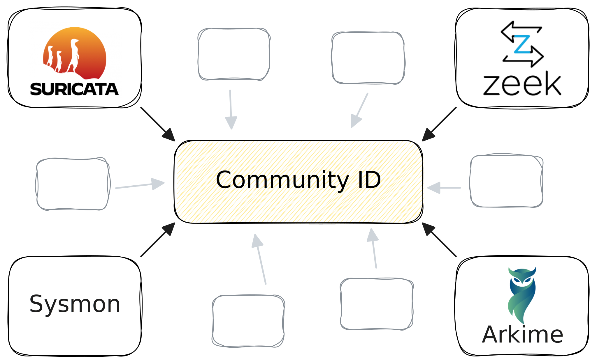

The [Community ID](https://github.com/corelight/community-id-spec) is a
standardized flow hash that generates a unique identifier for a network
connection. Since it's implemented across multiple tools, it allows for tracking
events associated with the same connection across different systems. This is
particularly valuable for correlating network and endpoint events.



<!-- truncate -->

For instance, when using [Suricata](https://suricata.io) or
[Zeek](https://zeek.org) for network visibility alongside
[Sysmon](https://learn.microsoft.com/en-us/sysinternals/downloads/sysmon) or a
full-fledged EDR for endpoint telemetry, a core challenge is seamlessly linking
these two types of events to answer questions like:

- Which files were accessed or modified by the process behind this network
  activity?
- Which user was logged in when this potentially malicious DNS request was made?
- What other network connections were established by the same process that
  communicated with this C2 server?
- Which process initiated this TLS-encrypted network connection that just
  matched a JA4 fingerprint?
- What application is responsible for this anomalous-looking network traffic?

Let's make this more tangible with a concrete example. Consider this Zeek
connection event:

```json title="conn.log"
{
  "ts": "2024-08-29T12:34:56.789Z",
  "uid": "CZwqhx3td8eTfCSwJb",
  "id": {
    "orig_h": "192.168.1.100",
    "orig_p": 65432,
    "resp_h": "93.184.216.34",
    "resp_p": 80
  },
  "proto": "tcp",
  "service": "http",
  "duration": "5.16s",
  "orig_bytes": 205,
  "resp_bytes": 278,
  "conn_state": "SF",
  "missed_bytes": 0,
  "history": "ShADadfF",
  "orig_pkts": 6,
  "orig_ip_bytes": 525,
  "resp_pkts": 5,
  "resp_ip_bytes": 546,
  "community_id": "1:7rgwE/NtiMlsxtm1e9OpqJ3icU0="
}
```

This log reflects an HTTP connection from `192.168.1.100` to `93.184.216.34`. On
the endpoint, this activity might correspond to a Sysmon event like this:

```json title="Sysmon Event ID 3: Network connection detected"
{
  "Event": {
    "System": {
      "Provider": {
        "Name": "Microsoft-Windows-Sysmon",
        "Guid": "{5770385f-c22a-43e0-bf4c-06f5698ffbd9}"
      },
      "EventID": 3,
      "Version": 5,
      "Level": 4,
      "Task": 3,
      "Opcode": 0,
      "Keywords": "0x8000000000000000",
      "TimeCreated": {
        "SystemTime": "2024-08-29T12:34:56.789Z"
      },
      "EventRecordID": 12345678,
      "Correlation": {},
      "Execution": {
        "ProcessID": 4567,
        "ThreadID": 8901
      },
      "Channel": "Microsoft-Windows-Sysmon/Operational",
      "Computer": "DESKTOP-EXAMPLE",
      "Security": {
        "UserID": "S-1-5-18"
      }
    },
    "EventData": {
      "RuleName": "NetworkConnection",
      "UtcTime": "2024-08-29 12:34:56.789",
      "ProcessGuid": "{ABCDEF01-1234-5678-90AB-CDEF12345678}",
      "ProcessId": 1234,
      "Image": "C:\\Windows\\System32\\svchost.exe",
      "User": "NT AUTHORITY\\SYSTEM",
      "Protocol": "tcp",
      "Initiated": "true",
      "SourceIsIpv6": "false",
      "SourceIp": "192.168.1.100",
      "SourceHostname": "DESKTOP-EXAMPLE",
      "SourcePort": 65432,
      "SourcePortName": null,
      "DestinationIsIpv6": "false",
      "DestinationIp": "93.184.216.34",
      "DestinationHostname": "example.com",
      "DestinationPort": 80,
      "DestinationPortName": "http"
    }
  }
}
```

How would you pivot between these two events if given only one of them? This is
where the Community ID shines. The Zeek event already has a Community ID:
`1:YXWfTYEyYLKVv5Ge4WqijUnKTrM=`, but the Sysmon event doesn't.

Luckily, you can compute the Community ID retroactively because all the
necessary information is present in the Sysmon event. With Tenzir's pipelined
query language (TQL), you can generate the Community ID by passing the
relevant fields to the `community_id` function like this:

```tql title="pipeline.tql"
// tql2
from "sysmon.json"
CommunityID = community_id(
  src_ip=Event.EventData.SourceIp,
  src_port=Event.EventData.SourcePort,
  dst_ip=Event.EventData.DestinationIp,
  dst_port=Event.EventData.DestinationPort,
  proto=Event.EventData.Protocol,
)
```

When you [run the pipeline](/usage/run-pipelines), the output will now include
an extra field:

```json title="Enhanced Sysmon event"
{
  "Event": {
    // ... other fields ...
  },
  "CommunityID": "1:7rgwE/NtiMlsxtm1e9OpqJ3icU0="
}
```

There you go! In your analytics environment, you can now pivot between these two
events by simply following the value of the Community ID.

Whether you’re building out an XDR stack, enhancing your threat hunting
capabilities, or responding to incidents, having a flexible data integration
layer is crucial. Tenzir has you covered. Our data pipeline engine is
security-first and supports much more than just Community ID computation. Check
out our free [Community Edition](https://app.tenzir.com) to try it yourself, or
join our friendly [Discord community](/discord) to learn more.
