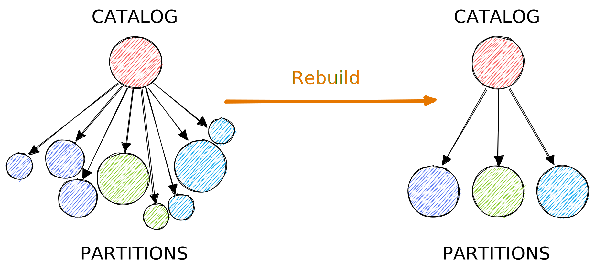

[VAST v2.3][github-vast-release] is now available, which introduces an automatic
data defragmentation capability.

[github-vast-release]: https://github.com/tenzir/vast/releases/tag/v2.3.0

<!--truncate-->

## Automatic Rebuilds

VAST server processes now continuously rebuild partitions in the background. The
following diagram visualizes what happens under the hood:



Rebuilding kicks in when a partition has the following properties:

1. **Outdated**: if a partitions does not have the latest partition version, it
   may not enjoy the latest features and optimizations. It makes it also faster
   to adopt VAST versions that include breaking changes in the storage layout.
   Therefore, VAST rebuilds outdated partitions to bring them into the most
   recent state.

2. **Undersized**: numerous small partitions can cause fragmentation in the
   catalog, causing higher memory consumption, larger database footprint, and
   slower queries. Rebuilding merges undersized partitions, thereby
   defragmenting the system. This reduces the resource footprint and makes
   queries faster.

To enable automatic rebuilding, set the new `vast.automatic-rebuild` option.

```yaml
vast:
  # Control automatic rebuilding of partitions in the background for
  # optimization purposes. The given number controls how many rebuilds to run
  # concurrently, and thus directly controls the performance vs. memory and CPU
  # usage trade-off. Set to 0 to disable. Defaults to 1.
  automatic-rebuild: 1
```

Now that we have an LSM-style merge operation of partitions, we reduced
the partition cutoff timeout to 5 minutes from 1 hour by default (controlled
through the option `vast.active-partition-timeout`). This reduces the risk of
data loss in case of a crash. This comes in handy in particular for low-volume
data sources that never exhaust their capacity.

## Optional Partition Indexes

Historically, VAST evolved from a special-purpose bitmap indexing system into a
general-purpose telemetry engine for security data. Today, VAST has a two-tiered
indexing architecture with sparse sketch structures at the top, followed by a
second layer of dense indexes. As of this release, it is possible to disable
this second layer.

The space savings can be substantial based on the size of your index. For
example, if the first layer of indexing always yields highly selective results,
then it the dense indexes do not provide a lot of value. One scenario would be
retro-matching: if you only do IoC-style point queries, they will be most likely
covered well by the sketches. If you do not have selective queries, the dense
index is not helping much anyway, since you need access the base data anyway. A
really good use case for the indexes when your have a scatterd data access
patterns, i.e., highly selective results *within* a partition, but a result that
spans many disparate partitions.

In a simplified model, VAST performs three steps when executing a query:

1. Send the query to the catalog, which maintains VAST's partitions, and ask it
   for a list of candidate partitions. The catalog maintains the first tier of
   sparse indexes, currently one per partition.

2. Send the query to all candidate partitions in parallel, each of which
   contains dense indexes for all fields in the partition's schema. The index
   lookup yields a set of candidate records IDs within the partition.

3. Send the query to all candidate partition's stores, provided the index lookup
   yielded record IDs. Then evaluating the query against the candidate events
   and return the result.

Here's how you can configure a partition index to be disabled:

```yaml
vast:
  index:
    rules:
        # Don't create partition indexes the suricata.http.http.url field.
      - targets:
          - suricata.http.http.url
        partition-index: false
        # Don't create partition indexes for fields of type addr.
      - targets:
          - :ip
        partition-index: false
```

## Improved Responsiveness Under High Load

Two small changes improve VAST's behavior under exceptionally high load.

First, the new `vast.connection-timeout` option allows for modifying the default
client-to-server connection timeout of 10 seconds. Previously, if a VAST server
was too busy to respond to a new client within 10 seconds, the client simply
exited with an unintelligable `request_timeout` error message. Here's how you
can set a custom timeout:

```yaml
vast:
  # The timeout for connecting to a VAST server. Set to 0 seconds to wait
  # indefinitely.
  connection-timeout: 10s
```

The option is additionally available under the environment variable
`VAST_CONNECTION_TIMEOUT` and the `--connection-timeout` command-line option.

Second, we improved the operability of VAST servers under high load from
automated low-priority queries. We noticed that when spawning thousands of
automated retro-match queries that compaction would stall and make little
visible progress, risking the disk running full or no longer being compliant
with GDPR-related policies enforced by compaction.

To ensure that compaction's internal and regular user-issued queries work as
expected even in this scenario, VAST now considers queries issued with
`--low-priority`, with even less priority compared to regular queries (down from
33.3% to 4%) and internal high-priority queries used for rebuilding and
compaction (down from 12.5% to 1%).
