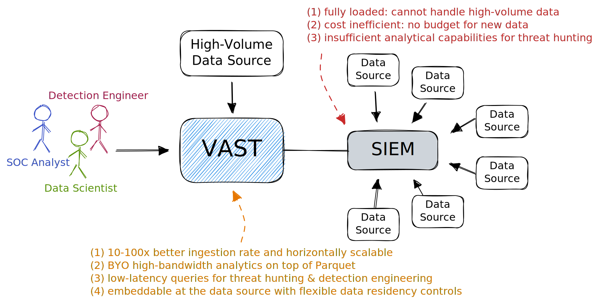

# SIEM Offloading

There is [a trend towards a second SIEM][corelight-2nd-siem], and [it's not
new][gartner-dual-siem]. Benefits include cost savings, new analytical
capabilities, higher visibility, improved detection in a modern engine. And most
importantly, *incremental deployability*: you can add a new system without
disrupting existing services.

When you realize that you need to deploy two SIEMs, you are basically taking the
first step towards a distributed architecture. While it's possible to run the
offloading engine centrally, this is the time to re-evaluate your strategy. How
to comply best with data residency regulations? How do I break down silos? How
can I support threat hunting and detection engineering?

SIEM offloading with a new engine does not mean you have to immediately adopt a
fully decentralized architecture. You can also build your own lakehouse
architecture with VAST, thanks to a standardized data plane via [Apache
Arrow](https://arrow.apache.org). In fact, it makes sense to centralize
heavy-duty analytics that require a lot of horse power. But you can also push a
lot of front-line detection deep into the edge.

[corelight-2nd-siem]: https://corelight.com/blog/one-siem-is-not-enough
[gartner-dual-siem]: https://medium.com/anton-on-security/living-with-multiple-siems-c7fea37c5020

:::tip Key Benefits
Using VAST in front of your SIEM has the following benefits:

1. **Reduced cost**: VAST cuts your bill by absorbing the load of the heavy
   hitters while you can keep using the long tail of integrated data sources
   without disruption.
2. **Higher performance**: VAST's system architecture has a strict separation
   of read and write path that scale independently, making it possible to
   operate the system under continuous inbound load. Compared to legacy SIEMs,
   VAST is a resource-efficient, embeddable telemetry engine that offers 10-100x
   ingestion bandwidth, and executes queries with
   interactive latencies.
3. **Reduce Lock-in**: VAST stores all event data in an open, analytics-friendly
   format ([Parquet](https://parquet.apache.org)) that makes it easy to BYO
   detection workloads.
4. **Easy compliance**: VAST's powerful transforms allow you to perform
   fine-grained field-level modifications to anonymize, pseudonymize, or encrypt
   sensitive data. With compaction, you can specify retention periods (e.g.,
   "anonymize URLs after 7 days") and define a multi-level roll-up strategy to
   age data gracefully.
:::
