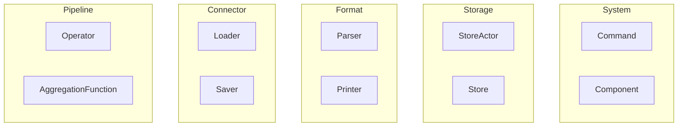

# Plugins

Tenzir has a plugin system that makes it easy to hook into various places of
the data processing pipeline and add custom functionality in a safe and
sustainable way. A set of customization points allow anyone to add new
functionality that adds CLI commands, receives a copy of the input stream,
spawns queries, or implements integrations with third-party libraries.

There exist **dynamic plugins** that come in the form shared libraries, and
**static plugins** that are compiled into libtenzir or Tenzir itself:

Plugins do not only exist for extensions by third parties, but Tenzir also
implements core functionality through the plugin API. Such plugins compile as
static plugins. Because they are always built, we call them *builtins*.

## Plugin types

Tenzir offers several customization points to exchange or enhance functionality
selectively. Here is a list of available plugin categories and plugin types:

### Operator

The pipeline plugin adds a new [pipeline
operator](../../understand/operators/README.md) that users can reference in a
[pipeline definition](../../understand/pipelines.md).

### Aggregation Function

The aggregation function plugin adds a new [aggregation
function](../../understand/operators/transformations/summarize.md#aggregate-functions)
for the `summarize` pipeline operator that performs an incremental aggregation
over a set of grouped input values of a single type.

### Loader

The loader plugin defines the input side of a
[connector](../../understand/connectors/) for use in the `from
CONNECTOR read FORMAT` and `load CONNECTOR` operators.

### Saver

The saver plugin defines the output side of a
[connector](../../understand/connectors/) for use in the `write FORMAT to
CONNECTOR` and `save CONNECTOR` operators.

### Parser

The parser plugin defines the input side of a
[format](../../understand/formats/) for use in the `from CONNECTOR read FORMAT`
and `parse FORMAT` operators.

### Printer

The parser plugin defines the output side of a
[format](../../understand/formats/) for use in the `write FORMAT to CONNECTOR`
and `print FORMAT` operators.

### Store

Inside a partition, the store plugin implements the conversion from in-memory
Arrow record batches to the persistent format, and vice versa.

:::note Store Actor
There exists a variant of the store plugin called the store actor plugin, which
is more powerful and allows for customizing the control flow on top of providing
a custom store backend. Unlike the store plugin, the store actor plugin is
responsible for doing I/O itself.
:::

### Command

The command plugin adds a new command to the `tenzir` executable, at a
configurable location in the command hierarchy. New commands can have
sub-commands as well and allow for flexible structuring of the provided
functionality.

### Component

The component plugin spawns a component inside a node. A component is an
[actor](actor-model) and runs in parallel with all other components.

This plugin is the most generic mechanism to introduce new functionality.
