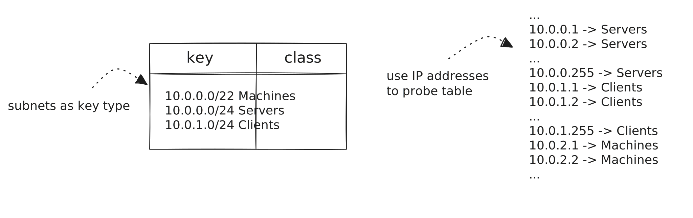
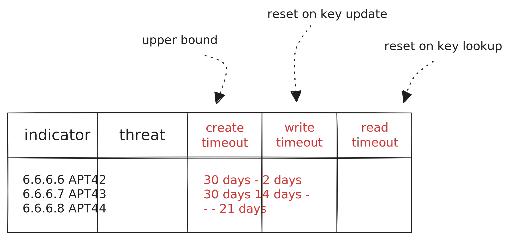
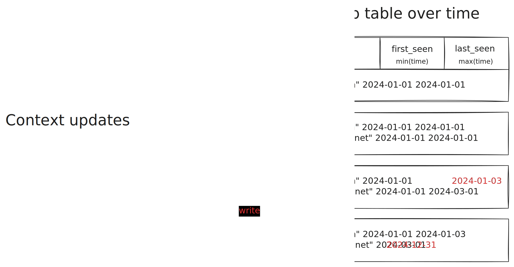

# Enrichment

Enrichment means adding contextual data to events. The purpose of this added
context is to allow for making better decisions, e.g., to triage alerts and weed
out false positive, to leverage country information to classify logins as
malicious, or to flag a sighting of an indicator of compromise.

Tenzir comes a flexible enrichment framework where the central abstraction is a
[context](../contexts.md): a stateful object that can be updated with pipelines
and used for enrichment in other pipelines:

The update and enrich operations can occur concurrently. This allows for
creating highly dynamic use cases where context state rapidly changes, such as
when modelling the threat landscape or internal network infrastructure.

Reusing pipelines as mechanism for context updates (as opposed to other systems
that, say, offer a separate interface to only load static CSV files) has the
benefit that we can leverage the full power of TQL. In other words, we can reuse
*all* existing connectors, formats, periodic scheduling, and more.

## Enrichment Modes

In general, we distinguish three different contextualization modes:

1. **In-band**. The context data is co-located with the pipeline that enriches
   the dataflow. For high-velocity pipelines with thousands of events per
   second, this is of often the only way to enrich.
2. **Out-of-band**. The context data is outside of the to-be-contextualized
   dataflow. The most common example of this kind are REST APIs. Enrichment then
   means performing one API call per event, waiting for the result, and then
   merging it into the event to continue processing. For public APIs, latencies
   are in the tens to hundreds of milliseconds, making this mode suitable for
   low-velocity.
3. **Hybrid**. An excerpt of the context sits inline and the bulk of it
   remotely. When both performance matters and state is not possible to ship
   to the contextualization point itself, then a hybrid approach can be a viable
   middle ground. [Google Safe Browsing][safebrowsing] is an example of this
   kind, where the Chrome browser keeps a subset of context state that
   represents threat actor URLs in the form of partial hashes, and when a users
   visits a URL where a partial match occurs, Chrome performs a candidate check
   using an API call. More than 99% of checked URLs never make it to the remote
   API, making this approach scalable. Note that the extra layer of hashing also
   protects the privacy of the entity performing the context lookup.

[safebrowsing]: https://security.googleblog.com/2022/08/how-hash-based-safe-browsing-works-in.html

To date, Tenzir only supports in-band enrichment, but out-of-band and hybrid
modes are already planned.

## Context Types

Tenzir features several context types:

- [Lookup table](../contexts/lookup-table.md): a hash table that associates
  arbitrary information with a given enrichment key.
- [GeoIP database](../contexts/geoip.md): a special-purpose table for attaching
  geographic information to IP addresses.
- [Bloom filter](../contexts/bloom-filter.md): a compact representation of a
  sets that allows for membership tests only, with the space efficiency coming
  at the cost a false positives during lookup.

If these built-in types do not suffice for your needs, you can also write your
own C++ context plugin.

### Lookup Table

Tenzir's lookup table context is a hash table that can have both keys and values
of different types. For example, you can have IP addresses, subnets, and numbers
as table keys all in the same table, and every value can have a different type.

There are three particularly powerful features of lookup tables that we describe
next.

#### 1. Longest-Prefix Subnet Match for Subnet Keys

When table keys are of type `subnet`, you can probe the lookup table with values
of type `ip` in addition. For example, if you have a key `10.0.0.0/8` you can
perform a lookup with `10.0.0.1`, `10.1.1.1`, etc. The lookup table will always
return the value associated with `10.0.0.0/8`.

When a table contains subnet keys with overlapping ranges, such as `10.0.0.0/22`
and `10.0.0.0/24`, a lookup returns the entry with the *longest-prefix match* of
the key. For example, probing the table with `10.0.0.1` returns the value
associated with the `/24` subnet, because it is a longer match (24 > 22).

:::tip Modeling CMDB & Asset Inventory
Subnet key matching comes in handy when you are building lookup tables that
represent your infrastructure. We often see giant static spreadsheets as
"network plans" that (alas often only partially) describe roles of certain
network segments. This information can be gold from a security perspective, when
it comes to triaging alerts, e.g., to assess whether the crown jewels are
affected, or when detecting dubious network traffic zone transitions, e.g.,
during lateral movement of attackers.
:::

#### 2. Per-Key Create/Write/Read Expiration

Every table entry has three optional expiration timeouts that evict the entry.
These timeout are compounding, so it suffices if *one* of them fires to trigger
eviction.

The three timeout types are:

1. **Create timeout**: Whenever a new entry is created in the table, e.g.,
   through `context::update`, this timeout starts counting down. This happens
   exactly once and the timer cannot be reset. Therefore, a create timeout is an
   *upper bound* on the lifetime of an entry.
2. **Write timeout**: Whenever an update modifies a table entry by writing a new
   value for a given key with `context::update`, this timeout resets.
3. **Read timeout**: Whenever an entry is accessed, which happens during
   `context::enrich`, this timeout resets.

All three timers start at table entry creation, i.e., creating an entry is the
"0th" write and read.

:::tip Modeling Threat Intelligence Decay
Per-key timeouts come in handy when you want to associate lifetimes with
observables or indicators of compromise. Many indicators have a short half-life
and most are obsolete a couple of weeks. To avoid accumulating "garbage" that
produces false positives, use a combination of timeouts to automatically remove
stale entries. Many threat feeds and threat intelligence platforms provide this
information already to generate more actionable enrichments.
:::

#### 3. Aggregation Functions as Values

Lookup tables offer more than just entries with static values. You can also
aggregate into values with [aggregation
functions](../tql2/functions.md#aggregation). In this case an update of a table
entry does not write the new value directly, but rather hands that value to the
configured aggregation function, which in turn updates the table value.

For example, the `min` aggregation function computes the minimum over its
values. Consider a sequence of context updates with values `3`, `4`, `2`, `3`,
`1` for the updated key. Then the value after each update would be `3`, `3`,
`2`, `2`, `1`. The example below uses `min` and `max` to implement a first-seen
and last-seen timestamps—a common pattern during entity tracking.

:::tip Passive Inventorization
Aggregating into table values instead of just overwriting the value has a
plethora of use cases. A popular example involves computing
first/last/times-seen statistics to build passive DNS tables. But also
extracting IP-to-MAC, host-to-username, or any other mappings available in
telemetry provide valuable context for entity-based reasoning. Our [Suricon 2024 talk][suricon2024] has more examples.
:::

[suricon2024]: https://docs.google.com/presentation/d/1SnWQMBN7HQ4ASckUgy_kfQyWzHSnrN9zl-m4ptMVolQ/present

### Bloom Filter

[Bloom filters](https://en.wikipedia.org/wiki/Bloom_filter) are a
space-efficient representation of a set. In case you have a massive number of
elements but only need to check for set membership. However, the compact spatial
representation comes at a cost of a false probability during lookup. You can
think of it as a [lookup table](#lookup-table) without values—just keys, but
where looking up a key may say "yes" even though the key doesn't actually exist.
The probability of this happening is fortunately configurable.

A Bloom filter has two tuning knobs:

1. **Capacity**: the maximum number of items in the filter.
2. **False-positive probability**: the chance of reporting an item not in
   the filter.

These two parameters dictate the space usage of the Bloom filter. Consult Thomas
Hurst's [Bloom Filter Calculator](https://hur.st/bloomfilter/) for finding the
optimal configuration for your use case.

Tenzir's Bloom filter implementation is a C++ rebuild of DCSO's
[bloom](https://github.com/DCSO/bloom) library. It is binary-compatible and uses
the exact same method for FNV1 hashing and parameter calculation, making it a
drop-in replacement for `bloom` users.

:::tip Large Observable Sets
Let's say you have a 10 billion SHA256 hash digests of malware samples. Your
endpoint telemetry provides a SHA256 along with every process creation event.
You'd like to check whether the newly created process is in the malware set.
With a lookup table, you would need at least 256 / 8 * 100^6 = 320 GB of memory.
With a Bloom filter that has a 1% false positive rate, you can represent the
same set with XXX memory. A lot less!
:::

### GeoIP Database

The GeoIP context provides geo-spatial information about a given IP address.
Conceptually, it is a lookup table with IP addresses as keys that maps to  
country codes/names, region codes/names, cities, zip codes, and geographic
coordinates.

Since a naive table representation would explode in memory,
[MaxMind](https://www.maxmind.com/) came up with a custom binary [MMDB
format](https://maxmind.github.io/MaxMind-DB/) along with a [corresponding
library](https://github.com/maxmind/libmaxminddb) to perform IP lookups. This
format is the de-facto standard for geo-spatial IP address enrichment today.
Tenzir supports it natively.

:::tip Detecting Anomalous Logins
The textbook example for a GeoIP use case involves performing anomaly detection
on user login events. When a user logs into a system from previously unknown
country, a detection engine often raises an alert. Assuming your endpoint
telemetry only provides you with the IP address of the device that performed the
login, you can use a GeoIP context to add the missing country information that a
downstream detector can then evaluate.
:::
