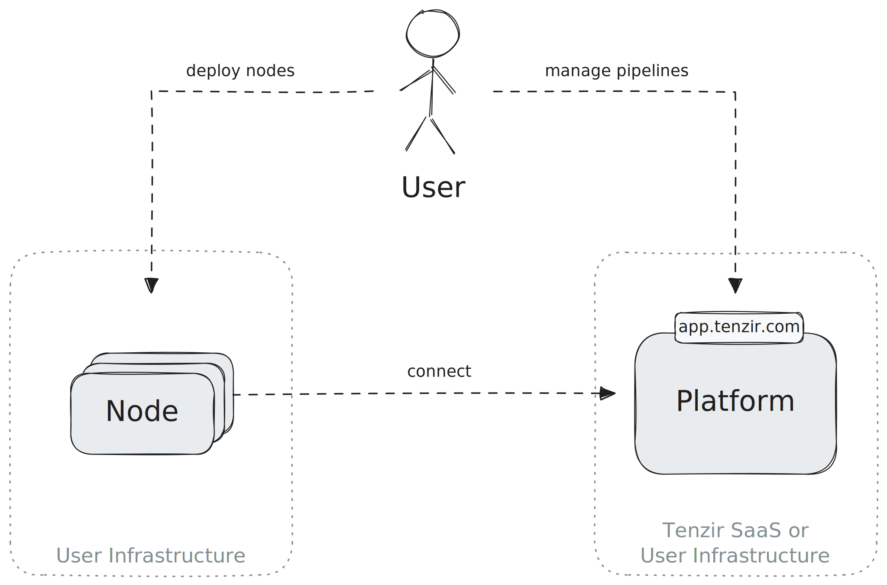

# How Does Tenzir Work?

Tenzir revolves around three primary components:

- **Pipeline**: A defined sequence of operators responsible for loading,
  parsing, transforming, and routing data. Pipelines are the core mechanism for
  data processing.
- **Node**: A running process that manages and executes pipelines.
- **Platform**: A higher-level management layer that provides oversight and
  control over multiple nodes.

## Standalone and Managed Pipelines

Tenzir offers flexibility in running pipelines through two main modes:

1. **Standalone Execution**: Run directly from the command line using the
   `tenzir` binary. This mode is ideal for quick, manual data transformations
   akin to how one would use `jq`, but with broader data handling capabilities.
2. **Managed Execution via Nodes**: For more sustained or automated data
   processing, pipelines can be managed within a node. This is either launched
   as a Docker container or by running the `tenzir-node` binary.

The standalone option caters to interactive, ad-hoc tasks, while managed
pipelines are better suited for continuous or scheduled dataflows. Notably,
managed pipelines can handle both long-term and short-duration jobs.

## Connecting Nodes to the Platform

When deploying a node, it will automatically attempt to connect to the platform,
providing a seamless way to manage and deploy pipelines through the platform’s
web interface. However, using the platform is optional—pipelines can still be
controlled directly via the node’s API in a more hands-on, CRUD-like approach.

The platform, beyond pipeline management, offers user and workspace
administration, authentication support via external identity providers (IdP),
and persistent storage for dashboards. These dashboards can be customized with
charts, which are themselves powered by pipelines.

## Pipeline Use Cases

Tenzir pipelines are flexible enough to support a wide range of data processing
tasks, from cost optimization to building sophisticated security data lakes. The
general structure of many pipelines includes:

1. **Data Onboarding**: Accepting input in various formats.
2. **Data Normalization**: Converting inputs to a consistent schema, such as
   [OCSF](https://github.com/ocsf).
3. **Data Enrichment**: Adding extra context or relevant information to events.
4. **Routing**: Directing enriched data to its intended destination.

For more advanced needs, pipelines can be combined to form larger, more complex
data fabrics. A typical example is split-routing: sending contextual, actionable
data to a SIEM while archiving large volumes of low-fidelity data in a cheaper
storage solution.

With these tools at your disposal, Tenzir empowers you to build versatile,
scalable data pipelines tailored to your specific use cases. Now it's your turn
to create something powerful!
