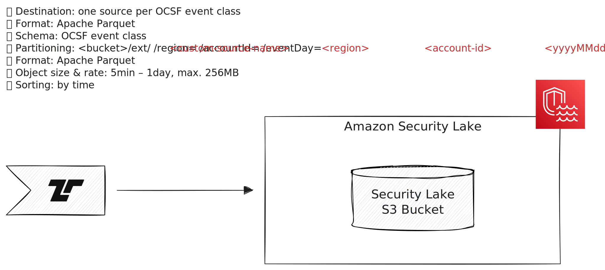

# Security Lake

[Amazon Security Lake (ASL)][asl] is an OCSF event collection service.

[asl]: https://aws.amazon.com/security-lake/



Tenzir can send events to ASL via the [`to_asl` operator](../../../tql2/operators/to_asl.md).

## Configuration

Follow the [standard configuration instructions](../README.md) to authenticate
with your AWS credentials.

Set up a custom source in ASL and use its s3 bucket URI with the `to_asl` operator.

## Examples

### Send all stored OCSF Network Activity events to ASL

```tql
export
where @name == "ocsf.network_activity"
to_asl "s3://aws-security-data-lake-us-west-2-lake-uid/ext/tenzir_network_activity/region=us-west-2/accountId=123456789012"
```
