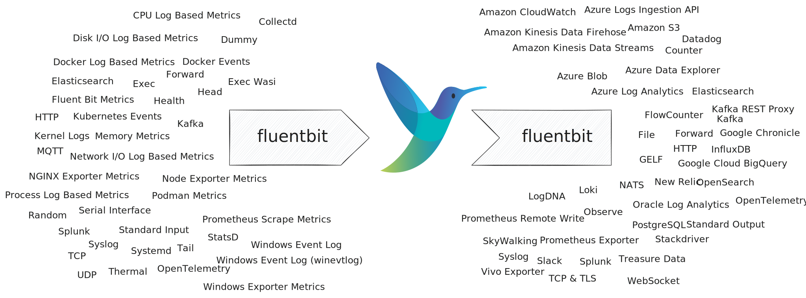

# Fluent Bit

[Fluent Bit](https://fluentbit.io) is a an open source observability
pipeline. Tenzir embeds Fluent Bit, exposing all its [inputs][inputs] and
[outputs][outputs] through the [`fluentbit`](../../tql2/operators/fluentbit.md)
operator. This makes Tenzir effectively a superset of Fluent Bit.

[inputs]: https://docs.fluentbit.io/manual/pipeline/inputs
[outputs]: https://docs.fluentbit.io/manual/pipeline/outputs



Fluent Bit [parsers][parsers] map to Tenzir operators that accept bytes as input
and produce events as output. Fluent Bit [filters][filters] correspond to
Tenzir operators that perform event-to-event transformations. Tenzir does not
expose Fluent Bit parsers and filters, only inputs and output.

[parsers]: https://docs.fluentbit.io/manual/pipeline/parsers
[filters]: https://docs.fluentbit.io/manual/pipeline/filters

Internally, Fluent Bit uses [MsgPack](https://msgpack.org/) to encode events
whereas Tenzir uses [Arrow](https://arrow.apache.org) record batches. The
`fluentbit` source operator transposes MsgPack to Arrow, and the `fluentbit`
sink performs the reverse operation.

## Usage

Syntactically, the `fluentbit` operator behaves similar to an invocation of the
`fluent-bit` command line utility. For example, the invocation

```bash
fluent-bit -o plugin -p key1=value1 -p key2=value2 -p ...
```

translates to Tenzir's `fluentbit` operator as follows:

```tql
fluentbit "plugin", options = {key1: value1, ...}
```

## Examples

### Ingest OpenTelemetry logs, metrics, and traces

```tql
fluentbit "opentelemetry"
```

You can then send JSON-encoded log data to a freshly created API endpoint:

```bash
curl \
  --header "Content-Type: application/json" \
  --request POST \
  --data '{"resourceLogs":[{"resource":{},"scopeLogs":[{"scope":{},"logRecords":[{"timeUnixNano":"1660296023390371588","body":{"stringValue":"{\"message\":\"dummy\"}"},"traceId":"","spanId":""}]}]}]}' \
  http://0.0.0.0:4318/v1/logs
```

### Imitate a Splunk HEC endpoint

```tql
fluentbit "splunk", options = {port: 8088}
```

### Imitate an ElasticSearch & OpenSearch Bulk API endpoint

This allows you to ingest from beats (e.g., Filebeat, Metricbeat, Winlogbeat).

```tql
fluentbit "elasticsearch", options = {port: 9200}
```

### Send to Datadog

```tql
fluentbit "datadog", options = {apikey: "XXX"}
```

### Send to ElasticSearch

```tql
fluentbit "es", options = {host: 192.168.2.3, port: 9200, index: "my_index", type: "my_type"}
```
