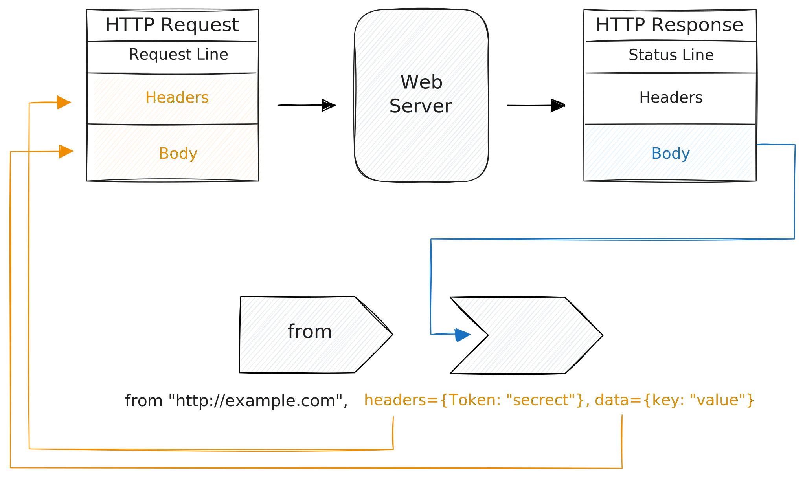

# HTTP(S)

Tenzir supports HTTP and HTTPS, both as sender and receiver.

When retrieving data from an API or website, you prepare your HTTP request and
get back the HTTP response body as your pipeline data:



When sending data from a pipeline to an API or website, the events in the
pipeline make up the HTTP request body. If the HTTP status code is not 2\*\*,
you will get a warning.


In both cases, you can only provide static header data.

:::tip URL Support
The URL schemes `http://` and `https://` dispatch to
[`load_http`](../../tql2/operators/load_http.md) and
[`save_http`](../../tql2/operators/save_http.md) for seamless URL-style use via
[`from`](../../tql2/operators/from.md) and [`to`](../../tql2/operators/to.md).

Since the majority of HTTP activity uses JSON-encoded request/response
bodies, you do not need to provide a separate pipeline argument with
`read_json`/`write_json`.
:::

## Examples

### Perform a GET request with URL parameters

```tql
from "http://example.com:8888/api", method="GET", params={query: "tenzir"}
```

### Perform a POST request with JSON body

```tql
from "http://example.com:8888/api", method="POST", body={query: "tenzir"}
```

### Call a webhook API with pipeline data

```tql
from {
  x: 42,
  y: "foo",
}
to "http://example.com:8888/api" 
```
