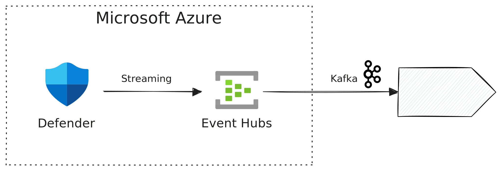

# Defender

[Microsoft Defender][defender] offers protection, detection, investigation, and
response to threats. Defender comes in multiple editions, [Defender for Office
365][defender-o365], [Defender for Endpoint][defender-endpoint], [Defender for
IoT][defender-iot], [Defender for Identity][defender-identity], and [Defender
for Cloud][defender-cloud]. All Defender products can stream events in real time
to Tenzir using [Azure Event Hubs][event-hubs].

[defender]: https://learn.microsoft.com/en-us/defender-xdr/microsoft-365-defender-portal
[defender-o365]: https://learn.microsoft.com/en-us/defender-office-365/mdo-about
[defender-iot]: https://learn.microsoft.com/en-us/defender-for-iot/microsoft-defender-iot
[defender-endpoint]: https://learn.microsoft.com/en-us/defender-endpoint/
[defender-identity]: https://learn.microsoft.com/en-us/defender-for-identity/what-is
[defender-cloud]: https://learn.microsoft.com/en-us/defender-xdr/microsoft-365-security-center-defender-cloud
[event-hubs]: https://learn.microsoft.com/en-us/azure/event-hubs/event-hubs-about



:::tip Microsoft Defender Setup
The following example assumes that you have already set up Microsoft Defender
and Microsoft Defender XDR, for example, by following the [official
documentation](https://learn.microsoft.com/en-us/azure/defender-for-cloud/connect-azure-subscription).
:::

## Requirements and Setup

### Azure Event Hub & Kafka

To stream security events from Defender in realtime, you can use Azure Event
Hub, which provides a Kafka endpoint starting at the Standard tier. Make sure to
enable *Kafka Surface* after the Event Hub setup.

### Microsoft Security Center

In Microsoft Security Center, configure Streaming under `System -> Settings ->
Microsoft Defender XDR -> General -> Streaming API`. Add a new Streaming API for
the target Event Hub and enable all event types that you want to collect.

## Examples

### Process Defender events with a pipeline

Tenzir's [Kafka integration](../../kafka/README.md) allows for seamless
consumption of Defender events. In the following pipeline,
replace all strings starting with `YOUR_`with the configuration values in Azure
under `Event Hub Namespace -> Settings -> Shared access policies -> (Your
policy)`.

```tql
from "kafka://YOUR_EVENT_HUB_NAME", options = {
  "bootstrap.servers": "YOUR_EVENT_HUB_NAME.servicebus.windows.net:9093",
  "security.protocol": "SASL_SSL",
  "sasl.mechanism": "PLAIN",
  "sasl.username": "$ConnectionString",
  "sasl.password": "YOUR_CONNECTION_STRING" // Connection string-primary key
} {
  read_json
}
```

After replacing the configuration values, your pipeline may look like this:

```tql
from "kafka://tenzir-defender-event-hub", options = {
  "bootstrap.servers": "tenzir-defender-event-hub.servicebus.windows.net:9093",
  "security.protocol": "SASL_SSL",
  "sasl.mechanism": "PLAIN",
  "sasl.username": "$ConnectionString",
  "sasl.password": "Endpoint=sb://tenzir-defender-event-hub.servicebus.windows.net/;SharedAccessKeyName=RootManageSharedAccessKey;SharedAccessKey=SECRET123456"
} {
  read_json
}
```

```tql
{
  records: [
    {
      time: "2024-12-04T13:38:20.360851",
      tenantId: "40431729-d276-4582-abb4-01e21c8b58fe",
      operationName: "Publish",
      category: "AdvancedHunting-IdentityLogonEvents",
      _TimeReceivedBySvc: "2024-12-04T13:36:26.632556",
      properties: {
        ActionType: "LogonFailed",
        LogonType: "Failed logon",
        Protocol: "Ntlm",
        AccountDisplayName: null,
        AccountUpn: null,
        AccountName: "elias",
        AccountDomain: "tenzir.com",
        AccountSid: null,
        AccountObjectId: null,
        IPAddress: null,
        Location: null,
        DeviceName: "WIN-P3MCS4024KP",
        OSPlatform: null,
        DeviceType: null,
        ISP: null,
        DestinationDeviceName: "ad-test.tenzir.com",
        TargetDeviceName: null,
        FailureReason: "UnknownUser",
        Port: null,
        DestinationPort: null,
        DestinationIPAddress: null,
        TargetAccountDisplayName: null,
        AdditionalFields: {
          Count: "1",
          Category: "Initial Access",
          AttackTechniques: "Valid Accounts (T1078), Domain Accounts (T1078.002)",
          SourceAccountName: "tenzir.com\\elias",
          SourceComputerOperatingSystemType: "unknown",
          DestinationComputerObjectGuid: "793e9b90-9eef-4620-aaa2-442a22f81321",
          DestinationComputerOperatingSystem: "windows server 2022 datacenter",
          DestinationComputerOperatingSystemVersion: "10.0 (20348)",
          DestinationComputerOperatingSystemType: "windows",
          SourceComputerId: "computer win-p3mcs4024kp",
          FROM.DEVICE: "WIN-P3MCS4024KP",
          TO.DEVICE: "ad-test",
          ACTOR.DEVICE: "",
        },
        ReportId: "3d359b95-f8d5-4dbd-a64b-7327c92d32f1",
        Timestamp: "2024-12-04T13:33:19.801823",
        Application: "Active Directory",
      },
      Tenant: "DefaultTenant",
    },
  ]
}
```
