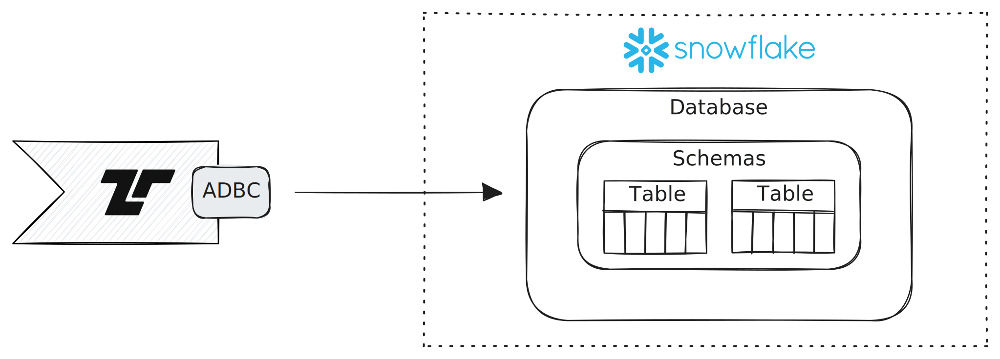

# Snowflake

[Snowflake](https://snowflake.com) is a multi-cloud data warehouse. Tenzir can
send events from a pipeline into [Snowflake
databases](https://docs.snowflake.com/en/sql-reference/ddl-database).



Use the [`to_snowflake`](../../tql2/operators/to_snowflake.md) output operator
at the end of a pipeline to send events to a specific table.

:::info ADBC
Tenzir Apache Arrow under the hood to represent batches of events. Therefore, we
can use [Arrow Database Connectivity
(ADBC)](https://arrow.apache.org/docs/format/ADBC.html) as interface to
Snowflake, enabling efficient transfer of large datasets. Think of ADBC as the
columnar equivalent of JDBC/ODBC. Thanks to the existing [Snowflake
driver](https://arrow.apache.org/adbc/current/driver/snowflake.html), you can
directly stream events from a Tenzir pipeline to Snowflake using ADBC's *Bulk
Ingestion* API. For further details on ADBC, read the [introductory blog
post](https://arrow.apache.org/blog/2023/01/05/introducing-arrow-adbc/) from the
Arrow project.
:::

## Examples

### Send data to a Snowflake database

```tql
from {foo: 42, bar: true}
to_snowflake \
  account_identifier="asldyuf-xgb47555",
  user_name="tenzir_user",
  password="password1234",
  database="MY_DB",
  schema="MY_SCHEMA",
  table="TENZIR"
```
