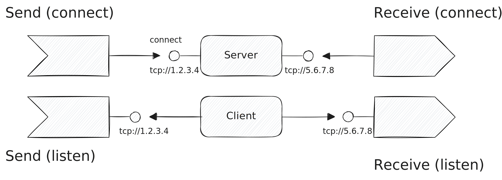

# TCP

The [Transmission Control Protocol
(TCP)](https://en.wikipedia.org/wiki/Transmission_Control_Protocol) offers a
bi-directional byte stream between applications that communicate via IP. Tenzir
supports writing to and reading from TCP sockets, both in server (listening) and
client (connect) mode.



Use the IP address `0.0.0.0` to listen on all available network interfaces.

:::tip URL Support
The URL schemes `tcp://` and `tcps://` dispatch to
[`load_tcp`](../../tql2/operators/load_tcp.mdx) and
[`save_tcp`](../../tql2/operators/save_tcp.mdx) for seamless URL-style use via
[`from`](../../tql2/operators/from.md) and [`to`](../../tql2/operators/to.md).
:::

## SSL/TLS

To enable TLS, use `tls=true`. You can optionally pass a PEM-encoded certificate
and private key via the `certfile` and `keyfile` options.

For testing purposes, you can quickly generate a self-signed certificate as
follows:

```bash
openssl req -x509 -newkey rsa:2048 -keyout key_and_cert.pem -out key_and_cert.pem -days 365 -nodes
```

An easy way to test a TLS connection is to try connecting via OpenSSL:

```bash
openssl s_client 127.0.0.1:443
```

## Examples

### Read data by connecting to a remote TCP server

```tql
from "tcp://127.0.0.1:443", connect=true {
  read_json
}
```

### Read data by listen on localhost with TLS enabled

```tql
from "tcp://127.0.0.1:443", tls=true, certfile="cert.pem", keyfile="key.pem" {
  read_json
}
```
