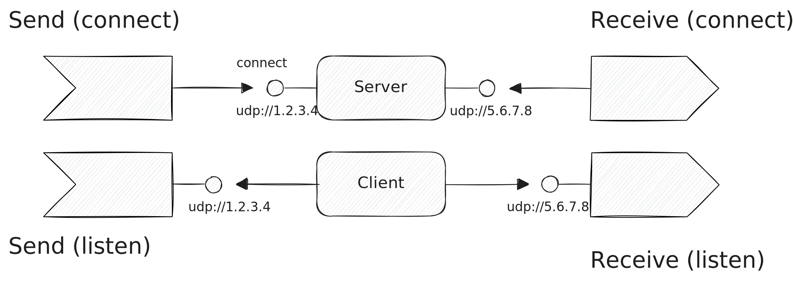

# UDP

The [User Datagram Protocol
(UDP)](https://en.wikipedia.org/wiki/User_Datagram_Protocol) is a
connection-less protocol to send messages on an IP network.  Tenzir supports
writing to and reading from UDP sockets, both in server (listening) and client
(connect) mode.



Use the IP address `0.0.0.0` to listen on all available network interfaces.

:::tip URL Support
The URL scheme `udp://` dispatches to
[`load_udp`](../../tql2/operators/load_udp.md) and
[`save_udp`](../../tql2/operators/save_udp.md) for seamless URL-style use via
[`from`](../../tql2/operators/from.md) and [`to`](../../tql2/operators/to.md).
:::

## Examples

### Accept Syslog messages over UDP

```tql
from "udp://127.0.0.1:541" {
  read_syslog
}
```

### Send events to a UDP socket

```tql
from {message: "Tenzir"}
to "udp://1.2.3.4:8080" {
  write_ndjson
}
```
