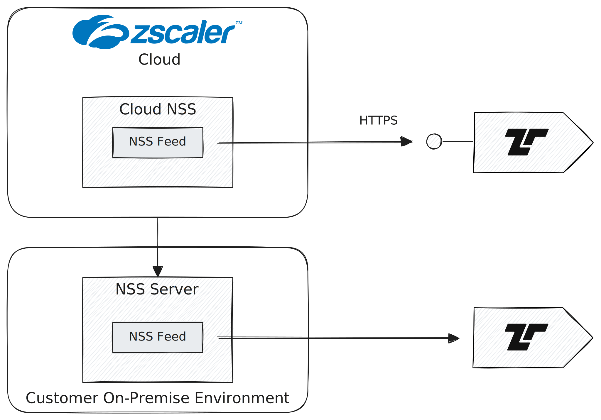

# Zscaler

Zscaler's [Nanolog Streaming Service (NSS)][nss] is a family of products that
enable Zscaler cloud communication with third-party security solution devices
for exchanging event logs. You can either use Zscaler's Cloud NSS or deploy an
on-prem NSS server to obtain the logs. Tenzir can receive Zscaler logs in either
case.

[nss]: https://help.zscaler.com/zia/understanding-nanolog-streaming-service



## Use a Cloud NSS Feed to send events to Tenzir

### Configure Tenzir

First, spin up a Tenzir pipeline that mimics a [Splunk HEC
endpoint](../splunk/README.md):

```tql
from_fluent_bit "splunk", options={
  listen: 0.0.0.0,
  port: 8088,
  splunk_token: YOUR_TOKEN,
}
publish "zscaler"
```

In the above example, the pipeline uses `0.0.0.0` to listen on all IP addresses
available.

### Create a Cloud NSS Feed

Perform the following steps to create a Cloud NSS feed:

1. Log in to your ZIA Admin Portal and go to *Administration → Nanolog Streaming
   Service*.
2. Select the *Cloud NSS Feeds* tab.
3. Click *Add Cloud NSS Feed*.

In the new dialog, configure the following options:

- **Feed Name**: Enter a name, e.g., `Tenzir ZIA Logs`
- **NSS Type**: NSS for Web
- **Status**: Enabled
- **SIEM Rate**: Unlimited
- **SIEM Type**: Other
- **OAuth 2.0 Authentication**: disabled
- **Max Batch Size**: 16 KB
- **API URL**: Enter the URL that identifies the Tenzir pipeline where the
  Splunk HEC endpoint is listening, e.g.,
  https://1.2.3.4:8080/services/collector.
- **HTTP Headers**: Add your token from the Tenzir pipeline enable compression
  with the following two headers.
  - `Authorization`: `YOUR_TOKEN`
  - `Content-Encoding`: `gzip`
- **Feed Output Type**: JSON
- **JSON Array Notation**: disabled
- **Feed Escape Character**: `,\"`

After a web, firewall, or DNS feed has been configured, activate the changes as
needed and test the feed. To test the connection:

1. Go to *Administration* → *Nanolog Streaming Service* → *Cloud NSS Feeds*.
2. Click the *Cloud icon*. This sends a test message to the Cribl receiver.

## Use an NSS Feed to send events to Tenzir

The on-prem NSS server VM pulls logs from the Zscaler cloud and pushes them to
Tenzir via Syslog over TCP. The NSS server also buffers logs if the TCP
connection goes down.

:::info Unencrypted Communication
Note that the forwarding TCP connection is *unencrypted*, as the assumption is
that the NSS server is on premises next to the receiver.
:::

### Configure Tenzir

Spin up a Tenzir pipeline that accepts [TCP](../tcp/README.md) connection and
parses Syslog:

```tql
from "tcp://0.0.0.0:514" {
  read_syslog
}
publish "zscaler"
```

In the above example, the pipeline uses `0.0.0.0` to listen on all IP addresses
available.

Depending on how your NSS Feed is configured, you can futher dissect the opaque
Syslog message into a structured record.

### Create an NSS Feed

First, [deploy an NSS server](https://help.zscaler.com/zia/adding-nss-servers).
Then log into ZIA using your administrator account:

1. Go to *Administration* → *Cloud Configuration* → *Nanolog Streaming Service*.
2. Verify that the NSS State is Healthy. Deploy a new NSS server by following
   the steps at [NSS Deployment Guides][nss-deployment].
3. Click the *NSS Feeds* tab, and then click *Add NSS Feed*.

[nss-deployment]: https://help.zscaler.com/zia/nanolog-streaming-service

Follow the [official documentation to add an NSS
feed](https://help.zscaler.com/zia/adding-nss-feeds). You can add up to 16 NSS
feeds per NSS server.

In the new dialog, configure the following options:

- **Feed Name**: Enter a name, e.g., `Tenzir ZIA Logs`
- **NSS Server**: Choose your server
- **Status**: Enabled
- **SIEM Destination Type**: FQDN
- **SIEM IP Address**: Enter the address of your Tenzir Node
- **SIEM TCP Port**: Enter the port of your pipeline
- **SIEM Rate**: Unlimited
- **Feed Output Type**: JSON
- **Feed Escape Character**: `,\"`
