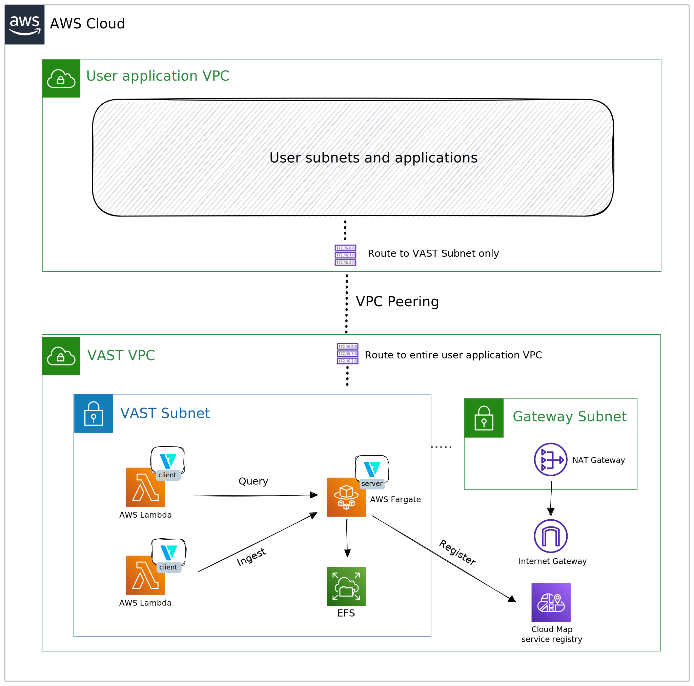

# AWS

## Architecture Choices

The AWS architecture builds on serverless principles to deliver a scalable
cloud-native deployment option. To combine continuously running services with
dynamic ad-hoc tasks, we use Lambda and Fargate as building blocks for on-demand
query capacity while continuously ingesting data.

Specifically, we embed the long-running VAST server in a Fargate task
definition, which allows for flexible resource allocation based on compute
resource needs. VAST mounts EFS storage for maximum flexibility and
pay-as-you-go scaling. The VAST client performs short-running ad-hoc tasks, like
ingesting a file or running query. We map such actions to Lambda functions.

## VPC Infrastructure

The provided Terraform script creates the following architecture within a given
VPC:

The assumption is that the VPC has an Internet Gateway attached. Given a CIDR
block within this VPC, Terraform creates two subnets:

1. **VAST Subnet**: a private subnet where the VAST nodes and other security
   tools run.
2. **Gateway Subnet**: a public subnet to talk to other AWS services and the
   Internet

To resolve the IP address of the VAST server and other appliances, we use AWS
Cloud Map as a service discovery provider.

## Images and Registries

Both Lambda and Fargate deploy VAST as a Docker image. They use the official
[tenzir/vast](https://hub.docker.com/r/tenzir/vast) image with extra layers
containing tooling such as:

| Image            | Tooling                             |
| ---------------- | ----------------------------------- |
| Lambda only      | the Lambda Runtime Interface        |
| Lambda only      | the AWS and other CLI tools (jq...) |
| Lambda & Fargate | AWS specific schemas and concepts   |

For that reason, our toolchain builds a Lambda and a Fargate specific image
locally and pushes it to a private ECR repository.

