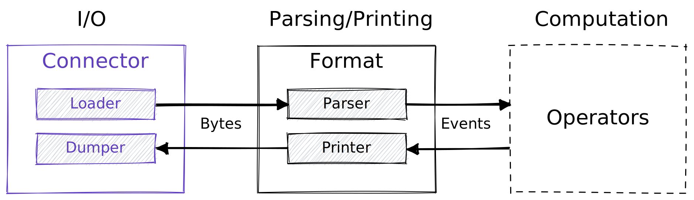

# Connectors

A connector specifies how to exchange raw bytes with an underlying resource,
such as a file, network socket, or message queue.

1. **Loader**: translates raw bytes into structured event data
2. **Saver**: translates structured events into raw bytes

Loaders and savers interact with their corresponding dual from a
[format](formats), as the diagram below shows:

:::caution WIP
Connectors are not yet exposed directly to the user. We have a corresponding
[roadmap item](https://github.com/tenzir/public-roadmap/issues/18) to track this
effort. Please refer to the [format](formats) documentation until then.
:::
