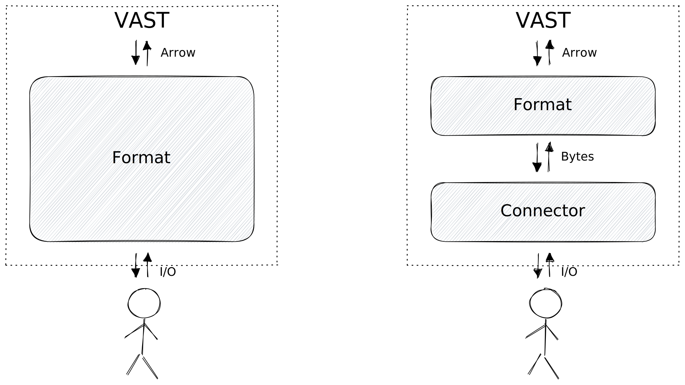

# Formats

A format is the bridge between raw bytes and structured data. A format provides
a *parser* and/or *printer*:

1. **Parser**: translates raw bytes into structured event data
2. **Printer**: translates structured events into raw bytes

Parsers and printers interact with their corresponding dual from a
[connector](connectors):

VAST ships with the following formats:

import DocCardList from '@theme/DocCardList';

<DocCardList />
